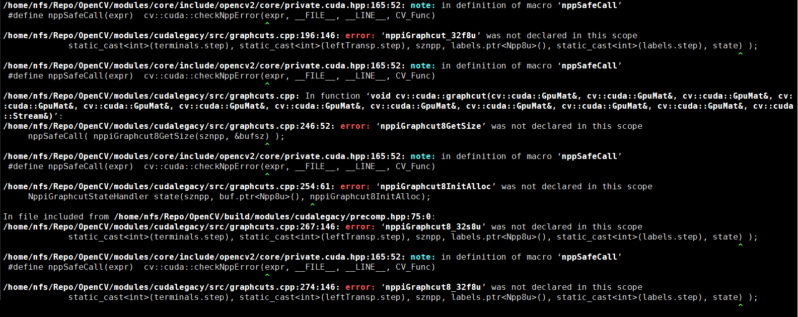
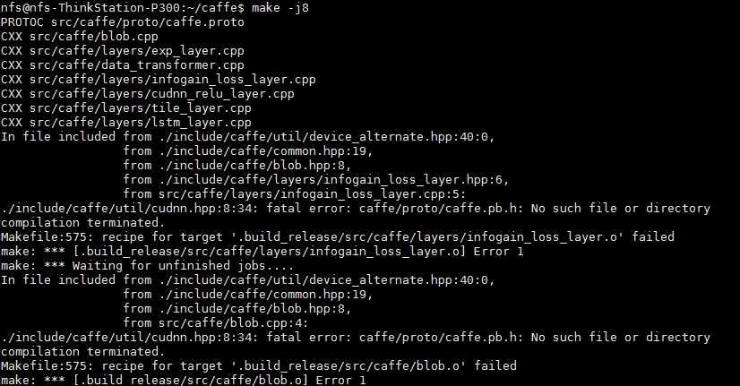

- 声明：本博客欢迎转发，但请保留原作者信息!
- 作者: [曹文龙]
- 博客： <https://cwlseu.github.io/>

## 引言
做深度学习，没用玩过深度学习框架caffe就有点说不过去了。虽然自己的小机器显卡能力不行，但是希望在cuda上跑caffe的心却没有停止过。从ubuntu12.04一直折腾到16.04，cuda从6.5也release到了8.0，中间走过的弯路很多。
- cuda与系统的适配能力问题
- ubuntu系统的问题
- caffe的框架的问题
经过这几年的发展，现在caffe的安装已经变得异常简单便捷。在此记录一下曾经的坑。
建议: 直接在机器上安装linux进行下面操作，要是在虚拟机里整，几乎没有什么戏，而且会把你给整疯了了的。

### 安装BLAS
BLAS 可以通过mkl atlas openblas等实现，[性能比较](http://stackoverflow.com/questions/7596612/benchmarking-python-vs-c-using-blas-and-numpy)
发现这个mkl是不错的，但是要[收费](https://software.intel.com/en-us/intel-mkl/)
最后选择默认的[Atlas](http://sourceforge.net/settings/mirror_choices?projectname=math-atlas&filename=Stable/3.10.2/atlas3.10.2.tar.bz2)

********** Important Install Information: CPU THROTTLING ***********
    Architecture configured as  Corei2 (27)
    /tmp/ccp8Kkgo.o: In function `ATL_tmpnam':
    /home/charles/Repo/ATLAS//CONFIG/include/atlas_sys.h:224: warning: the use of `tmpnam' is dangerous, better use `mkstemp'

    Clock rate configured as 800Mhz

    Maximum number of threads configured as  4
    probe_pmake.o: In function `ATL_tmpnam':
    /home/charles/Repo/ATLAS//CONFIG/include/atlas_sys.h:224: warning: the use of `tmpnam` is dangerous, better use `mkstemp`
    Parallel make command configured as '$(MAKE) -j 4'
    CPU Throttling apparently enabled!
    It appears you have cpu throttling enabled, which makes timings
    unreliable and an ATLAS install nonsensical.  Aborting.
    See ATLAS/INSTALL.txt for further information
    xconfig exited with 1
******************************* Solution ***************************
use ubuntu main software source 
switch to root admin

apt-get install gnome-applets
cpufreq-selector -g performance -c 0

`sudo apt-get install libatlas-base-dev`

### 安装Boost
* preinstall boost should install following software
* compile the source code 
下载源代码，当前最新版本为version 1.60

```sh
wget http://downloads.sourceforge.net/project/boost/boost/1.60.0/boost_1_60_0.tar.gz
unpacking boost 1.60.tar.gz
source boot
./b2
./b2 install --prefix=/usr/local
```

```cpp
    #include <boost/lexical_cast.hpp>
    #include <iostream>
    int main()
    {
        using boost::lexical_cast;
        int a = lexical_cast<int>("123");
        double b = lexical_cast<double>("123.12");
        std::cout<<a<<std::endl;
        std::cout<<b<<std::endl;
    return 0;
    }
```
 
或者直接`apt-get install libboost-all-dev`


### 从7.5之后安装的方法简单得多
`sudo apt-get --purge remove nvidia-*`
到https://developer.nvidia.com/cuda-downloads下载对应的deb文件
到deb的下载目录下

```sh
    sudo dpkg -i cuda-repo-ubuntu1404_7.5-18_amd64.deb 
    sudo apt-get update 
    sudo apt-get install cuda
    sudo reboot
```
完成，cuda和显卡驱动就都装好了；其他的什么都不用动
而网上大部分中文和英文的参考教程都是过时的，折腾几个小时不说还容易装不成。

### 查看机器参数是否满足CUDA计算的最低要求
lspci | grep -i nvidia
01:00.0 3D controller: NVIDIA Corporation GF117M [GeForce 610M/710M/820M / GT 620M/625M/630M/720M] (rev a1)
参照nvidia [往年发布的gpus](http://developer.nvidia.com/cuda-gpus)
我的机器为Compute Capability 2.1，是可以使用CUDA加速的。：）

### 不是所有Nvida显卡都支持Cudnn的
折腾了很久的cudnn安装，后来才发现是自己的显卡太low了，不支持Cudnn，因为Compute Capability 才2.1，要支持Cudnn， Capability >= 3.0，[查看自己显卡的计算能力](https://developer.nvidia.com/cuda-gpus)

### install cuDNN
PREREQUISITES
CUDA 7.0 and a GPU of compute capability 3.0 or higher are required.
Extract the cuDNN archive to a directory of your choice, referred to below as <installpath>.Then follow the platform-specific instructions as follows.

>LINUX

```sh
    cd <installpath>
    export LD_LIBRARY_PATH=`pwd`:$LD_LIBRARY_PATH

    Add <installpath> to your build and link process by adding -I<installpath> to your compile
    line and -L<installpath> -lcudnn to your link line.
```
>WINDOWS

Add <installpath> to the PATH environment variable.

In your Visual Studio project properties, add <installpath> to the Include Directories 
and Library Directories lists and add cudnn.lib to Linker->Input->Additional Dependencies.


## 非GPU的自动安装脚本
[Install Caffe Script](https://github.com/cwlseu/script-ubuntu-debian/blob/master/install-caffe.sh)

## pycaffe
1. 首先要编译caffe成功，make pycaffe也成功
2. 使得pycaffe可以被访问到, set PYTHONPATH=$PYTHONPATH:/path/to/caffe/python
3. install dependencies python package.在python文件夹下面有requirements.txt文件，列出了所有有关的python package.
   `pip install -r requirements.txt`
**Note**
这里一定要弄明白，默认情况下是使用python2.x的，如果你使用python3.x的话，请安装python3-pip,使用pip3进行安装，

## 综合一个安装cuda的教程
可以参考<https://gwyve.github.io/>博客，为了方便把gwyve的cuda 安装部分blog放到这里，

## 引言      

使用NVIDIA GPU进行dnn目前已经成为了主流，年前就打算自行安装一遍，拖了这么长时间，到今天才弄得差不多了。本来觉得这个不打算写个东西的，后来怕忘了，还是写下来吧

## 设备介绍

主机: ThinkStation-P300       
CPU: Intel(R) Core(TM) i7-4790 CPU @ 3.60GHz              
GPU: Tesla K20c

## 所需软件

以下软件，在国内只有tensorflow需要翻墙，NVIDIA的都可以直接下载，速度还可以的

### Ubuntu

[Ubuntu 16.04.2 LTS](https://www.ubuntu.com/download/alternative-downloads)                   
[file_torrent](http://releases.ubuntu.com/16.04/ubuntu-16.04.2-desktop-amd64.iso.torrent?_ga=1.169319585.1810803403.1486517128)

### 驱动

[Nvidia-375.39](http://www.nvidia.cn/download/driverResults.aspx/115286/cn)                               
[file](http://cn.download.nvidia.com/XFree86/Linux-x86_64/375.39/NVIDIA-Linux-x86_64-375.39.run)

### cuda

[cuda-8.0](https://developer.nvidia.com/cuda-downloads)                          
[file](https://developer.nvidia.com/compute/cuda/8.0/Prod2/local_installers/cuda_8.0.61_375.26_linux-run)      

### cuDNN

[cuDNN_5.1](https://developer.nvidia.com/rdp/cudnn-download)                         
[file](https://developer.nvidia.com/compute/machine-learning/cudnn/secure/v5.1/prod_20161129/8.0/cudnn-8.0-linux-x64-v5.1-tgz)


## 安装步骤

### 系统安装

安装Ubuntu的过程自行搜索吧，教程很多，在此不说了。
### 选择正确的源

此处采用[mirror.aliyun.com](mirror.aliyun.com)

### 安装NVIDIA Driver

起初，我是选择使用直接安装cuda的，cuda中有driver，但是，cuda安装完了之后，重复出现登录界面，无法进入系统，所以，我选择单独安装driver，然后，再安装cuda。解决重复登录界面参考[参考1](http://blog.csdn.net/u012759136/article/details/53355781)

1.[选择](http://www.nvidia.cn/Download/index.aspx?lang=cn)机子所需要的驱动，并下载。                  
2.卸载原有驱动：

```bash
$ sudo apt-get remove –purge nvidia*
```     

3.关闭nouveau                                   
创建 /etc/modprobe.d/blacklist-nouveau.conf并包含

```bash
blacklist nouveau
options nouveau modeset=0
```
在terminal输入

`sudo update-initramfs -u`    

4.进入命令行模式                            
Ctrl+Alt+F1              
5.关闭lightdm服务 

`sudo service lightdm stop`

6.运行驱动文件
改变权限       

`sudo chmod a+x NVIDIA-Linux-x86_64-375.39.run`

运行  **注意参数**

`sudo ./NVIDIA-Linux-x86_64-375.39.run –no-x-check –no-nouveau-check –no-opengl-files`  

    - no-x-check 安装驱动时关闭X服务
    - no-nouveau-check 安装驱动时禁用nouveau
    - no-opengl-files 只安装驱动文件，不安装OpenGL文件

7.重启，不出现循环登录问题,如果出现循环登陆, 请看后面的问题。

### 安装cuda

本来是按照deb安装的，后来各种问题，就改成选择runfile的方式了。

这里主要参考[参考2](http://docs.nvidia.com/cuda/cuda-installation-guide-linux/#runfile-nouveau-ubuntu)，全是英文的，要是不想看英文的话，我觉得，那还是放弃做dnn吧，目前这个前沿领域中文文献比较少～

1.在运行.run文件之后，在选择是否安装驱动的位置选择no，剩下的都是yes。                       
2.添加环境变量                      
打开 ～/.bashrc在最后添加

```bash
export PATH=/usr/local/cuda/bin:$PATH
export LD_LIBRARY_PATH=/usr/local/cuda/lib:$LD_LIBRARY_PATH
```

在terminal输入  
`source ~/.bashrc`
3.测试cuda安装是否成功
`nvcc -V`
输入cuda的版本信息                       
4.测试samples                      
这部分参考[参考3](http://blog.csdn.net/u012235003/article/details/54575758)
           
进入 `NVIDIA_CUDA-8.0-Samples/` 
`make`
运行NVIDIA_CUDA-8.0-Samples/bin/x86_64/linux/release/deviceQuery


显示最后出现“Resalt=PASS”，代表成功

### 安装cuDNN
安装之前一定要确认你的GPU是支持cuDNN的。
这个都不应该叫做安装，就是一个创建链接的过程。这个主要参考[参考4](http://blog.csdn.net/jk123vip/article/details/50361951)

1.下载tar文件，解压                         
解压出一个叫做cuda的文件夹，以下操作都是在该文件夹下进行                  
2.复制文件  

```bash
sudo cp include/cudnn.h /usr/local/include
sudo cp lib64/libcudnn.so* /usr/local/lib
```

3.创建cudnn的软链接

```bash
$ sudo ln -sf /usr/local/lib/libcudnn.so.5.1.10 /usr/local/lib/libcudnn.so.5
$ sudo ln -sf /usr/local/lib/libcudnn.so.5 /usr/local/lib/libcudnn.so
$ sudo ldconfig -v
```

## Caffe install  Prepare Dependencies
[安装caffe之前，自动化安装的各种依赖脚本](https://github.com/cwlseu/recipes/blob/master/script/install-caffe.sh)

## Install OpenCV from Source
自行进行官网查询或者采用如下脚本进行安装。
[Install OpenCV scripts](https://github.com/cwlseu/recipes/blob/master/script/install-opencv.sh)
当然cmake可以采用最基本的：`cmake ..`进行就完全ok

    安装结束之后，请务必添加OpenCV lib所在的路径添加到`LD_LIBRARY_PATH`，因为OpenCV 默认安装路径`/usr/local/lib`并不在`LD_LIBRARY_PATH`中。

```sh
export PATH=/usr/local/cuda/bin:$PATH
export LD_LIBRARY_PATH=/usr/local/lib:/usr/local/cuda/lib:$LD_LIBRARY_PATH
```

## Install Python dependencies

```sh 
sudo apt-get install -y python-pip
cd $CAFFE_ROOT/python
for pack in $(cat requirements.txt); do sudo pip install $pack; done
```
等待python依赖的库安装完毕。
ok， 现在应该就可以运行example/下的某些例子了。

## 问题总结
### hdf5.h没有找到

```cpp
CXX src/caffe/layer_factory.cpp
CXX src/caffe/util/insert_splits.cpp
CXX src/caffe/util/db.cpp
CXX src/caffe/util/upgrade_proto.cpp
In file included from src/caffe/util/upgrade_proto.cpp:10:0:
./include/caffe/util/io.hpp:8:18: fatal error: hdf5.h: no such file or directory
 #include "hdf5.h"
                  ^
compilation terminated.
Makefile:512: recipe for target '.build_release/src/caffe/util/upgrade_proto.o' failed
make: *** [.build_release/src/caffe/util/upgrade_proto.o] Error 1
make: *** 正在等待未完成的任务....
In file included from ./include/caffe/common_layers.hpp:10:0,
                 from ./include/caffe/vision_layers.hpp:10,
                 from src/caffe/layer_factory.cpp:6:
./include/caffe/data_layers.hpp:9:18: fatal error: hdf5.h: no such file or directory
 #include "hdf5.h"
                  ^
compilation terminated.
Makefile:512: recipe for target '.build_release/src/caffe/layer_factory.o' failed
make: *** [.build_release/src/caffe/layer_factory.o] Error 1
```
参看[caffe issues](https://github.com/NVIDIA/DIGITS/issues/156)

#### 方案一：

```sh
cd /usr/lib/x86_64-linux-gnu
sudo ln -s libhdf5_serial.so.8.0.2 libhdf5.so
sudo ln -s libhdf5_serial_hl.so.8.0.2 libhdf5_hl.so
```

#### 方案二
just modify the Makefile.config
INCLUDE_DIRS := $(PYTHON_INCLUDE) /usr/local/include /usr/include/hdf5/serial/
LIBRARY_DIRS := $(PYTHON_LIB) /usr/local/lib /usr/lib /usr/lib/x86_64-linux-gnu/hdf5/serial/
[issues 2690](https://github.com/BVLC/caffe/issues/2690)

### 编译OpenCV  syntax error: identifier 'NppiGraphcutState'


```sh
1>------ Build started: Project: opencv_cudalegacy, Configuration: Debug x64 ------
1>  graphcuts.cpp
1>V:\Opencv31\opencv\sources\modules\cudalegacy\src\graphcuts.cpp(120): error C2061: syntax error: identifier 'NppiGraphcutState'
1>V:\Opencv31\opencv\sources\modules\cudalegacy\src\graphcuts.cpp(135): error C2833: 'operator NppiGraphcutState' is not a recognized operator or type
1>V:\Opencv31\opencv\sources\modules\cudalegacy\src\graphcuts.cpp(135): error C2059: syntax error: 'newline'
1>V:\Opencv31\opencv\sources\modules\cudalegacy\src\graphcuts.cpp(136): error C2334: unexpected token(s) preceding '{'; skipping apparent function body
1>V:\Opencv31\opencv\sources\modules\cudalegacy\src\graphcuts.cpp(141): error C2143: syntax error: missing ';' before '*'
1>V:\Opencv31\opencv\sources\modules\cudalegacy\src\graphcuts.cpp(141): error C4430: missing type specifier - int assumed. Note: C++ does not support default-int
1>V:\Opencv31\opencv\sources\modules\cudalegacy\src\graphcuts.cpp(141): error C2238: unexpected token(s) preceding ';'
1>V:\Opencv31\opencv\sources\modules\cudalegacy\src\graphcuts.cpp(127): error C2065: 'pState': undeclared identifier
1>V:\Opencv31\opencv\sources\modules\cudalegacy\src\graphcuts.cpp(132): error C2065: 'pState': undeclared identifier
1>V:\Opencv31\opencv\sources\modules\cudalegacy\src\graphcuts.cpp(132): error C3861: 'nppiGraphcutFree': identifier not found
1>V:\Opencv31\opencv\sources\modules\cudalegacy\src\graphcuts.cpp(174): error C3861: 'nppiGraphcutGetSize': identifier not found
1>V:\Opencv31\opencv\sources\modules\cudalegacy\src\graphcuts.cpp(182): error C2065: 'nppiGraphcutInitAlloc': undeclared identifier
1>V:\Opencv31\opencv\sources\modules\cudalegacy\src\graphcuts.cpp(190): error C3861: 'nppiGraphcut_32s8u': identifier not found
1>V:\Opencv31\opencv\sources\modules\cudalegacy\src\graphcuts.cpp(195): error C3861: 'nppiGraphcut_32f8u': identifier not found
1>V:\Opencv31\opencv\sources\modules\cudalegacy\src\graphcuts.cpp(246): error C3861: 'nppiGraphcut8GetSize': identifier not found
1>V:\Opencv31\opencv\sources\modules\cudalegacy\src\graphcuts.cpp(254): error C2065: 'nppiGraphcut8InitAlloc': undeclared identifier
1>V:\Opencv31\opencv\sources\modules\cudalegacy\src\graphcuts.cpp(264): error C3861: 'nppiGraphcut8_32s8u': identifier not found
1>V:\Opencv31\opencv\sources\modules\cudalegacy\src\graphcuts.cpp(271): error C3861: 'nppiGraphcut8_32f8u': identifier not found
2>------ Build started: Project: opencv_cudaoptflow, Configuration: Debug x64 ------
2>LINK : warning LNK4044: unrecognized option '/LV:/NVIDIA GPU Computing Toolkit/Cuda8/lib/x64'; ignored
2>LINK : fatal error LNK1104: cannot open file '..\..\lib\Debug\opencv_cudalegacy310d.lib'
```

[cudalegacy-not-compile-nppigraphcut-missing](http://answers.opencv.org/question/95148/cudalegacy-not-compile-nppigraphcut-missing/)
这个问题在opencv中已经fix掉了。

将opencv\sources\modules\cudalegacy\src\graphcuts.cpp中的

```
#include "precomp.hpp"
#if !defined (HAVE_CUDA) || defined (CUDA_DISABLER)
```
修改为：

```
#include "precomp.hpp"

#if !defined (HAVE_CUDA) || defined (CUDA_DISABLER)  || (CUDART_VERSION >= 8000)
```

### ld链接失败，或者.o没有生成


如果你使用的是`make -j8`进行编译的，并且你需要的lib已经都加到`LD_LIBRARY_PATH`中了，那么你可以再试一遍`make -j8`或者使用`make -j4` or `make -j`，最保险的情况就是使用`make`进行编译，虽然慢点但是不会出现各种依赖找不到的情况。
    
    因为使用多线程编译的时候，不同线程编译不同的cpp文件，尤其是caffe编译过程中首先是要调用 `protoc` 进行生成 `caffe.pb.h` 的，如果多线程编译过程中，一个线程编译的cpp依赖caffe.pb.h，但是此时还没有生成完毕caffe.pb.h,就会出现类似错误。

### 循环登陆界面

#### 方案一
1. 卸掉nvidia-driver
`sudo apt-get remove --purge nvidia*`
2. 看看能不能登陆guest，可以的话
删除home/user/目录下的 `.Xauthority  .xsession-errors`
3. reboot

#### 方案二
1. 卸掉nvidia-driver
`sudo apt-get remove --purge nvidia*`
2. 进入grub启动界面，可是使用advance 启动方式，进行修复界面。通过选择`recovery mode`进行恢复之后，然后重启。

    后来经过调研和重新格式化系统进行安装之后发现，原来是CUDA7.5 的`.deb`对Ubuntu 14.04 的支持性不好，导致显示驱动程序有问题，从而无法正常进入系统。而且有人建议采用`.run`的toolkit进行安装, 所以后面使用`.run`进行安装

## [双电源供电的一些坑](http://gwyve.com/blog/2017/05/02/double-power.html) 

## 没有sudu权限，安装caffe

1. 下载[caffe 依赖包](链接：http://pan.baidu.com/s/1kUZoq7H 密码：aumh)，解压到某个路径下。如果失活了, emailto:<caowenlong92@gmail.com>
2. 添加caffelib/lib的绝对路径到~/.bashrc 中
`export LD_LIBRARY_PATH=/home/.../caffelib/lib$LD_LIBRARY_PATH`
3. 在Makefile.config中`INCLUDE_DIRS`中添加caffelib/include的绝对路径；`LIBRARY_DIRS`中添加添加caffelib/lib的绝对路径
4. cuda啥的一般管理员就帮你搞定了，实在不行咱自己安装到某个路径下，在Makefile.config中配置一下路径就ok了
5. python 依赖可以通过`virtualenv`解决掉的，[如何使用`virtualenv`](https://virtualenv.pypa.io/en/stable/userguide/)可以看官网


## Quarto Fx580
查看显卡型号`lspci | grep "VGA"` 

    01:00.0 VGA compatible controller: NVIDIA Corporation G96GL [Quadro FX 580] (rev a1)

[驱动下载](http://www.nvidia.com/content/DriverDownload-March2009/confirmation.php?url=/XFree86/Linux-x86_64/340.102/NVIDIA-Linux-x86_64-340.102.run&lang=us&type=geforcem)

[查看GPU卡是否支持cuda](https://developer.nvidia.com/cuda-gpus)
哦哦，并不支持，好吧，换卡吧。

## 参考

1.[【解决】Ubuntu安装NVIDIA驱动后桌面循环登录问题](http://blog.csdn.net/u012759136/article/details/53355781)                                
2.[NVIDIA CUDA Installation Guide for Linux](http://docs.nvidia.com/cuda/cuda-installation-guide-linux/#runfile-nouveau-ubuntu)         
3.[CUDA安装和测试](http://blog.csdn.net/u012235003/article/details/54575758)
4.[import TensorFlow提示Unable to load cuDNN DSO](http://blog.csdn.net/jk123vip/article/details/50361951)                        
5.[Installing TensorFlow on Ubuntu](https://www.tensorflow.org/install/install_linux)
6.[Install OpenCV Scripts](https://github.com/cwlseu/recipes/blob/master/script/install-opencv.sh)
7.[virtualenv user guide](https://virtualenv.pypa.io/en/stable/userguide/)
8.[查看GPU卡是否支持cuda](https://developer.nvidia.com/cuda-gpus)
9.[cuda各个版本库](https://developer.nvidia.com/cuda-toolkit-archive)