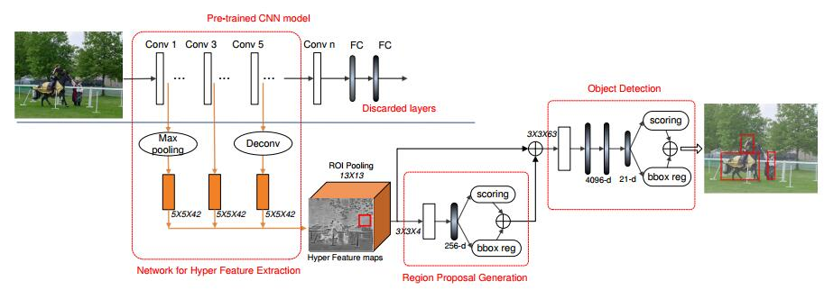
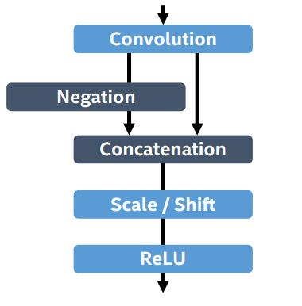
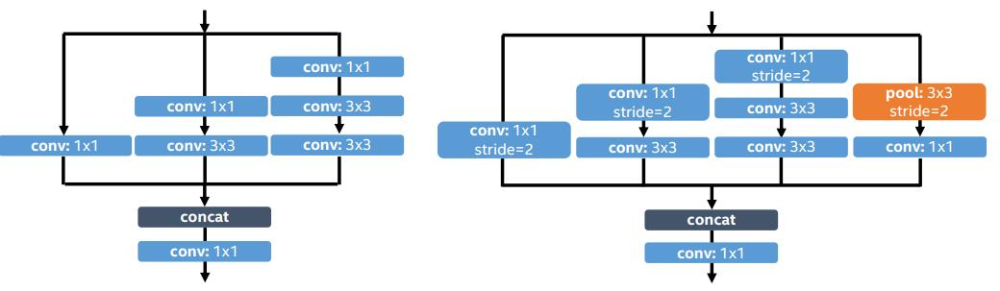
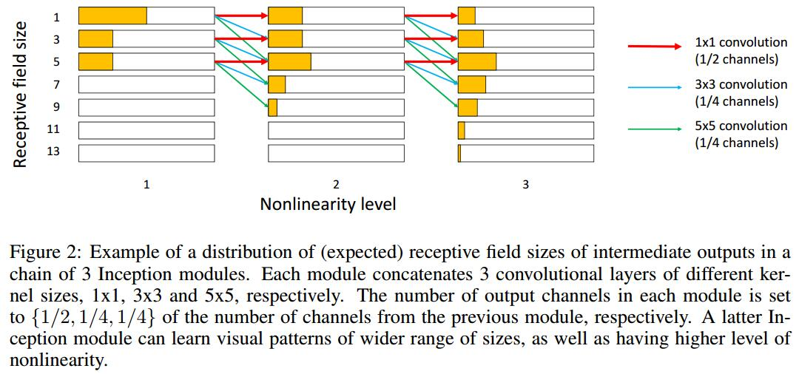
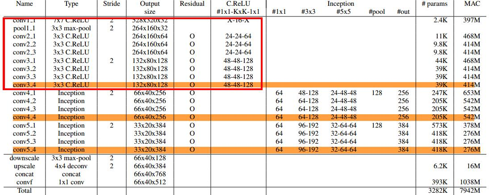
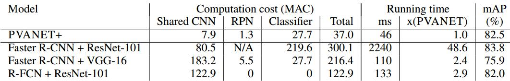

声明：本博客欢迎转发，但请保留原作者信息!
作者: [cwlseu]
博客： <https://cwlseu.github.io/>

## 论文下载
论文：<https://www.arxiv.org/pdf/1608.08021v3.pdf>
code：<https://github.com/sanghoon/pva-faster-rcnn>

## Abstract
1. 使用"Feature Extraction+Region Proposal+RoI Classification" 的结构，主要对Feature Extraction进行重新设计。因为，Region Proposal部分计算量不太大而且classification部分可以使用通用的技术(例如：Truncated SVD) 进行有效的压缩。
2. 设计原则：Less channels with more layers 和采用一些Building blocks （包括：串级的ReLU、Inception和HyperNet)


结果 
  VOC2007—83.8\%mAP；VOC2012—82.5\%mAP，46ms/image在NVIDIA Titan X GPU；计算量是ResNet-101的12.3\% (理论上)


## Introduction

准确率很高的检测算法有往往需要很大的计算量。现在压缩和量化技术的发展对减小网络的计算量很重要。这篇文章展示了我们用于目标检测的一个轻量级的特征提取的网络结构——PVANET

串级的ReLU(C.ReLU—Concatenated rectified linear unit)[^1]被用在我们的CNNs 的初期阶段来减少一半的计算数量而不损失精度。

Inception[^2]被用在剩下的生成feature的子网络中。一个Inception module 产生不同大小的感受野（receptive fields）的输出激活值，所以增加前一层感受野大小的 变化。 我们观察叠加的Inception modules可以比线性链式的CNNs更有效的捕捉大范围的大小变化的目标。

采用multi-scale representation的思想[^3], 结合多个中间的输出，所以，这使得可以同时考虑多个level的细节和非线性。我们展示设计的网络deep and thin，在batch normalization、residual connections和基于plateau detection的learning rate的调整的帮助下进行有效地训练

##  Review Related Work

### HyperNet
Hypernet[2]算是在物体识别任务中的一个多尺度利用特征的里程碑吧，其中主要贡献有两点：
* 同时利用第1， 第3和第5卷积层的输出结果作为分类特征
* 将有效改变ROI推荐模块中的工作任务，提高了任务处理速度



### Inception
Inception最早是在NIN中提出来的，但是其中没有1x1卷积核的掺入，导致一些问题。后来在GoogLeNet中重新设计了Inception模块，有效地拓展了当时对卷积结构的认识，使得神经网络向着更深的模型方向发展。Inception最有创造性的是对于同一个输入数据，采用不同尺度的感受野(卷积核)进行处理，将不同尺度的信息通过级联方式进行组合。这种将多尺度特征引用到后面网络层中的方式，受到设计深层网络人的追捧。


## Nerual Network Design
### C.ReLU

    C.ReLU来源于CNN中间激活模式引发的。观察发现，输出节点倾向于是"配对的"，一个节点激活是另一个节点的相反面。



* 求同
    C.ReLU减少一半输出通数量，通过简单的连接相同的输出和negation 使其变成双倍，这使得2倍的速度提升而没有损失精度
* 存异
    同时，增加了scaling and shifting在concatenation之后，这允许每个channel 的斜率和激活阈值与其相反的channel不同。


### Inception
Inception是捕获图像中小目标和大目标的最具有成效的Building Blocks之一;
为了学习捕获大目标的视觉模式，CNN特征应该对应于足够大的感受野，这可以很容易的通过叠加 3x3或者更大的核卷积实现;
为了捕获小尺寸的物体，输出特征应该对应于足够小的感受野来精确定位小的感兴趣区域。


1x1的conv扮演了关键的角色，保留上一层的感受野。只是增加输入模式的非线性，它减慢了一些输出特征的感受野的增长，使得可以精确地捕获小尺寸的目标。



## 整个网络的结构

从中可以看出，在conv3\_4, conv4\_4, conv5\_4的输出特征通过下采样和上采样技术实现相同的size之后进行级联作为最后的卷积特征。


## Summary

1. C.ReLU减少训练过程中的网络大小
2. Inception是网络设计中的用于压缩网络的技巧
3. 1x1的使用相当于挖掘卷积结果中的冗余信息，从而减少channel个数
4. 多尺度方法有很多，
   * 最初的直接在输入数据上进行下采样的方式；或者像sift中的高斯金字塔方式
   * HyperNet中采用不同卷积层的方式
   * Inception中采用不同卷积核拼接的方式
   * 再到后面针对Object Dectection任务中的anchor大小的设置，cellsize的设置，都是在考虑多尺度的问题

## 模型分析
```python
name: "PVANET"

###############################################################################
## Input
###############################################################################

## 训练过程的输入
layer {
  name: 'input-data'
  type: 'Python'
  top: 'data'
  top: 'im_info'
  top: 'gt_boxes'
  include { phase: TRAIN }
  python_param {
    module: 'roi_data_layer.layer'
    layer: 'RoIDataLayer'
    param_str: "'num_classes': 21"
  }
}

## 测试过程的输入情况
layer {
  name: "input-data"
  type: "DummyData"
  top: "data"
  top: "im_info"
  include { phase: TEST }
  dummy_data_param {
    shape { dim: 1 dim: 3 dim: 224 dim: 224 }
    shape { dim: 1 dim: 3 }
  }
}

##############################################################################
## Convolution
##############################################################################
layer {
  name: "conv1_1/conv"
  type: "Convolution"
  bottom: "data"
  top: "conv1_1/conv"
  param {
    lr_mult: 1.0
    decay_mult: 1.0
  }
  convolution_param {
    num_output: 16
    bias_term: false
    weight_filler {
      type: "xavier" # 实现在某个范围内的均匀分布
    }
    pad_h: 3
    pad_w: 3
    kernel_h: 7
    kernel_w: 7
    stride_h: 2
    stride_w: 2
  }
}
layer {
  name: "conv1_1/bn"
  type: "BatchNorm"
  bottom: "conv1_1/conv"
  top: "conv1_1/conv"
  param {
    lr_mult: 0
    decay_mult: 0
  }
  param {
    lr_mult: 0
    decay_mult: 0
  }
  param {
    lr_mult: 0
    decay_mult: 0
  }
  batch_norm_param {
    use_global_stats: true
  }
}

## Power类型的层是对每个输入x，计算(shift + scale * x) ^ power
layer {
  name: "conv1_1/neg"
  type: "Power"
  bottom: "conv1_1/conv"
  top: "conv1_1/neg"
  power_param {
    power: 1
    scale: -1.0
    shift: 0
  }
}
layer {
  name: "conv1_1/concat"
  type: "Concat"
  bottom: "conv1_1/conv"
  bottom: "conv1_1/neg"
  top: "conv1_1"
}
layer {
  name: "conv1_1/scale"
  type: "Scale"
  bottom: "conv1_1"
  top: "conv1_1"
  param {
    lr_mult: 1.0
    decay_mult: 0
  }
  param {
    lr_mult: 2.0
    decay_mult: 0
  }
  scale_param {
    bias_term: true
  }
}
layer {
  name: "conv1_1/relu"
  type: "ReLU"
  bottom: "conv1_1"
  top: "conv1_1"
}

## Max Pooling 层
layer {
  name: "pool1"
  type: "Pooling"
  bottom: "conv1_1"
  top: "pool1"
  pooling_param {
    pool: MAX
    kernel_size: 3
    stride: 2
    pad: 0
  }
}

## Conv2 
layer {
  name: "conv2_1/1/conv"
  type: "Convolution"
  bottom: "pool1"
  top: "conv2_1/1"
  param {
    lr_mult: 1.0
    decay_mult: 1.0
  }
  param {
    lr_mult: 2.0
    decay_mult: 0.0
  }
  convolution_param {
    num_output: 24
    weight_filler {
      type: "xavier"
    }
    bias_filler {
      type: "constant"
      value: 0.1
    }
    pad_h: 0
    pad_w: 0
    kernel_h: 1
    kernel_w: 1
    stride_h: 1
    stride_w: 1
  }
}
layer {
  name: "conv2_1/2/bn"
  type: "BatchNorm"
  bottom: "conv2_1/1"
  top: "conv2_1/2/pre"
  param {
    lr_mult: 0
    decay_mult: 0
  }
  param {
    lr_mult: 0
    decay_mult: 0
  }
  param {
    lr_mult: 0
    decay_mult: 0
  }
  batch_norm_param {
    use_global_stats: true
  }
}
layer {
  name: "conv2_1/2/bn_scale"
  type: "Scale"
  bottom: "conv2_1/2/pre"
  top: "conv2_1/2/pre"
  param {
    lr_mult: 1.0
    decay_mult: 0
  }
  param {
    lr_mult: 1.0
    decay_mult: 0
  }
  scale_param {
    bias_term: true
  }
}
layer {
  name: "conv2_1/2/relu"
  type: "ReLU"
  bottom: "conv2_1/2/pre"
  top: "conv2_1/2/pre"
}
layer {
  name: "conv2_1/2/conv"
  type: "Convolution"
  bottom: "conv2_1/2/pre"
  top: "conv2_1/2"
  param {
    lr_mult: 1.0
    decay_mult: 1.0
  }
  param {
    lr_mult: 2.0
    decay_mult: 0.0
  }
  convolution_param {
    num_output: 24
    weight_filler {
      type: "xavier"
    }
    bias_filler {
      type: "constant"
      value: 0.1
    }
    pad_h: 1
    pad_w: 1
    kernel_h: 3
    kernel_w: 3
    stride_h: 1
    stride_w: 1
  }
}
layer {
  name: "conv2_1/3/bn"
  type: "BatchNorm"
  bottom: "conv2_1/2"
  top: "conv2_1/3/pre"
  param {
    lr_mult: 0
    decay_mult: 0
  }
  param {
    lr_mult: 0
    decay_mult: 0
  }
  param {
    lr_mult: 0
    decay_mult: 0
  }
  batch_norm_param {
    use_global_stats: true
  }
}
layer {
  name: "conv2_1/3/neg"
  type: "Power"
  bottom: "conv2_1/3/pre"
  top: "conv2_1/3/neg"
  power_param {
    power: 1
    scale: -1.0
    shift: 0
  }
}
layer {
  name: "conv2_1/3/concat"
  type: "Concat"
  bottom: "conv2_1/3/pre"
  bottom: "conv2_1/3/neg"
  top: "conv2_1/3/preAct"
}
layer {
  name: "conv2_1/3/scale"
  type: "Scale"
  bottom: "conv2_1/3/preAct"
  top: "conv2_1/3/preAct"
  param {
    lr_mult: 1.0
    decay_mult: 0
  }
  param {
    lr_mult: 2.0
    decay_mult: 0
  }
  scale_param {
    bias_term: true
  }
}
layer {
  name: "conv2_1/3/relu"
  type: "ReLU"
  bottom: "conv2_1/3/preAct"
  top: "conv2_1/3/preAct"
}
layer {
  name: "conv2_1/3/conv"
  type: "Convolution"
  bottom: "conv2_1/3/preAct"
  top: "conv2_1/3"
  param {
    lr_mult: 1.0
    decay_mult: 1.0
  }
  param {
    lr_mult: 2.0
    decay_mult: 0.0
  }
  convolution_param {
    num_output: 64
    weight_filler {
      type: "xavier"
    }
    bias_filler {
      type: "constant"
      value: 0.1
    }
    pad_h: 0
    pad_w: 0
    kernel_h: 1
    kernel_w: 1
    stride_h: 1
    stride_w: 1
  }
}
layer {
  name: "conv2_1/proj"
  type: "Convolution"
  bottom: "pool1"
  top: "conv2_1/proj"
  param {
    lr_mult: 1.0
    decay_mult: 1.0
  }
  param {
    lr_mult: 2.0
    decay_mult: 0.0
  }
  convolution_param {
    num_output: 64
    weight_filler {
      type: "xavier"
    }
    bias_filler {
      type: "constant"
      value: 0.1
    }
    pad_h: 0
    pad_w: 0
    kernel_h: 1
    kernel_w: 1
    stride_h: 1
    stride_w: 1
  }
}
## 求权的加和
layer {
  name: "conv2_1"
  type: "Eltwise"
  bottom: "conv2_1/3"
  bottom: "conv2_1/proj"
  top: "conv2_1"
  eltwise_param {
    operation: SUM
    coeff: 1
    coeff: 1
  }
}

## conv2_2
layer {
  name: "conv2_2/1/bn"
  type: "BatchNorm"
  bottom: "conv2_1"
  top: "conv2_2/1/pre"
  param {
    lr_mult: 0
    decay_mult: 0
  }
  param {
    lr_mult: 0
    decay_mult: 0
  }
  param {
    lr_mult: 0
    decay_mult: 0
  }
  batch_norm_param {
    use_global_stats: true
  }
}
layer {
  name: "conv2_2/1/bn_scale"
  type: "Scale"
  bottom: "conv2_2/1/pre"
  top: "conv2_2/1/pre"
  param {
    lr_mult: 1.0
    decay_mult: 0
  }
  param {
    lr_mult: 1.0
    decay_mult: 0
  }
  scale_param {
    bias_term: true
  }
}
layer {
  name: "conv2_2/1/relu"
  type: "ReLU"
  bottom: "conv2_2/1/pre"
  top: "conv2_2/1/pre"
}
layer {
  name: "conv2_2/1/conv"
  type: "Convolution"
  bottom: "conv2_2/1/pre"
  top: "conv2_2/1"
  param {
    lr_mult: 1.0
    decay_mult: 1.0
  }
  param {
    lr_mult: 2.0
    decay_mult: 0.0
  }
  convolution_param {
    num_output: 24
    weight_filler {
      type: "xavier"
    }
    bias_filler {
      type: "constant"
      value: 0.1
    }
    pad_h: 0
    pad_w: 0
    kernel_h: 1
    kernel_w: 1
    stride_h: 1
    stride_w: 1
  }
}

layer {
  name: "conv2_2/2/bn"
  type: "BatchNorm"
  bottom: "conv2_2/1"
  top: "conv2_2/2/pre"
  param {
    lr_mult: 0
    decay_mult: 0
  }
  param {
    lr_mult: 0
    decay_mult: 0
  }
  param {
    lr_mult: 0
    decay_mult: 0
  }
  batch_norm_param {
    use_global_stats: true
  }
}
layer {
  name: "conv2_2/2/bn_scale"
  type: "Scale"
  bottom: "conv2_2/2/pre"
  top: "conv2_2/2/pre"
  param {
    lr_mult: 1.0
    decay_mult: 0
  }
  param {
    lr_mult: 1.0
    decay_mult: 0
  }
  scale_param {
    bias_term: true
  }
}
layer {
  name: "conv2_2/2/relu"
  type: "ReLU"
  bottom: "conv2_2/2/pre"
  top: "conv2_2/2/pre"
}
layer {
  name: "conv2_2/2/conv"
  type: "Convolution"
  bottom: "conv2_2/2/pre"
  top: "conv2_2/2"
  param {
    lr_mult: 1.0
    decay_mult: 1.0
  }
  param {
    lr_mult: 2.0
    decay_mult: 0.0
  }
  convolution_param {
    num_output: 24
    weight_filler {
      type: "xavier"
    }
    bias_filler {
      type: "constant"
      value: 0.1
    }
    pad_h: 1
    pad_w: 1
    kernel_h: 3
    kernel_w: 3
    stride_h: 1
    stride_w: 1
  }
}
layer {
  name: "conv2_2/3/bn"
  type: "BatchNorm"
  bottom: "conv2_2/2"
  top: "conv2_2/3/pre"
  param {
    lr_mult: 0
    decay_mult: 0
  }
  param {
    lr_mult: 0
    decay_mult: 0
  }
  param {
    lr_mult: 0
    decay_mult: 0
  }
  batch_norm_param {
    use_global_stats: true
  }
}
layer {
  name: "conv2_2/3/neg"
  type: "Power"
  bottom: "conv2_2/3/pre"
  top: "conv2_2/3/neg"
  power_param {
    power: 1
    scale: -1.0
    shift: 0
  }
}
layer {
  name: "conv2_2/3/concat"
  type: "Concat"
  bottom: "conv2_2/3/pre"
  bottom: "conv2_2/3/neg"
  top: "conv2_2/3/preAct"
}
layer {
  name: "conv2_2/3/scale"
  type: "Scale"
  bottom: "conv2_2/3/preAct"
  top: "conv2_2/3/preAct"
  param {
    lr_mult: 1.0
    decay_mult: 0
  }
  param {
    lr_mult: 2.0
    decay_mult: 0
  }
  scale_param {
    bias_term: true
  }
}
layer {
  name: "conv2_2/3/relu"
  type: "ReLU"
  bottom: "conv2_2/3/preAct"
  top: "conv2_2/3/preAct"
}
layer {
  name: "conv2_2/3/conv"
  type: "Convolution"
  bottom: "conv2_2/3/preAct"
  top: "conv2_2/3"
  param {
    lr_mult: 1.0
    decay_mult: 1.0
  }
  param {
    lr_mult: 2.0
    decay_mult: 0.0
  }
  convolution_param {
    num_output: 64
    weight_filler {
      type: "xavier"
    }
    bias_filler {
      type: "constant"
      value: 0.1
    }
    pad_h: 0
    pad_w: 0
    kernel_h: 1
    kernel_w: 1
    stride_h: 1
    stride_w: 1
  }
}

layer {
  name: "conv2_2/input"
  type: "Power"
  bottom: "conv2_1"
  top: "conv2_2/input"
  power_param {
    power: 1
    scale: 1
    shift: 0
  }
}
layer {
  name: "conv2_2"
  type: "Eltwise"
  bottom: "conv2_2/3"
  bottom: "conv2_2/input"
  top: "conv2_2"
  eltwise_param {
    operation: SUM
    coeff: 1
    coeff: 1
  }
}
layer {
  name: "conv2_3/1/bn"
  type: "BatchNorm"
  bottom: "conv2_2"
  top: "conv2_3/1/pre"
  param {
    lr_mult: 0
    decay_mult: 0
  }
  param {
    lr_mult: 0
    decay_mult: 0
  }
  param {
    lr_mult: 0
    decay_mult: 0
  }
  batch_norm_param {
    use_global_stats: true
  }
}
layer {
  name: "conv2_3/1/bn_scale"
  type: "Scale"
  bottom: "conv2_3/1/pre"
  top: "conv2_3/1/pre"
  param {
    lr_mult: 1.0
    decay_mult: 0
  }
  param {
    lr_mult: 1.0
    decay_mult: 0
  }
  scale_param {
    bias_term: true
  }
}
layer {
  name: "conv2_3/1/relu"
  type: "ReLU"
  bottom: "conv2_3/1/pre"
  top: "conv2_3/1/pre"
}
layer {
  name: "conv2_3/1/conv"
  type: "Convolution"
  bottom: "conv2_3/1/pre"
  top: "conv2_3/1"
  param {
    lr_mult: 1.0
    decay_mult: 1.0
  }
  param {
    lr_mult: 2.0
    decay_mult: 0.0
  }
  convolution_param {
    num_output: 24
    weight_filler {
      type: "xavier"
    }
    bias_filler {
      type: "constant"
      value: 0.1
    }
    pad_h: 0
    pad_w: 0
    kernel_h: 1
    kernel_w: 1
    stride_h: 1
    stride_w: 1
  }
}
layer {
  name: "conv2_3/2/bn"
  type: "BatchNorm"
  bottom: "conv2_3/1"
  top: "conv2_3/2/pre"
  param {
    lr_mult: 0
    decay_mult: 0
  }
  param {
    lr_mult: 0
    decay_mult: 0
  }
  param {
    lr_mult: 0
    decay_mult: 0
  }
  batch_norm_param {
    use_global_stats: true
  }
}
layer {
  name: "conv2_3/2/bn_scale"
  type: "Scale"
  bottom: "conv2_3/2/pre"
  top: "conv2_3/2/pre"
  param {
    lr_mult: 1.0
    decay_mult: 0
  }
  param {
    lr_mult: 1.0
    decay_mult: 0
  }
  scale_param {
    bias_term: true
  }
}
layer {
  name: "conv2_3/2/relu"
  type: "ReLU"
  bottom: "conv2_3/2/pre"
  top: "conv2_3/2/pre"
}
layer {
  name: "conv2_3/2/conv"
  type: "Convolution"
  bottom: "conv2_3/2/pre"
  top: "conv2_3/2"
  param {
    lr_mult: 1.0
    decay_mult: 1.0
  }
  param {
    lr_mult: 2.0
    decay_mult: 0.0
  }
  convolution_param {
    num_output: 24
    weight_filler {
      type: "xavier"
    }
    bias_filler {
      type: "constant"
      value: 0.1
    }
    pad_h: 1
    pad_w: 1
    kernel_h: 3
    kernel_w: 3
    stride_h: 1
    stride_w: 1
  }
}
layer {
  name: "conv2_3/3/bn"
  type: "BatchNorm"
  bottom: "conv2_3/2"
  top: "conv2_3/3/pre"
  param {
    lr_mult: 0
    decay_mult: 0
  }
  param {
    lr_mult: 0
    decay_mult: 0
  }
  param {
    lr_mult: 0
    decay_mult: 0
  }
  batch_norm_param {
    use_global_stats: true
  }
}
layer {
  name: "conv2_3/3/neg"
  type: "Power"
  bottom: "conv2_3/3/pre"
  top: "conv2_3/3/neg"
  power_param {
    power: 1
    scale: -1.0
    shift: 0
  }
}
layer {
  name: "conv2_3/3/concat"
  type: "Concat"
  bottom: "conv2_3/3/pre"
  bottom: "conv2_3/3/neg"
  top: "conv2_3/3/preAct"
}
layer {
  name: "conv2_3/3/scale"
  type: "Scale"
  bottom: "conv2_3/3/preAct"
  top: "conv2_3/3/preAct"
  param {
    lr_mult: 1.0
    decay_mult: 0
  }
  param {
    lr_mult: 2.0
    decay_mult: 0
  }
  scale_param {
    bias_term: true
  }
}
layer {
  name: "conv2_3/3/relu"
  type: "ReLU"
  bottom: "conv2_3/3/preAct"
  top: "conv2_3/3/preAct"
}
layer {
  name: "conv2_3/3/conv"
  type: "Convolution"
  bottom: "conv2_3/3/preAct"
  top: "conv2_3/3"
  param {
    lr_mult: 1.0
    decay_mult: 1.0
  }
  param {
    lr_mult: 2.0
    decay_mult: 0.0
  }
  convolution_param {
    num_output: 64
    weight_filler {
      type: "xavier"
    }
    bias_filler {
      type: "constant"
      value: 0.1
    }
    pad_h: 0
    pad_w: 0
    kernel_h: 1
    kernel_w: 1
    stride_h: 1
    stride_w: 1
  }
}
layer {
  name: "conv2_3/input"
  type: "Power"
  bottom: "conv2_2"
  top: "conv2_3/input"
  power_param {
    power: 1
    scale: 1
    shift: 0
  }
}
layer {
  name: "conv2_3"
  type: "Eltwise"
  bottom: "conv2_3/3"
  bottom: "conv2_3/input"
  top: "conv2_3"
  eltwise_param {
    operation: SUM
    coeff: 1
    coeff: 1
  }
}
layer {
  name: "conv3_1/1/bn"
  type: "BatchNorm"
  bottom: "conv2_3"
  top: "conv3_1/1/pre"
  param {
    lr_mult: 0
    decay_mult: 0
  }
  param {
    lr_mult: 0
    decay_mult: 0
  }
  param {
    lr_mult: 0
    decay_mult: 0
  }
  batch_norm_param {
    use_global_stats: true
  }
}
layer {
  name: "conv3_1/1/bn_scale"
  type: "Scale"
  bottom: "conv3_1/1/pre"
  top: "conv3_1/1/pre"
  param {
    lr_mult: 1.0
    decay_mult: 0
  }
  param {
    lr_mult: 1.0
    decay_mult: 0
  }
  scale_param {
    bias_term: true
  }
}
layer {
  name: "conv3_1/1/relu"
  type: "ReLU"
  bottom: "conv3_1/1/pre"
  top: "conv3_1/1/pre"
}
layer {
  name: "conv3_1/1/conv"
  type: "Convolution"
  bottom: "conv3_1/1/pre"
  top: "conv3_1/1"
  param {
    lr_mult: 1.0
    decay_mult: 1.0
  }
  param {
    lr_mult: 2.0
    decay_mult: 0.0
  }
  convolution_param {
    num_output: 48
    weight_filler {
      type: "xavier"
    }
    bias_filler {
      type: "constant"
      value: 0.1
    }
    pad_h: 0
    pad_w: 0
    kernel_h: 1
    kernel_w: 1
    stride_h: 2
    stride_w: 2
  }
}
layer {
  name: "conv3_1/2/bn"
  type: "BatchNorm"
  bottom: "conv3_1/1"
  top: "conv3_1/2/pre"
  param {
    lr_mult: 0
    decay_mult: 0
  }
  param {
    lr_mult: 0
    decay_mult: 0
  }
  param {
    lr_mult: 0
    decay_mult: 0
  }
  batch_norm_param {
    use_global_stats: true
  }
}
layer {
  name: "conv3_1/2/bn_scale"
  type: "Scale"
  bottom: "conv3_1/2/pre"
  top: "conv3_1/2/pre"
  param {
    lr_mult: 1.0
    decay_mult: 0
  }
  param {
    lr_mult: 1.0
    decay_mult: 0
  }
  scale_param {
    bias_term: true
  }
}
layer {
  name: "conv3_1/2/relu"
  type: "ReLU"
  bottom: "conv3_1/2/pre"
  top: "conv3_1/2/pre"
}
layer {
  name: "conv3_1/2/conv"
  type: "Convolution"
  bottom: "conv3_1/2/pre"
  top: "conv3_1/2"
  param {
    lr_mult: 1.0
    decay_mult: 1.0
  }
  param {
    lr_mult: 2.0
    decay_mult: 0.0
  }
  convolution_param {
    num_output: 48
    weight_filler {
      type: "xavier"
    }
    bias_filler {
      type: "constant"
      value: 0.1
    }
    pad_h: 1
    pad_w: 1
    kernel_h: 3
    kernel_w: 3
    stride_h: 1
    stride_w: 1
  }
}
layer {
  name: "conv3_1/3/bn"
  type: "BatchNorm"
  bottom: "conv3_1/2"
  top: "conv3_1/3/pre"
  param {
    lr_mult: 0
    decay_mult: 0
  }
  param {
    lr_mult: 0
    decay_mult: 0
  }
  param {
    lr_mult: 0
    decay_mult: 0
  }
  batch_norm_param {
    use_global_stats: true
  }
}
layer {
  name: "conv3_1/3/neg"
  type: "Power"
  bottom: "conv3_1/3/pre"
  top: "conv3_1/3/neg"
  power_param {
    power: 1
    scale: -1.0
    shift: 0
  }
}
layer {
  name: "conv3_1/3/concat"
  type: "Concat"
  bottom: "conv3_1/3/pre"
  bottom: "conv3_1/3/neg"
  top: "conv3_1/3/preAct"
}
layer {
  name: "conv3_1/3/scale"
  type: "Scale"
  bottom: "conv3_1/3/preAct"
  top: "conv3_1/3/preAct"
  param {
    lr_mult: 1.0
    decay_mult: 0
  }
  param {
    lr_mult: 2.0
    decay_mult: 0
  }
  scale_param {
    bias_term: true
  }
}
layer {
  name: "conv3_1/3/relu"
  type: "ReLU"
  bottom: "conv3_1/3/preAct"
  top: "conv3_1/3/preAct"
}
layer {
  name: "conv3_1/3/conv"
  type: "Convolution"
  bottom: "conv3_1/3/preAct"
  top: "conv3_1/3"
  param {
    lr_mult: 1.0
    decay_mult: 1.0
  }
  param {
    lr_mult: 2.0
    decay_mult: 0.0
  }
  convolution_param {
    num_output: 128
    weight_filler {
      type: "xavier"
    }
    bias_filler {
      type: "constant"
      value: 0.1
    }
    pad_h: 0
    pad_w: 0
    kernel_h: 1
    kernel_w: 1
    stride_h: 1
    stride_w: 1
  }
}
layer {
  name: "conv3_1/proj"
  type: "Convolution"
  bottom: "conv3_1/1/pre"
  top: "conv3_1/proj"
  param {
    lr_mult: 1.0
    decay_mult: 1.0
  }
  param {
    lr_mult: 2.0
    decay_mult: 0.0
  }
  convolution_param {
    num_output: 128
    weight_filler {
      type: "xavier"
    }
    bias_filler {
      type: "constant"
      value: 0.1
    }
    pad_h: 0
    pad_w: 0
    kernel_h: 1
    kernel_w: 1
    stride_h: 2
    stride_w: 2
  }
}
layer {
  name: "conv3_1"
  type: "Eltwise"
  bottom: "conv3_1/3"
  bottom: "conv3_1/proj"
  top: "conv3_1"
  eltwise_param {
    operation: SUM
    coeff: 1
    coeff: 1
  }
}
layer {
  name: "conv3_2/1/bn"
  type: "BatchNorm"
  bottom: "conv3_1"
  top: "conv3_2/1/pre"
  param {
    lr_mult: 0
    decay_mult: 0
  }
  param {
    lr_mult: 0
    decay_mult: 0
  }
  param {
    lr_mult: 0
    decay_mult: 0
  }
  batch_norm_param {
    use_global_stats: true
  }
}
layer {
  name: "conv3_2/1/bn_scale"
  type: "Scale"
  bottom: "conv3_2/1/pre"
  top: "conv3_2/1/pre"
  param {
    lr_mult: 1.0
    decay_mult: 0
  }
  param {
    lr_mult: 1.0
    decay_mult: 0
  }
  scale_param {
    bias_term: true
  }
}
layer {
  name: "conv3_2/1/relu"
  type: "ReLU"
  bottom: "conv3_2/1/pre"
  top: "conv3_2/1/pre"
}
layer {
  name: "conv3_2/1/conv"
  type: "Convolution"
  bottom: "conv3_2/1/pre"
  top: "conv3_2/1"
  param {
    lr_mult: 1.0
    decay_mult: 1.0
  }
  param {
    lr_mult: 2.0
    decay_mult: 0.0
  }
  convolution_param {
    num_output: 48
    weight_filler {
      type: "xavier"
    }
    bias_filler {
      type: "constant"
      value: 0.1
    }
    pad_h: 0
    pad_w: 0
    kernel_h: 1
    kernel_w: 1
    stride_h: 1
    stride_w: 1
  }
}
layer {
  name: "conv3_2/2/bn"
  type: "BatchNorm"
  bottom: "conv3_2/1"
  top: "conv3_2/2/pre"
  param {
    lr_mult: 0
    decay_mult: 0
  }
  param {
    lr_mult: 0
    decay_mult: 0
  }
  param {
    lr_mult: 0
    decay_mult: 0
  }
  batch_norm_param {
    use_global_stats: true
  }
}
layer {
  name: "conv3_2/2/bn_scale"
  type: "Scale"
  bottom: "conv3_2/2/pre"
  top: "conv3_2/2/pre"
  param {
    lr_mult: 1.0
    decay_mult: 0
  }
  param {
    lr_mult: 1.0
    decay_mult: 0
  }
  scale_param {
    bias_term: true
  }
}
layer {
  name: "conv3_2/2/relu"
  type: "ReLU"
  bottom: "conv3_2/2/pre"
  top: "conv3_2/2/pre"
}
layer {
  name: "conv3_2/2/conv"
  type: "Convolution"
  bottom: "conv3_2/2/pre"
  top: "conv3_2/2"
  param {
    lr_mult: 1.0
    decay_mult: 1.0
  }
  param {
    lr_mult: 2.0
    decay_mult: 0.0
  }
  convolution_param {
    num_output: 48
    weight_filler {
      type: "xavier"
    }
    bias_filler {
      type: "constant"
      value: 0.1
    }
    pad_h: 1
    pad_w: 1
    kernel_h: 3
    kernel_w: 3
    stride_h: 1
    stride_w: 1
  }
}
layer {
  name: "conv3_2/3/bn"
  type: "BatchNorm"
  bottom: "conv3_2/2"
  top: "conv3_2/3/pre"
  param {
    lr_mult: 0
    decay_mult: 0
  }
  param {
    lr_mult: 0
    decay_mult: 0
  }
  param {
    lr_mult: 0
    decay_mult: 0
  }
  batch_norm_param {
    use_global_stats: true
  }
}
layer {
  name: "conv3_2/3/neg"
  type: "Power"
  bottom: "conv3_2/3/pre"
  top: "conv3_2/3/neg"
  power_param {
    power: 1
    scale: -1.0
    shift: 0
  }
}
layer {
  name: "conv3_2/3/concat"
  type: "Concat"
  bottom: "conv3_2/3/pre"
  bottom: "conv3_2/3/neg"
  top: "conv3_2/3/preAct"
}
layer {
  name: "conv3_2/3/scale"
  type: "Scale"
  bottom: "conv3_2/3/preAct"
  top: "conv3_2/3/preAct"
  param {
    lr_mult: 1.0
    decay_mult: 0
  }
  param {
    lr_mult: 2.0
    decay_mult: 0
  }
  scale_param {
    bias_term: true
  }
}
layer {
  name: "conv3_2/3/relu"
  type: "ReLU"
  bottom: "conv3_2/3/preAct"
  top: "conv3_2/3/preAct"
}
layer {
  name: "conv3_2/3/conv"
  type: "Convolution"
  bottom: "conv3_2/3/preAct"
  top: "conv3_2/3"
  param {
    lr_mult: 1.0
    decay_mult: 1.0
  }
  param {
    lr_mult: 2.0
    decay_mult: 0.0
  }
  convolution_param {
    num_output: 128
    weight_filler {
      type: "xavier"
    }
    bias_filler {
      type: "constant"
      value: 0.1
    }
    pad_h: 0
    pad_w: 0
    kernel_h: 1
    kernel_w: 1
    stride_h: 1
    stride_w: 1
  }
}
layer {
  name: "conv3_2/input"
  type: "Power"
  bottom: "conv3_1"
  top: "conv3_2/input"
  power_param {
    power: 1
    scale: 1
    shift: 0
  }
}
layer {
  name: "conv3_2"
  type: "Eltwise"
  bottom: "conv3_2/3"
  bottom: "conv3_2/input"
  top: "conv3_2"
  eltwise_param {
    operation: SUM
    coeff: 1
    coeff: 1
  }
}
layer {
  name: "conv3_3/1/bn"
  type: "BatchNorm"
  bottom: "conv3_2"
  top: "conv3_3/1/pre"
  param {
    lr_mult: 0
    decay_mult: 0
  }
  param {
    lr_mult: 0
    decay_mult: 0
  }
  param {
    lr_mult: 0
    decay_mult: 0
  }
  batch_norm_param {
    use_global_stats: true
  }
}
layer {
  name: "conv3_3/1/bn_scale"
  type: "Scale"
  bottom: "conv3_3/1/pre"
  top: "conv3_3/1/pre"
  param {
    lr_mult: 1.0
    decay_mult: 0
  }
  param {
    lr_mult: 1.0
    decay_mult: 0
  }
  scale_param {
    bias_term: true
  }
}
layer {
  name: "conv3_3/1/relu"
  type: "ReLU"
  bottom: "conv3_3/1/pre"
  top: "conv3_3/1/pre"
}
layer {
  name: "conv3_3/1/conv"
  type: "Convolution"
  bottom: "conv3_3/1/pre"
  top: "conv3_3/1"
  param {
    lr_mult: 1.0
    decay_mult: 1.0
  }
  param {
    lr_mult: 2.0
    decay_mult: 0.0
  }
  convolution_param {
    num_output: 48
    weight_filler {
      type: "xavier"
    }
    bias_filler {
      type: "constant"
      value: 0.1
    }
    pad_h: 0
    pad_w: 0
    kernel_h: 1
    kernel_w: 1
    stride_h: 1
    stride_w: 1
  }
}
layer {
  name: "conv3_3/2/bn"
  type: "BatchNorm"
  bottom: "conv3_3/1"
  top: "conv3_3/2/pre"
  param {
    lr_mult: 0
    decay_mult: 0
  }
  param {
    lr_mult: 0
    decay_mult: 0
  }
  param {
    lr_mult: 0
    decay_mult: 0
  }
  batch_norm_param {
    use_global_stats: true
  }
}
layer {
  name: "conv3_3/2/bn_scale"
  type: "Scale"
  bottom: "conv3_3/2/pre"
  top: "conv3_3/2/pre"
  param {
    lr_mult: 1.0
    decay_mult: 0
  }
  param {
    lr_mult: 1.0
    decay_mult: 0
  }
  scale_param {
    bias_term: true
  }
}
layer {
  name: "conv3_3/2/relu"
  type: "ReLU"
  bottom: "conv3_3/2/pre"
  top: "conv3_3/2/pre"
}
layer {
  name: "conv3_3/2/conv"
  type: "Convolution"
  bottom: "conv3_3/2/pre"
  top: "conv3_3/2"
  param {
    lr_mult: 1.0
    decay_mult: 1.0
  }
  param {
    lr_mult: 2.0
    decay_mult: 0.0
  }
  convolution_param {
    num_output: 48
    weight_filler {
      type: "xavier"
    }
    bias_filler {
      type: "constant"
      value: 0.1
    }
    pad_h: 1
    pad_w: 1
    kernel_h: 3
    kernel_w: 3
    stride_h: 1
    stride_w: 1
  }
}
layer {
  name: "conv3_3/3/bn"
  type: "BatchNorm"
  bottom: "conv3_3/2"
  top: "conv3_3/3/pre"
  param {
    lr_mult: 0
    decay_mult: 0
  }
  param {
    lr_mult: 0
    decay_mult: 0
  }
  param {
    lr_mult: 0
    decay_mult: 0
  }
  batch_norm_param {
    use_global_stats: true
  }
}
layer {
  name: "conv3_3/3/neg"
  type: "Power"
  bottom: "conv3_3/3/pre"
  top: "conv3_3/3/neg"
  power_param {
    power: 1
    scale: -1.0
    shift: 0
  }
}
layer {
  name: "conv3_3/3/concat"
  type: "Concat"
  bottom: "conv3_3/3/pre"
  bottom: "conv3_3/3/neg"
  top: "conv3_3/3/preAct"
}
layer {
  name: "conv3_3/3/scale"
  type: "Scale"
  bottom: "conv3_3/3/preAct"
  top: "conv3_3/3/preAct"
  param {
    lr_mult: 1.0
    decay_mult: 0
  }
  param {
    lr_mult: 2.0
    decay_mult: 0
  }
  scale_param {
    bias_term: true
  }
}
layer {
  name: "conv3_3/3/relu"
  type: "ReLU"
  bottom: "conv3_3/3/preAct"
  top: "conv3_3/3/preAct"
}
layer {
  name: "conv3_3/3/conv"
  type: "Convolution"
  bottom: "conv3_3/3/preAct"
  top: "conv3_3/3"
  param {
    lr_mult: 1.0
    decay_mult: 1.0
  }
  param {
    lr_mult: 2.0
    decay_mult: 0.0
  }
  convolution_param {
    num_output: 128
    weight_filler {
      type: "xavier"
    }
    bias_filler {
      type: "constant"
      value: 0.1
    }
    pad_h: 0
    pad_w: 0
    kernel_h: 1
    kernel_w: 1
    stride_h: 1
    stride_w: 1
  }
}
layer {
  name: "conv3_3/input"
  type: "Power"
  bottom: "conv3_2"
  top: "conv3_3/input"
  power_param {
    power: 1
    scale: 1
    shift: 0
  }
}
layer {
  name: "conv3_3"
  type: "Eltwise"
  bottom: "conv3_3/3"
  bottom: "conv3_3/input"
  top: "conv3_3"
  eltwise_param {
    operation: SUM
    coeff: 1
    coeff: 1
  }
}
layer {
  name: "conv3_4/1/bn"
  type: "BatchNorm"
  bottom: "conv3_3"
  top: "conv3_4/1/pre"
  param {
    lr_mult: 0
    decay_mult: 0
  }
  param {
    lr_mult: 0
    decay_mult: 0
  }
  param {
    lr_mult: 0
    decay_mult: 0
  }
  batch_norm_param {
    use_global_stats: true
  }
}
layer {
  name: "conv3_4/1/bn_scale"
  type: "Scale"
  bottom: "conv3_4/1/pre"
  top: "conv3_4/1/pre"
  param {
    lr_mult: 1.0
    decay_mult: 0
  }
  param {
    lr_mult: 1.0
    decay_mult: 0
  }
  scale_param {
    bias_term: true
  }
}
layer {
  name: "conv3_4/1/relu"
  type: "ReLU"
  bottom: "conv3_4/1/pre"
  top: "conv3_4/1/pre"
}
layer {
  name: "conv3_4/1/conv"
  type: "Convolution"
  bottom: "conv3_4/1/pre"
  top: "conv3_4/1"
  param {
    lr_mult: 1.0
    decay_mult: 1.0
  }
  param {
    lr_mult: 2.0
    decay_mult: 0.0
  }
  convolution_param {
    num_output: 48
    weight_filler {
      type: "xavier"
    }
    bias_filler {
      type: "constant"
      value: 0.1
    }
    pad_h: 0
    pad_w: 0
    kernel_h: 1
    kernel_w: 1
    stride_h: 1
    stride_w: 1
  }
}
layer {
  name: "conv3_4/2/bn"
  type: "BatchNorm"
  bottom: "conv3_4/1"
  top: "conv3_4/2/pre"
  param {
    lr_mult: 0
    decay_mult: 0
  }
  param {
    lr_mult: 0
    decay_mult: 0
  }
  param {
    lr_mult: 0
    decay_mult: 0
  }
  batch_norm_param {
    use_global_stats: true
  }
}
layer {
  name: "conv3_4/2/bn_scale"
  type: "Scale"
  bottom: "conv3_4/2/pre"
  top: "conv3_4/2/pre"
  param {
    lr_mult: 1.0
    decay_mult: 0
  }
  param {
    lr_mult: 1.0
    decay_mult: 0
  }
  scale_param {
    bias_term: true
  }
}
layer {
  name: "conv3_4/2/relu"
  type: "ReLU"
  bottom: "conv3_4/2/pre"
  top: "conv3_4/2/pre"
}
layer {
  name: "conv3_4/2/conv"
  type: "Convolution"
  bottom: "conv3_4/2/pre"
  top: "conv3_4/2"
  param {
    lr_mult: 1.0
    decay_mult: 1.0
  }
  param {
    lr_mult: 2.0
    decay_mult: 0.0
  }
  convolution_param {
    num_output: 48
    weight_filler {
      type: "xavier"
    }
    bias_filler {
      type: "constant"
      value: 0.1
    }
    pad_h: 1
    pad_w: 1
    kernel_h: 3
    kernel_w: 3
    stride_h: 1
    stride_w: 1
  }
}
layer {
  name: "conv3_4/3/bn"
  type: "BatchNorm"
  bottom: "conv3_4/2"
  top: "conv3_4/3/pre"
  param {
    lr_mult: 0
    decay_mult: 0
  }
  param {
    lr_mult: 0
    decay_mult: 0
  }
  param {
    lr_mult: 0
    decay_mult: 0
  }
  batch_norm_param {
    use_global_stats: true
  }
}
layer {
  name: "conv3_4/3/neg"
  type: "Power"
  bottom: "conv3_4/3/pre"
  top: "conv3_4/3/neg"
  power_param {
    power: 1
    scale: -1.0
    shift: 0
  }
}
layer {
  name: "conv3_4/3/concat"
  type: "Concat"
  bottom: "conv3_4/3/pre"
  bottom: "conv3_4/3/neg"
  top: "conv3_4/3/preAct"
}
layer {
  name: "conv3_4/3/scale"
  type: "Scale"
  bottom: "conv3_4/3/preAct"
  top: "conv3_4/3/preAct"
  param {
    lr_mult: 1.0
    decay_mult: 0
  }
  param {
    lr_mult: 2.0
    decay_mult: 0
  }
  scale_param {
    bias_term: true
  }
}
layer {
  name: "conv3_4/3/relu"
  type: "ReLU"
  bottom: "conv3_4/3/preAct"
  top: "conv3_4/3/preAct"
}
layer {
  name: "conv3_4/3/conv"
  type: "Convolution"
  bottom: "conv3_4/3/preAct"
  top: "conv3_4/3"
  param {
    lr_mult: 1.0
    decay_mult: 1.0
  }
  param {
    lr_mult: 2.0
    decay_mult: 0.0
  }
  convolution_param {
    num_output: 128
    weight_filler {
      type: "xavier"
    }
    bias_filler {
      type: "constant"
      value: 0.1
    }
    pad_h: 0
    pad_w: 0
    kernel_h: 1
    kernel_w: 1
    stride_h: 1
    stride_w: 1
  }
}
layer {
  name: "conv3_4/input"
  type: "Power"
  bottom: "conv3_3"
  top: "conv3_4/input"
  power_param {
    power: 1
    scale: 1
    shift: 0
  }
}
layer {
  name: "conv3_4"
  type: "Eltwise"
  bottom: "conv3_4/3"
  bottom: "conv3_4/input"
  top: "conv3_4"
  eltwise_param {
    operation: SUM
    coeff: 1
    coeff: 1
  }
}

## Inception

layer {
  name: "conv4_1/incep/bn"
  type: "BatchNorm"
  bottom: "conv3_4"
  top: "conv4_1/incep/pre"
  param {
    lr_mult: 0
    decay_mult: 0
  }
  param {
    lr_mult: 0
    decay_mult: 0
  }
  param {
    lr_mult: 0
    decay_mult: 0
  }
  batch_norm_param {
    use_global_stats: true
  }
}
layer {
  name: "conv4_1/incep/bn_scale"
  type: "Scale"
  bottom: "conv4_1/incep/pre"
  top: "conv4_1/incep/pre"
  param {
    lr_mult: 1.0
    decay_mult: 0
  }
  param {
    lr_mult: 1.0
    decay_mult: 0
  }
  scale_param {
    bias_term: true
  }
}
layer {
  name: "conv4_1/incep/relu"
  type: "ReLU"
  bottom: "conv4_1/incep/pre"
  top: "conv4_1/incep/pre"
}
layer {
  name: "conv4_1/incep/0/conv"
  type: "Convolution"
  bottom: "conv4_1/incep/pre"
  top: "conv4_1/incep/0"
  param {
    lr_mult: 1.0
    decay_mult: 1.0
  }
  convolution_param {
    num_output: 64
    bias_term: false
    weight_filler {
      type: "xavier"
    }
    pad_h: 0
    pad_w: 0
    kernel_h: 1
    kernel_w: 1
    stride_h: 2
    stride_w: 2
  }
}
layer {
  name: "conv4_1/incep/0/bn"
  type: "BatchNorm"
  bottom: "conv4_1/incep/0"
  top: "conv4_1/incep/0"
  param {
    lr_mult: 0
    decay_mult: 0
  }
  param {
    lr_mult: 0
    decay_mult: 0
  }
  param {
    lr_mult: 0
    decay_mult: 0
  }
  batch_norm_param {
    use_global_stats: true
  }
}
layer {
  name: "conv4_1/incep/0/bn_scale"
  type: "Scale"
  bottom: "conv4_1/incep/0"
  top: "conv4_1/incep/0"
  param {
    lr_mult: 1.0
    decay_mult: 0
  }
  param {
    lr_mult: 1.0
    decay_mult: 0
  }
  scale_param {
    bias_term: true
  }
}
layer {
  name: "conv4_1/incep/0/relu"
  type: "ReLU"
  bottom: "conv4_1/incep/0"
  top: "conv4_1/incep/0"
}
layer {
  name: "conv4_1/incep/1_reduce/conv"
  type: "Convolution"
  bottom: "conv4_1/incep/pre"
  top: "conv4_1/incep/1_reduce"
  param {
    lr_mult: 1.0
    decay_mult: 1.0
  }
  convolution_param {
    num_output: 48
    bias_term: false
    weight_filler {
      type: "xavier"
    }
    pad_h: 0
    pad_w: 0
    kernel_h: 1
    kernel_w: 1
    stride_h: 2
    stride_w: 2
  }
}
layer {
  name: "conv4_1/incep/1_reduce/bn"
  type: "BatchNorm"
  bottom: "conv4_1/incep/1_reduce"
  top: "conv4_1/incep/1_reduce"
  param {
    lr_mult: 0
    decay_mult: 0
  }
  param {
    lr_mult: 0
    decay_mult: 0
  }
  param {
    lr_mult: 0
    decay_mult: 0
  }
  batch_norm_param {
    use_global_stats: true
  }
}
layer {
  name: "conv4_1/incep/1_reduce/bn_scale"
  type: "Scale"
  bottom: "conv4_1/incep/1_reduce"
  top: "conv4_1/incep/1_reduce"
  param {
    lr_mult: 1.0
    decay_mult: 0
  }
  param {
    lr_mult: 1.0
    decay_mult: 0
  }
  scale_param {
    bias_term: true
  }
}
layer {
  name: "conv4_1/incep/1_reduce/relu"
  type: "ReLU"
  bottom: "conv4_1/incep/1_reduce"
  top: "conv4_1/incep/1_reduce"
}
layer {
  name: "conv4_1/incep/1_0/conv"
  type: "Convolution"
  bottom: "conv4_1/incep/1_reduce"
  top: "conv4_1/incep/1_0"
  param {
    lr_mult: 1.0
    decay_mult: 1.0
  }
  convolution_param {
    num_output: 128
    bias_term: false
    weight_filler {
      type: "xavier"
    }
    pad_h: 1
    pad_w: 1
    kernel_h: 3
    kernel_w: 3
    stride_h: 1
    stride_w: 1
  }
}
layer {
  name: "conv4_1/incep/1_0/bn"
  type: "BatchNorm"
  bottom: "conv4_1/incep/1_0"
  top: "conv4_1/incep/1_0"
  param {
    lr_mult: 0
    decay_mult: 0
  }
  param {
    lr_mult: 0
    decay_mult: 0
  }
  param {
    lr_mult: 0
    decay_mult: 0
  }
  batch_norm_param {
    use_global_stats: true
  }
}
layer {
  name: "conv4_1/incep/1_0/bn_scale"
  type: "Scale"
  bottom: "conv4_1/incep/1_0"
  top: "conv4_1/incep/1_0"
  param {
    lr_mult: 1.0
    decay_mult: 0
  }
  param {
    lr_mult: 1.0
    decay_mult: 0
  }
  scale_param {
    bias_term: true
  }
}
layer {
  name: "conv4_1/incep/1_0/relu"
  type: "ReLU"
  bottom: "conv4_1/incep/1_0"
  top: "conv4_1/incep/1_0"
}
layer {
  name: "conv4_1/incep/2_reduce/conv"
  type: "Convolution"
  bottom: "conv4_1/incep/pre"
  top: "conv4_1/incep/2_reduce"
  param {
    lr_mult: 1.0
    decay_mult: 1.0
  }
  convolution_param {
    num_output: 24
    bias_term: false
    weight_filler {
      type: "xavier"
    }
    pad_h: 0
    pad_w: 0
    kernel_h: 1
    kernel_w: 1
    stride_h: 2
    stride_w: 2
  }
}
layer {
  name: "conv4_1/incep/2_reduce/bn"
  type: "BatchNorm"
  bottom: "conv4_1/incep/2_reduce"
  top: "conv4_1/incep/2_reduce"
  param {
    lr_mult: 0
    decay_mult: 0
  }
  param {
    lr_mult: 0
    decay_mult: 0
  }
  param {
    lr_mult: 0
    decay_mult: 0
  }
  batch_norm_param {
    use_global_stats: true
  }
}
layer {
  name: "conv4_1/incep/2_reduce/bn_scale"
  type: "Scale"
  bottom: "conv4_1/incep/2_reduce"
  top: "conv4_1/incep/2_reduce"
  param {
    lr_mult: 1.0
    decay_mult: 0
  }
  param {
    lr_mult: 1.0
    decay_mult: 0
  }
  scale_param {
    bias_term: true
  }
}
layer {
  name: "conv4_1/incep/2_reduce/relu"
  type: "ReLU"
  bottom: "conv4_1/incep/2_reduce"
  top: "conv4_1/incep/2_reduce"
}
layer {
  name: "conv4_1/incep/2_0/conv"
  type: "Convolution"
  bottom: "conv4_1/incep/2_reduce"
  top: "conv4_1/incep/2_0"
  param {
    lr_mult: 1.0
    decay_mult: 1.0
  }
  convolution_param {
    num_output: 48
    bias_term: false
    weight_filler {
      type: "xavier"
    }
    pad_h: 1
    pad_w: 1
    kernel_h: 3
    kernel_w: 3
    stride_h: 1
    stride_w: 1
  }
}
layer {
  name: "conv4_1/incep/2_0/bn"
  type: "BatchNorm"
  bottom: "conv4_1/incep/2_0"
  top: "conv4_1/incep/2_0"
  param {
    lr_mult: 0
    decay_mult: 0
  }
  param {
    lr_mult: 0
    decay_mult: 0
  }
  param {
    lr_mult: 0
    decay_mult: 0
  }
  batch_norm_param {
    use_global_stats: true
  }
}
layer {
  name: "conv4_1/incep/2_0/bn_scale"
  type: "Scale"
  bottom: "conv4_1/incep/2_0"
  top: "conv4_1/incep/2_0"
  param {
    lr_mult: 1.0
    decay_mult: 0
  }
  param {
    lr_mult: 1.0
    decay_mult: 0
  }
  scale_param {
    bias_term: true
  }
}
layer {
  name: "conv4_1/incep/2_0/relu"
  type: "ReLU"
  bottom: "conv4_1/incep/2_0"
  top: "conv4_1/incep/2_0"
}
layer {
  name: "conv4_1/incep/2_1/conv"
  type: "Convolution"
  bottom: "conv4_1/incep/2_0"
  top: "conv4_1/incep/2_1"
  param {
    lr_mult: 1.0
    decay_mult: 1.0
  }
  convolution_param {
    num_output: 48
    bias_term: false
    weight_filler {
      type: "xavier"
    }
    pad_h: 1
    pad_w: 1
    kernel_h: 3
    kernel_w: 3
    stride_h: 1
    stride_w: 1
  }
}
layer {
  name: "conv4_1/incep/2_1/bn"
  type: "BatchNorm"
  bottom: "conv4_1/incep/2_1"
  top: "conv4_1/incep/2_1"
  param {
    lr_mult: 0
    decay_mult: 0
  }
  param {
    lr_mult: 0
    decay_mult: 0
  }
  param {
    lr_mult: 0
    decay_mult: 0
  }
  batch_norm_param {
    use_global_stats: true
  }
}
layer {
  name: "conv4_1/incep/2_1/bn_scale"
  type: "Scale"
  bottom: "conv4_1/incep/2_1"
  top: "conv4_1/incep/2_1"
  param {
    lr_mult: 1.0
    decay_mult: 0
  }
  param {
    lr_mult: 1.0
    decay_mult: 0
  }
  scale_param {
    bias_term: true
  }
}
layer {
  name: "conv4_1/incep/2_1/relu"
  type: "ReLU"
  bottom: "conv4_1/incep/2_1"
  top: "conv4_1/incep/2_1"
}
layer {
  name: "conv4_1/incep/pool"
  type: "Pooling"
  bottom: "conv4_1/incep/pre"
  top: "conv4_1/incep/pool"
  pooling_param {
    pool: MAX
    kernel_size: 3
    stride: 2
    pad: 0
  }
}
layer {
  name: "conv4_1/incep/poolproj/conv"
  type: "Convolution"
  bottom: "conv4_1/incep/pool"
  top: "conv4_1/incep/poolproj"
  param {
    lr_mult: 1.0
    decay_mult: 1.0
  }
  convolution_param {
    num_output: 128
    bias_term: false
    weight_filler {
      type: "xavier"
    }
    pad_h: 0
    pad_w: 0
    kernel_h: 1
    kernel_w: 1
    stride_h: 1
    stride_w: 1
  }
}
layer {
  name: "conv4_1/incep/poolproj/bn"
  type: "BatchNorm"
  bottom: "conv4_1/incep/poolproj"
  top: "conv4_1/incep/poolproj"
  param {
    lr_mult: 0
    decay_mult: 0
  }
  param {
    lr_mult: 0
    decay_mult: 0
  }
  param {
    lr_mult: 0
    decay_mult: 0
  }
  batch_norm_param {
    use_global_stats: true
  }
}
layer {
  name: "conv4_1/incep/poolproj/bn_scale"
  type: "Scale"
  bottom: "conv4_1/incep/poolproj"
  top: "conv4_1/incep/poolproj"
  param {
    lr_mult: 1.0
    decay_mult: 0
  }
  param {
    lr_mult: 1.0
    decay_mult: 0
  }
  scale_param {
    bias_term: true
  }
}
layer {
  name: "conv4_1/incep/poolproj/relu"
  type: "ReLU"
  bottom: "conv4_1/incep/poolproj"
  top: "conv4_1/incep/poolproj"
}
layer {
  name: "conv4_1/incep"
  type: "Concat"
  bottom: "conv4_1/incep/0"
  bottom: "conv4_1/incep/1_0"
  bottom: "conv4_1/incep/2_1"
  bottom: "conv4_1/incep/poolproj"
  top: "conv4_1/incep"
}
layer {
  name: "conv4_1/out/conv"
  type: "Convolution"
  bottom: "conv4_1/incep"
  top: "conv4_1/out"
  param {
    lr_mult: 1.0
    decay_mult: 1.0
  }
  param {
    lr_mult: 2.0
    decay_mult: 0.0
  }
  convolution_param {
    num_output: 256
    weight_filler {
      type: "xavier"
    }
    bias_filler {
      type: "constant"
      value: 0.1
    }
    pad_h: 0
    pad_w: 0
    kernel_h: 1
    kernel_w: 1
    stride_h: 1
    stride_w: 1
  }
}
layer {
  name: "conv4_1/proj"
  type: "Convolution"
  bottom: "conv3_4"
  top: "conv4_1/proj"
  param {
    lr_mult: 1.0
    decay_mult: 1.0
  }
  param {
    lr_mult: 2.0
    decay_mult: 0.0
  }
  convolution_param {
    num_output: 256
    weight_filler {
      type: "xavier"
    }
    bias_filler {
      type: "constant"
      value: 0.1
    }
    pad_h: 0
    pad_w: 0
    kernel_h: 1
    kernel_w: 1
    stride_h: 2
    stride_w: 2
  }
}
layer {
  name: "conv4_1"
  type: "Eltwise"
  bottom: "conv4_1/out"
  bottom: "conv4_1/proj"
  top: "conv4_1"
  eltwise_param {
    operation: SUM
    coeff: 1
    coeff: 1
  }
}
layer {
  name: "conv4_2/incep/bn"
  type: "BatchNorm"
  bottom: "conv4_1"
  top: "conv4_2/incep/pre"
  param {
    lr_mult: 0
    decay_mult: 0
  }
  param {
    lr_mult: 0
    decay_mult: 0
  }
  param {
    lr_mult: 0
    decay_mult: 0
  }
  batch_norm_param {
    use_global_stats: true
  }
}
layer {
  name: "conv4_2/incep/bn_scale"
  type: "Scale"
  bottom: "conv4_2/incep/pre"
  top: "conv4_2/incep/pre"
  param {
    lr_mult: 1.0
    decay_mult: 0
  }
  param {
    lr_mult: 1.0
    decay_mult: 0
  }
  scale_param {
    bias_term: true
  }
}
layer {
  name: "conv4_2/incep/relu"
  type: "ReLU"
  bottom: "conv4_2/incep/pre"
  top: "conv4_2/incep/pre"
}
layer {
  name: "conv4_2/incep/0/conv"
  type: "Convolution"
  bottom: "conv4_2/incep/pre"
  top: "conv4_2/incep/0"
  param {
    lr_mult: 1.0
    decay_mult: 1.0
  }
  convolution_param {
    num_output: 64
    bias_term: false
    weight_filler {
      type: "xavier"
    }
    pad_h: 0
    pad_w: 0
    kernel_h: 1
    kernel_w: 1
    stride_h: 1
    stride_w: 1
  }
}
layer {
  name: "conv4_2/incep/0/bn"
  type: "BatchNorm"
  bottom: "conv4_2/incep/0"
  top: "conv4_2/incep/0"
  param {
    lr_mult: 0
    decay_mult: 0
  }
  param {
    lr_mult: 0
    decay_mult: 0
  }
  param {
    lr_mult: 0
    decay_mult: 0
  }
  batch_norm_param {
    use_global_stats: true
  }
}
layer {
  name: "conv4_2/incep/0/bn_scale"
  type: "Scale"
  bottom: "conv4_2/incep/0"
  top: "conv4_2/incep/0"
  param {
    lr_mult: 1.0
    decay_mult: 0
  }
  param {
    lr_mult: 1.0
    decay_mult: 0
  }
  scale_param {
    bias_term: true
  }
}
layer {
  name: "conv4_2/incep/0/relu"
  type: "ReLU"
  bottom: "conv4_2/incep/0"
  top: "conv4_2/incep/0"
}
layer {
  name: "conv4_2/incep/1_reduce/conv"
  type: "Convolution"
  bottom: "conv4_2/incep/pre"
  top: "conv4_2/incep/1_reduce"
  param {
    lr_mult: 1.0
    decay_mult: 1.0
  }
  convolution_param {
    num_output: 64
    bias_term: false
    weight_filler {
      type: "xavier"
    }
    pad_h: 0
    pad_w: 0
    kernel_h: 1
    kernel_w: 1
    stride_h: 1
    stride_w: 1
  }
}
layer {
  name: "conv4_2/incep/1_reduce/bn"
  type: "BatchNorm"
  bottom: "conv4_2/incep/1_reduce"
  top: "conv4_2/incep/1_reduce"
  param {
    lr_mult: 0
    decay_mult: 0
  }
  param {
    lr_mult: 0
    decay_mult: 0
  }
  param {
    lr_mult: 0
    decay_mult: 0
  }
  batch_norm_param {
    use_global_stats: true
  }
}
layer {
  name: "conv4_2/incep/1_reduce/bn_scale"
  type: "Scale"
  bottom: "conv4_2/incep/1_reduce"
  top: "conv4_2/incep/1_reduce"
  param {
    lr_mult: 1.0
    decay_mult: 0
  }
  param {
    lr_mult: 1.0
    decay_mult: 0
  }
  scale_param {
    bias_term: true
  }
}
layer {
  name: "conv4_2/incep/1_reduce/relu"
  type: "ReLU"
  bottom: "conv4_2/incep/1_reduce"
  top: "conv4_2/incep/1_reduce"
}
layer {
  name: "conv4_2/incep/1_0/conv"
  type: "Convolution"
  bottom: "conv4_2/incep/1_reduce"
  top: "conv4_2/incep/1_0"
  param {
    lr_mult: 1.0
    decay_mult: 1.0
  }
  convolution_param {
    num_output: 128
    bias_term: false
    weight_filler {
      type: "xavier"
    }
    pad_h: 1
    pad_w: 1
    kernel_h: 3
    kernel_w: 3
    stride_h: 1
    stride_w: 1
  }
}
layer {
  name: "conv4_2/incep/1_0/bn"
  type: "BatchNorm"
  bottom: "conv4_2/incep/1_0"
  top: "conv4_2/incep/1_0"
  param {
    lr_mult: 0
    decay_mult: 0
  }
  param {
    lr_mult: 0
    decay_mult: 0
  }
  param {
    lr_mult: 0
    decay_mult: 0
  }
  batch_norm_param {
    use_global_stats: true
  }
}
layer {
  name: "conv4_2/incep/1_0/bn_scale"
  type: "Scale"
  bottom: "conv4_2/incep/1_0"
  top: "conv4_2/incep/1_0"
  param {
    lr_mult: 1.0
    decay_mult: 0
  }
  param {
    lr_mult: 1.0
    decay_mult: 0
  }
  scale_param {
    bias_term: true
  }
}
layer {
  name: "conv4_2/incep/1_0/relu"
  type: "ReLU"
  bottom: "conv4_2/incep/1_0"
  top: "conv4_2/incep/1_0"
}
layer {
  name: "conv4_2/incep/2_reduce/conv"
  type: "Convolution"
  bottom: "conv4_2/incep/pre"
  top: "conv4_2/incep/2_reduce"
  param {
    lr_mult: 1.0
    decay_mult: 1.0
  }
  convolution_param {
    num_output: 24
    bias_term: false
    weight_filler {
      type: "xavier"
    }
    pad_h: 0
    pad_w: 0
    kernel_h: 1
    kernel_w: 1
    stride_h: 1
    stride_w: 1
  }
}
layer {
  name: "conv4_2/incep/2_reduce/bn"
  type: "BatchNorm"
  bottom: "conv4_2/incep/2_reduce"
  top: "conv4_2/incep/2_reduce"
  param {
    lr_mult: 0
    decay_mult: 0
  }
  param {
    lr_mult: 0
    decay_mult: 0
  }
  param {
    lr_mult: 0
    decay_mult: 0
  }
  batch_norm_param {
    use_global_stats: true
  }
}
layer {
  name: "conv4_2/incep/2_reduce/bn_scale"
  type: "Scale"
  bottom: "conv4_2/incep/2_reduce"
  top: "conv4_2/incep/2_reduce"
  param {
    lr_mult: 1.0
    decay_mult: 0
  }
  param {
    lr_mult: 1.0
    decay_mult: 0
  }
  scale_param {
    bias_term: true
  }
}
layer {
  name: "conv4_2/incep/2_reduce/relu"
  type: "ReLU"
  bottom: "conv4_2/incep/2_reduce"
  top: "conv4_2/incep/2_reduce"
}
layer {
  name: "conv4_2/incep/2_0/conv"
  type: "Convolution"
  bottom: "conv4_2/incep/2_reduce"
  top: "conv4_2/incep/2_0"
  param {
    lr_mult: 1.0
    decay_mult: 1.0
  }
  convolution_param {
    num_output: 48
    bias_term: false
    weight_filler {
      type: "xavier"
    }
    pad_h: 1
    pad_w: 1
    kernel_h: 3
    kernel_w: 3
    stride_h: 1
    stride_w: 1
  }
}
layer {
  name: "conv4_2/incep/2_0/bn"
  type: "BatchNorm"
  bottom: "conv4_2/incep/2_0"
  top: "conv4_2/incep/2_0"
  param {
    lr_mult: 0
    decay_mult: 0
  }
  param {
    lr_mult: 0
    decay_mult: 0
  }
  param {
    lr_mult: 0
    decay_mult: 0
  }
  batch_norm_param {
    use_global_stats: true
  }
}
layer {
  name: "conv4_2/incep/2_0/bn_scale"
  type: "Scale"
  bottom: "conv4_2/incep/2_0"
  top: "conv4_2/incep/2_0"
  param {
    lr_mult: 1.0
    decay_mult: 0
  }
  param {
    lr_mult: 1.0
    decay_mult: 0
  }
  scale_param {
    bias_term: true
  }
}
layer {
  name: "conv4_2/incep/2_0/relu"
  type: "ReLU"
  bottom: "conv4_2/incep/2_0"
  top: "conv4_2/incep/2_0"
}
layer {
  name: "conv4_2/incep/2_1/conv"
  type: "Convolution"
  bottom: "conv4_2/incep/2_0"
  top: "conv4_2/incep/2_1"
  param {
    lr_mult: 1.0
    decay_mult: 1.0
  }
  convolution_param {
    num_output: 48
    bias_term: false
    weight_filler {
      type: "xavier"
    }
    pad_h: 1
    pad_w: 1
    kernel_h: 3
    kernel_w: 3
    stride_h: 1
    stride_w: 1
  }
}
layer {
  name: "conv4_2/incep/2_1/bn"
  type: "BatchNorm"
  bottom: "conv4_2/incep/2_1"
  top: "conv4_2/incep/2_1"
  param {
    lr_mult: 0
    decay_mult: 0
  }
  param {
    lr_mult: 0
    decay_mult: 0
  }
  param {
    lr_mult: 0
    decay_mult: 0
  }
  batch_norm_param {
    use_global_stats: true
  }
}
layer {
  name: "conv4_2/incep/2_1/bn_scale"
  type: "Scale"
  bottom: "conv4_2/incep/2_1"
  top: "conv4_2/incep/2_1"
  param {
    lr_mult: 1.0
    decay_mult: 0
  }
  param {
    lr_mult: 1.0
    decay_mult: 0
  }
  scale_param {
    bias_term: true
  }
}
layer {
  name: "conv4_2/incep/2_1/relu"
  type: "ReLU"
  bottom: "conv4_2/incep/2_1"
  top: "conv4_2/incep/2_1"
}
layer {
  name: "conv4_2/incep"
  type: "Concat"
  bottom: "conv4_2/incep/0"
  bottom: "conv4_2/incep/1_0"
  bottom: "conv4_2/incep/2_1"
  top: "conv4_2/incep"
}
layer {
  name: "conv4_2/out/conv"
  type: "Convolution"
  bottom: "conv4_2/incep"
  top: "conv4_2/out"
  param {
    lr_mult: 1.0
    decay_mult: 1.0
  }
  param {
    lr_mult: 2.0
    decay_mult: 0.0
  }
  convolution_param {
    num_output: 256
    weight_filler {
      type: "xavier"
    }
    bias_filler {
      type: "constant"
      value: 0.1
    }
    pad_h: 0
    pad_w: 0
    kernel_h: 1
    kernel_w: 1
    stride_h: 1
    stride_w: 1
  }
}
layer {
  name: "conv4_2/input"
  type: "Power"
  bottom: "conv4_1"
  top: "conv4_2/input"
  power_param {
    power: 1
    scale: 1
    shift: 0
  }
}
layer {
  name: "conv4_2"
  type: "Eltwise"
  bottom: "conv4_2/out"
  bottom: "conv4_2/input"
  top: "conv4_2"
  eltwise_param {
    operation: SUM
    coeff: 1
    coeff: 1
  }
}
layer {
  name: "conv4_3/incep/bn"
  type: "BatchNorm"
  bottom: "conv4_2"
  top: "conv4_3/incep/pre"
  param {
    lr_mult: 0
    decay_mult: 0
  }
  param {
    lr_mult: 0
    decay_mult: 0
  }
  param {
    lr_mult: 0
    decay_mult: 0
  }
  batch_norm_param {
    use_global_stats: true
  }
}
layer {
  name: "conv4_3/incep/bn_scale"
  type: "Scale"
  bottom: "conv4_3/incep/pre"
  top: "conv4_3/incep/pre"
  param {
    lr_mult: 1.0
    decay_mult: 0
  }
  param {
    lr_mult: 1.0
    decay_mult: 0
  }
  scale_param {
    bias_term: true
  }
}
layer {
  name: "conv4_3/incep/relu"
  type: "ReLU"
  bottom: "conv4_3/incep/pre"
  top: "conv4_3/incep/pre"
}
layer {
  name: "conv4_3/incep/0/conv"
  type: "Convolution"
  bottom: "conv4_3/incep/pre"
  top: "conv4_3/incep/0"
  param {
    lr_mult: 1.0
    decay_mult: 1.0
  }
  convolution_param {
    num_output: 64
    bias_term: false
    weight_filler {
      type: "xavier"
    }
    pad_h: 0
    pad_w: 0
    kernel_h: 1
    kernel_w: 1
    stride_h: 1
    stride_w: 1
  }
}
layer {
  name: "conv4_3/incep/0/bn"
  type: "BatchNorm"
  bottom: "conv4_3/incep/0"
  top: "conv4_3/incep/0"
  param {
    lr_mult: 0
    decay_mult: 0
  }
  param {
    lr_mult: 0
    decay_mult: 0
  }
  param {
    lr_mult: 0
    decay_mult: 0
  }
  batch_norm_param {
    use_global_stats: true
  }
}
layer {
  name: "conv4_3/incep/0/bn_scale"
  type: "Scale"
  bottom: "conv4_3/incep/0"
  top: "conv4_3/incep/0"
  param {
    lr_mult: 1.0
    decay_mult: 0
  }
  param {
    lr_mult: 1.0
    decay_mult: 0
  }
  scale_param {
    bias_term: true
  }
}
layer {
  name: "conv4_3/incep/0/relu"
  type: "ReLU"
  bottom: "conv4_3/incep/0"
  top: "conv4_3/incep/0"
}
layer {
  name: "conv4_3/incep/1_reduce/conv"
  type: "Convolution"
  bottom: "conv4_3/incep/pre"
  top: "conv4_3/incep/1_reduce"
  param {
    lr_mult: 1.0
    decay_mult: 1.0
  }
  convolution_param {
    num_output: 64
    bias_term: false
    weight_filler {
      type: "xavier"
    }
    pad_h: 0
    pad_w: 0
    kernel_h: 1
    kernel_w: 1
    stride_h: 1
    stride_w: 1
  }
}
layer {
  name: "conv4_3/incep/1_reduce/bn"
  type: "BatchNorm"
  bottom: "conv4_3/incep/1_reduce"
  top: "conv4_3/incep/1_reduce"
  param {
    lr_mult: 0
    decay_mult: 0
  }
  param {
    lr_mult: 0
    decay_mult: 0
  }
  param {
    lr_mult: 0
    decay_mult: 0
  }
  batch_norm_param {
    use_global_stats: true
  }
}
layer {
  name: "conv4_3/incep/1_reduce/bn_scale"
  type: "Scale"
  bottom: "conv4_3/incep/1_reduce"
  top: "conv4_3/incep/1_reduce"
  param {
    lr_mult: 1.0
    decay_mult: 0
  }
  param {
    lr_mult: 1.0
    decay_mult: 0
  }
  scale_param {
    bias_term: true
  }
}
layer {
  name: "conv4_3/incep/1_reduce/relu"
  type: "ReLU"
  bottom: "conv4_3/incep/1_reduce"
  top: "conv4_3/incep/1_reduce"
}
layer {
  name: "conv4_3/incep/1_0/conv"
  type: "Convolution"
  bottom: "conv4_3/incep/1_reduce"
  top: "conv4_3/incep/1_0"
  param {
    lr_mult: 1.0
    decay_mult: 1.0
  }
  convolution_param {
    num_output: 128
    bias_term: false
    weight_filler {
      type: "xavier"
    }
    pad_h: 1
    pad_w: 1
    kernel_h: 3
    kernel_w: 3
    stride_h: 1
    stride_w: 1
  }
}
layer {
  name: "conv4_3/incep/1_0/bn"
  type: "BatchNorm"
  bottom: "conv4_3/incep/1_0"
  top: "conv4_3/incep/1_0"
  param {
    lr_mult: 0
    decay_mult: 0
  }
  param {
    lr_mult: 0
    decay_mult: 0
  }
  param {
    lr_mult: 0
    decay_mult: 0
  }
  batch_norm_param {
    use_global_stats: true
  }
}
layer {
  name: "conv4_3/incep/1_0/bn_scale"
  type: "Scale"
  bottom: "conv4_3/incep/1_0"
  top: "conv4_3/incep/1_0"
  param {
    lr_mult: 1.0
    decay_mult: 0
  }
  param {
    lr_mult: 1.0
    decay_mult: 0
  }
  scale_param {
    bias_term: true
  }
}
layer {
  name: "conv4_3/incep/1_0/relu"
  type: "ReLU"
  bottom: "conv4_3/incep/1_0"
  top: "conv4_3/incep/1_0"
}
layer {
  name: "conv4_3/incep/2_reduce/conv"
  type: "Convolution"
  bottom: "conv4_3/incep/pre"
  top: "conv4_3/incep/2_reduce"
  param {
    lr_mult: 1.0
    decay_mult: 1.0
  }
  convolution_param {
    num_output: 24
    bias_term: false
    weight_filler {
      type: "xavier"
    }
    pad_h: 0
    pad_w: 0
    kernel_h: 1
    kernel_w: 1
    stride_h: 1
    stride_w: 1
  }
}
layer {
  name: "conv4_3/incep/2_reduce/bn"
  type: "BatchNorm"
  bottom: "conv4_3/incep/2_reduce"
  top: "conv4_3/incep/2_reduce"
  param {
    lr_mult: 0
    decay_mult: 0
  }
  param {
    lr_mult: 0
    decay_mult: 0
  }
  param {
    lr_mult: 0
    decay_mult: 0
  }
  batch_norm_param {
    use_global_stats: true
  }
}
layer {
  name: "conv4_3/incep/2_reduce/bn_scale"
  type: "Scale"
  bottom: "conv4_3/incep/2_reduce"
  top: "conv4_3/incep/2_reduce"
  param {
    lr_mult: 1.0
    decay_mult: 0
  }
  param {
    lr_mult: 1.0
    decay_mult: 0
  }
  scale_param {
    bias_term: true
  }
}
layer {
  name: "conv4_3/incep/2_reduce/relu"
  type: "ReLU"
  bottom: "conv4_3/incep/2_reduce"
  top: "conv4_3/incep/2_reduce"
}
layer {
  name: "conv4_3/incep/2_0/conv"
  type: "Convolution"
  bottom: "conv4_3/incep/2_reduce"
  top: "conv4_3/incep/2_0"
  param {
    lr_mult: 1.0
    decay_mult: 1.0
  }
  convolution_param {
    num_output: 48
    bias_term: false
    weight_filler {
      type: "xavier"
    }
    pad_h: 1
    pad_w: 1
    kernel_h: 3
    kernel_w: 3
    stride_h: 1
    stride_w: 1
  }
}
layer {
  name: "conv4_3/incep/2_0/bn"
  type: "BatchNorm"
  bottom: "conv4_3/incep/2_0"
  top: "conv4_3/incep/2_0"
  param {
    lr_mult: 0
    decay_mult: 0
  }
  param {
    lr_mult: 0
    decay_mult: 0
  }
  param {
    lr_mult: 0
    decay_mult: 0
  }
  batch_norm_param {
    use_global_stats: true
  }
}
layer {
  name: "conv4_3/incep/2_0/bn_scale"
  type: "Scale"
  bottom: "conv4_3/incep/2_0"
  top: "conv4_3/incep/2_0"
  param {
    lr_mult: 1.0
    decay_mult: 0
  }
  param {
    lr_mult: 1.0
    decay_mult: 0
  }
  scale_param {
    bias_term: true
  }
}
layer {
  name: "conv4_3/incep/2_0/relu"
  type: "ReLU"
  bottom: "conv4_3/incep/2_0"
  top: "conv4_3/incep/2_0"
}
layer {
  name: "conv4_3/incep/2_1/conv"
  type: "Convolution"
  bottom: "conv4_3/incep/2_0"
  top: "conv4_3/incep/2_1"
  param {
    lr_mult: 1.0
    decay_mult: 1.0
  }
  convolution_param {
    num_output: 48
    bias_term: false
    weight_filler {
      type: "xavier"
    }
    pad_h: 1
    pad_w: 1
    kernel_h: 3
    kernel_w: 3
    stride_h: 1
    stride_w: 1
  }
}
layer {
  name: "conv4_3/incep/2_1/bn"
  type: "BatchNorm"
  bottom: "conv4_3/incep/2_1"
  top: "conv4_3/incep/2_1"
  param {
    lr_mult: 0
    decay_mult: 0
  }
  param {
    lr_mult: 0
    decay_mult: 0
  }
  param {
    lr_mult: 0
    decay_mult: 0
  }
  batch_norm_param {
    use_global_stats: true
  }
}
layer {
  name: "conv4_3/incep/2_1/bn_scale"
  type: "Scale"
  bottom: "conv4_3/incep/2_1"
  top: "conv4_3/incep/2_1"
  param {
    lr_mult: 1.0
    decay_mult: 0
  }
  param {
    lr_mult: 1.0
    decay_mult: 0
  }
  scale_param {
    bias_term: true
  }
}
layer {
  name: "conv4_3/incep/2_1/relu"
  type: "ReLU"
  bottom: "conv4_3/incep/2_1"
  top: "conv4_3/incep/2_1"
}
layer {
  name: "conv4_3/incep"
  type: "Concat"
  bottom: "conv4_3/incep/0"
  bottom: "conv4_3/incep/1_0"
  bottom: "conv4_3/incep/2_1"
  top: "conv4_3/incep"
}
layer {
  name: "conv4_3/out/conv"
  type: "Convolution"
  bottom: "conv4_3/incep"
  top: "conv4_3/out"
  param {
    lr_mult: 1.0
    decay_mult: 1.0
  }
  param {
    lr_mult: 2.0
    decay_mult: 0.0
  }
  convolution_param {
    num_output: 256
    weight_filler {
      type: "xavier"
    }
    bias_filler {
      type: "constant"
      value: 0.1
    }
    pad_h: 0
    pad_w: 0
    kernel_h: 1
    kernel_w: 1
    stride_h: 1
    stride_w: 1
  }
}
layer {
  name: "conv4_3/input"
  type: "Power"
  bottom: "conv4_2"
  top: "conv4_3/input"
  power_param {
    power: 1
    scale: 1
    shift: 0
  }
}
layer {
  name: "conv4_3"
  type: "Eltwise"
  bottom: "conv4_3/out"
  bottom: "conv4_3/input"
  top: "conv4_3"
  eltwise_param {
    operation: SUM
    coeff: 1
    coeff: 1
  }
}
layer {
  name: "conv4_4/incep/bn"
  type: "BatchNorm"
  bottom: "conv4_3"
  top: "conv4_4/incep/pre"
  param {
    lr_mult: 0
    decay_mult: 0
  }
  param {
    lr_mult: 0
    decay_mult: 0
  }
  param {
    lr_mult: 0
    decay_mult: 0
  }
  batch_norm_param {
    use_global_stats: true
  }
}
layer {
  name: "conv4_4/incep/bn_scale"
  type: "Scale"
  bottom: "conv4_4/incep/pre"
  top: "conv4_4/incep/pre"
  param {
    lr_mult: 1.0
    decay_mult: 0
  }
  param {
    lr_mult: 1.0
    decay_mult: 0
  }
  scale_param {
    bias_term: true
  }
}
layer {
  name: "conv4_4/incep/relu"
  type: "ReLU"
  bottom: "conv4_4/incep/pre"
  top: "conv4_4/incep/pre"
}
layer {
  name: "conv4_4/incep/0/conv"
  type: "Convolution"
  bottom: "conv4_4/incep/pre"
  top: "conv4_4/incep/0"
  param {
    lr_mult: 1.0
    decay_mult: 1.0
  }
  convolution_param {
    num_output: 64
    bias_term: false
    weight_filler {
      type: "xavier"
    }
    pad_h: 0
    pad_w: 0
    kernel_h: 1
    kernel_w: 1
    stride_h: 1
    stride_w: 1
  }
}
layer {
  name: "conv4_4/incep/0/bn"
  type: "BatchNorm"
  bottom: "conv4_4/incep/0"
  top: "conv4_4/incep/0"
  param {
    lr_mult: 0
    decay_mult: 0
  }
  param {
    lr_mult: 0
    decay_mult: 0
  }
  param {
    lr_mult: 0
    decay_mult: 0
  }
  batch_norm_param {
    use_global_stats: true
  }
}
layer {
  name: "conv4_4/incep/0/bn_scale"
  type: "Scale"
  bottom: "conv4_4/incep/0"
  top: "conv4_4/incep/0"
  param {
    lr_mult: 1.0
    decay_mult: 0
  }
  param {
    lr_mult: 1.0
    decay_mult: 0
  }
  scale_param {
    bias_term: true
  }
}
layer {
  name: "conv4_4/incep/0/relu"
  type: "ReLU"
  bottom: "conv4_4/incep/0"
  top: "conv4_4/incep/0"
}
layer {
  name: "conv4_4/incep/1_reduce/conv"
  type: "Convolution"
  bottom: "conv4_4/incep/pre"
  top: "conv4_4/incep/1_reduce"
  param {
    lr_mult: 1.0
    decay_mult: 1.0
  }
  convolution_param {
    num_output: 64
    bias_term: false
    weight_filler {
      type: "xavier"
    }
    pad_h: 0
    pad_w: 0
    kernel_h: 1
    kernel_w: 1
    stride_h: 1
    stride_w: 1
  }
}
layer {
  name: "conv4_4/incep/1_reduce/bn"
  type: "BatchNorm"
  bottom: "conv4_4/incep/1_reduce"
  top: "conv4_4/incep/1_reduce"
  param {
    lr_mult: 0
    decay_mult: 0
  }
  param {
    lr_mult: 0
    decay_mult: 0
  }
  param {
    lr_mult: 0
    decay_mult: 0
  }
  batch_norm_param {
    use_global_stats: true
  }
}
layer {
  name: "conv4_4/incep/1_reduce/bn_scale"
  type: "Scale"
  bottom: "conv4_4/incep/1_reduce"
  top: "conv4_4/incep/1_reduce"
  param {
    lr_mult: 1.0
    decay_mult: 0
  }
  param {
    lr_mult: 1.0
    decay_mult: 0
  }
  scale_param {
    bias_term: true
  }
}
layer {
  name: "conv4_4/incep/1_reduce/relu"
  type: "ReLU"
  bottom: "conv4_4/incep/1_reduce"
  top: "conv4_4/incep/1_reduce"
}
layer {
  name: "conv4_4/incep/1_0/conv"
  type: "Convolution"
  bottom: "conv4_4/incep/1_reduce"
  top: "conv4_4/incep/1_0"
  param {
    lr_mult: 1.0
    decay_mult: 1.0
  }
  convolution_param {
    num_output: 128
    bias_term: false
    weight_filler {
      type: "xavier"
    }
    pad_h: 1
    pad_w: 1
    kernel_h: 3
    kernel_w: 3
    stride_h: 1
    stride_w: 1
  }
}
layer {
  name: "conv4_4/incep/1_0/bn"
  type: "BatchNorm"
  bottom: "conv4_4/incep/1_0"
  top: "conv4_4/incep/1_0"
  param {
    lr_mult: 0
    decay_mult: 0
  }
  param {
    lr_mult: 0
    decay_mult: 0
  }
  param {
    lr_mult: 0
    decay_mult: 0
  }
  batch_norm_param {
    use_global_stats: true
  }
}
layer {
  name: "conv4_4/incep/1_0/bn_scale"
  type: "Scale"
  bottom: "conv4_4/incep/1_0"
  top: "conv4_4/incep/1_0"
  param {
    lr_mult: 1.0
    decay_mult: 0
  }
  param {
    lr_mult: 1.0
    decay_mult: 0
  }
  scale_param {
    bias_term: true
  }
}
layer {
  name: "conv4_4/incep/1_0/relu"
  type: "ReLU"
  bottom: "conv4_4/incep/1_0"
  top: "conv4_4/incep/1_0"
}
layer {
  name: "conv4_4/incep/2_reduce/conv"
  type: "Convolution"
  bottom: "conv4_4/incep/pre"
  top: "conv4_4/incep/2_reduce"
  param {
    lr_mult: 1.0
    decay_mult: 1.0
  }
  convolution_param {
    num_output: 24
    bias_term: false
    weight_filler {
      type: "xavier"
    }
    pad_h: 0
    pad_w: 0
    kernel_h: 1
    kernel_w: 1
    stride_h: 1
    stride_w: 1
  }
}
layer {
  name: "conv4_4/incep/2_reduce/bn"
  type: "BatchNorm"
  bottom: "conv4_4/incep/2_reduce"
  top: "conv4_4/incep/2_reduce"
  param {
    lr_mult: 0
    decay_mult: 0
  }
  param {
    lr_mult: 0
    decay_mult: 0
  }
  param {
    lr_mult: 0
    decay_mult: 0
  }
  batch_norm_param {
    use_global_stats: true
  }
}
layer {
  name: "conv4_4/incep/2_reduce/bn_scale"
  type: "Scale"
  bottom: "conv4_4/incep/2_reduce"
  top: "conv4_4/incep/2_reduce"
  param {
    lr_mult: 1.0
    decay_mult: 0
  }
  param {
    lr_mult: 1.0
    decay_mult: 0
  }
  scale_param {
    bias_term: true
  }
}
layer {
  name: "conv4_4/incep/2_reduce/relu"
  type: "ReLU"
  bottom: "conv4_4/incep/2_reduce"
  top: "conv4_4/incep/2_reduce"
}
layer {
  name: "conv4_4/incep/2_0/conv"
  type: "Convolution"
  bottom: "conv4_4/incep/2_reduce"
  top: "conv4_4/incep/2_0"
  param {
    lr_mult: 1.0
    decay_mult: 1.0
  }
  convolution_param {
    num_output: 48
    bias_term: false
    weight_filler {
      type: "xavier"
    }
    pad_h: 1
    pad_w: 1
    kernel_h: 3
    kernel_w: 3
    stride_h: 1
    stride_w: 1
  }
}
layer {
  name: "conv4_4/incep/2_0/bn"
  type: "BatchNorm"
  bottom: "conv4_4/incep/2_0"
  top: "conv4_4/incep/2_0"
  param {
    lr_mult: 0
    decay_mult: 0
  }
  param {
    lr_mult: 0
    decay_mult: 0
  }
  param {
    lr_mult: 0
    decay_mult: 0
  }
  batch_norm_param {
    use_global_stats: true
  }
}
layer {
  name: "conv4_4/incep/2_0/bn_scale"
  type: "Scale"
  bottom: "conv4_4/incep/2_0"
  top: "conv4_4/incep/2_0"
  param {
    lr_mult: 1.0
    decay_mult: 0
  }
  param {
    lr_mult: 1.0
    decay_mult: 0
  }
  scale_param {
    bias_term: true
  }
}
layer {
  name: "conv4_4/incep/2_0/relu"
  type: "ReLU"
  bottom: "conv4_4/incep/2_0"
  top: "conv4_4/incep/2_0"
}
layer {
  name: "conv4_4/incep/2_1/conv"
  type: "Convolution"
  bottom: "conv4_4/incep/2_0"
  top: "conv4_4/incep/2_1"
  param {
    lr_mult: 1.0
    decay_mult: 1.0
  }
  convolution_param {
    num_output: 48
    bias_term: false
    weight_filler {
      type: "xavier"
    }
    pad_h: 1
    pad_w: 1
    kernel_h: 3
    kernel_w: 3
    stride_h: 1
    stride_w: 1
  }
}
layer {
  name: "conv4_4/incep/2_1/bn"
  type: "BatchNorm"
  bottom: "conv4_4/incep/2_1"
  top: "conv4_4/incep/2_1"
  param {
    lr_mult: 0
    decay_mult: 0
  }
  param {
    lr_mult: 0
    decay_mult: 0
  }
  param {
    lr_mult: 0
    decay_mult: 0
  }
  batch_norm_param {
    use_global_stats: true
  }
}
layer {
  name: "conv4_4/incep/2_1/bn_scale"
  type: "Scale"
  bottom: "conv4_4/incep/2_1"
  top: "conv4_4/incep/2_1"
  param {
    lr_mult: 1.0
    decay_mult: 0
  }
  param {
    lr_mult: 1.0
    decay_mult: 0
  }
  scale_param {
    bias_term: true
  }
}
layer {
  name: "conv4_4/incep/2_1/relu"
  type: "ReLU"
  bottom: "conv4_4/incep/2_1"
  top: "conv4_4/incep/2_1"
}
layer {
  name: "conv4_4/incep"
  type: "Concat"
  bottom: "conv4_4/incep/0"
  bottom: "conv4_4/incep/1_0"
  bottom: "conv4_4/incep/2_1"
  top: "conv4_4/incep"
}
layer {
  name: "conv4_4/out/conv"
  type: "Convolution"
  bottom: "conv4_4/incep"
  top: "conv4_4/out"
  param {
    lr_mult: 1.0
    decay_mult: 1.0
  }
  param {
    lr_mult: 2.0
    decay_mult: 0.0
  }
  convolution_param {
    num_output: 256
    weight_filler {
      type: "xavier"
    }
    bias_filler {
      type: "constant"
      value: 0.1
    }
    pad_h: 0
    pad_w: 0
    kernel_h: 1
    kernel_w: 1
    stride_h: 1
    stride_w: 1
  }
}
layer {
  name: "conv4_4/input"
  type: "Power"
  bottom: "conv4_3"
  top: "conv4_4/input"
  power_param {
    power: 1
    scale: 1
    shift: 0
  }
}
layer {
  name: "conv4_4"
  type: "Eltwise"
  bottom: "conv4_4/out"
  bottom: "conv4_4/input"
  top: "conv4_4"
  eltwise_param {
    operation: SUM
    coeff: 1
    coeff: 1
  }
}
layer {
  name: "conv5_1/incep/bn"
  type: "BatchNorm"
  bottom: "conv4_4"
  top: "conv5_1/incep/pre"
  param {
    lr_mult: 0
    decay_mult: 0
  }
  param {
    lr_mult: 0
    decay_mult: 0
  }
  param {
    lr_mult: 0
    decay_mult: 0
  }
  batch_norm_param {
    use_global_stats: true
  }
}
layer {
  name: "conv5_1/incep/bn_scale"
  type: "Scale"
  bottom: "conv5_1/incep/pre"
  top: "conv5_1/incep/pre"
  param {
    lr_mult: 1.0
    decay_mult: 0
  }
  param {
    lr_mult: 1.0
    decay_mult: 0
  }
  scale_param {
    bias_term: true
  }
}
layer {
  name: "conv5_1/incep/relu"
  type: "ReLU"
  bottom: "conv5_1/incep/pre"
  top: "conv5_1/incep/pre"
}
layer {
  name: "conv5_1/incep/0/conv"
  type: "Convolution"
  bottom: "conv5_1/incep/pre"
  top: "conv5_1/incep/0"
  param {
    lr_mult: 1.0
    decay_mult: 1.0
  }
  convolution_param {
    num_output: 64
    bias_term: false
    weight_filler {
      type: "xavier"
    }
    pad_h: 0
    pad_w: 0
    kernel_h: 1
    kernel_w: 1
    stride_h: 2
    stride_w: 2
  }
}
layer {
  name: "conv5_1/incep/0/bn"
  type: "BatchNorm"
  bottom: "conv5_1/incep/0"
  top: "conv5_1/incep/0"
  param {
    lr_mult: 0
    decay_mult: 0
  }
  param {
    lr_mult: 0
    decay_mult: 0
  }
  param {
    lr_mult: 0
    decay_mult: 0
  }
  batch_norm_param {
    use_global_stats: true
  }
}
layer {
  name: "conv5_1/incep/0/bn_scale"
  type: "Scale"
  bottom: "conv5_1/incep/0"
  top: "conv5_1/incep/0"
  param {
    lr_mult: 1.0
    decay_mult: 0
  }
  param {
    lr_mult: 1.0
    decay_mult: 0
  }
  scale_param {
    bias_term: true
  }
}
layer {
  name: "conv5_1/incep/0/relu"
  type: "ReLU"
  bottom: "conv5_1/incep/0"
  top: "conv5_1/incep/0"
}
layer {
  name: "conv5_1/incep/1_reduce/conv"
  type: "Convolution"
  bottom: "conv5_1/incep/pre"
  top: "conv5_1/incep/1_reduce"
  param {
    lr_mult: 1.0
    decay_mult: 1.0
  }
  convolution_param {
    num_output: 96
    bias_term: false
    weight_filler {
      type: "xavier"
    }
    pad_h: 0
    pad_w: 0
    kernel_h: 1
    kernel_w: 1
    stride_h: 2
    stride_w: 2
  }
}
layer {
  name: "conv5_1/incep/1_reduce/bn"
  type: "BatchNorm"
  bottom: "conv5_1/incep/1_reduce"
  top: "conv5_1/incep/1_reduce"
  param {
    lr_mult: 0
    decay_mult: 0
  }
  param {
    lr_mult: 0
    decay_mult: 0
  }
  param {
    lr_mult: 0
    decay_mult: 0
  }
  batch_norm_param {
    use_global_stats: true
  }
}
layer {
  name: "conv5_1/incep/1_reduce/bn_scale"
  type: "Scale"
  bottom: "conv5_1/incep/1_reduce"
  top: "conv5_1/incep/1_reduce"
  param {
    lr_mult: 1.0
    decay_mult: 0
  }
  param {
    lr_mult: 1.0
    decay_mult: 0
  }
  scale_param {
    bias_term: true
  }
}
layer {
  name: "conv5_1/incep/1_reduce/relu"
  type: "ReLU"
  bottom: "conv5_1/incep/1_reduce"
  top: "conv5_1/incep/1_reduce"
}
layer {
  name: "conv5_1/incep/1_0/conv"
  type: "Convolution"
  bottom: "conv5_1/incep/1_reduce"
  top: "conv5_1/incep/1_0"
  param {
    lr_mult: 1.0
    decay_mult: 1.0
  }
  convolution_param {
    num_output: 192
    bias_term: false
    weight_filler {
      type: "xavier"
    }
    pad_h: 1
    pad_w: 1
    kernel_h: 3
    kernel_w: 3
    stride_h: 1
    stride_w: 1
  }
}
layer {
  name: "conv5_1/incep/1_0/bn"
  type: "BatchNorm"
  bottom: "conv5_1/incep/1_0"
  top: "conv5_1/incep/1_0"
  param {
    lr_mult: 0
    decay_mult: 0
  }
  param {
    lr_mult: 0
    decay_mult: 0
  }
  param {
    lr_mult: 0
    decay_mult: 0
  }
  batch_norm_param {
    use_global_stats: true
  }
}
layer {
  name: "conv5_1/incep/1_0/bn_scale"
  type: "Scale"
  bottom: "conv5_1/incep/1_0"
  top: "conv5_1/incep/1_0"
  param {
    lr_mult: 1.0
    decay_mult: 0
  }
  param {
    lr_mult: 1.0
    decay_mult: 0
  }
  scale_param {
    bias_term: true
  }
}
layer {
  name: "conv5_1/incep/1_0/relu"
  type: "ReLU"
  bottom: "conv5_1/incep/1_0"
  top: "conv5_1/incep/1_0"
}
layer {
  name: "conv5_1/incep/2_reduce/conv"
  type: "Convolution"
  bottom: "conv5_1/incep/pre"
  top: "conv5_1/incep/2_reduce"
  param {
    lr_mult: 1.0
    decay_mult: 1.0
  }
  convolution_param {
    num_output: 32
    bias_term: false
    weight_filler {
      type: "xavier"
    }
    pad_h: 0
    pad_w: 0
    kernel_h: 1
    kernel_w: 1
    stride_h: 2
    stride_w: 2
  }
}
layer {
  name: "conv5_1/incep/2_reduce/bn"
  type: "BatchNorm"
  bottom: "conv5_1/incep/2_reduce"
  top: "conv5_1/incep/2_reduce"
  param {
    lr_mult: 0
    decay_mult: 0
  }
  param {
    lr_mult: 0
    decay_mult: 0
  }
  param {
    lr_mult: 0
    decay_mult: 0
  }
  batch_norm_param {
    use_global_stats: true
  }
}
layer {
  name: "conv5_1/incep/2_reduce/bn_scale"
  type: "Scale"
  bottom: "conv5_1/incep/2_reduce"
  top: "conv5_1/incep/2_reduce"
  param {
    lr_mult: 1.0
    decay_mult: 0
  }
  param {
    lr_mult: 1.0
    decay_mult: 0
  }
  scale_param {
    bias_term: true
  }
}
layer {
  name: "conv5_1/incep/2_reduce/relu"
  type: "ReLU"
  bottom: "conv5_1/incep/2_reduce"
  top: "conv5_1/incep/2_reduce"
}
layer {
  name: "conv5_1/incep/2_0/conv"
  type: "Convolution"
  bottom: "conv5_1/incep/2_reduce"
  top: "conv5_1/incep/2_0"
  param {
    lr_mult: 1.0
    decay_mult: 1.0
  }
  convolution_param {
    num_output: 64
    bias_term: false
    weight_filler {
      type: "xavier"
    }
    pad_h: 1
    pad_w: 1
    kernel_h: 3
    kernel_w: 3
    stride_h: 1
    stride_w: 1
  }
}
layer {
  name: "conv5_1/incep/2_0/bn"
  type: "BatchNorm"
  bottom: "conv5_1/incep/2_0"
  top: "conv5_1/incep/2_0"
  param {
    lr_mult: 0
    decay_mult: 0
  }
  param {
    lr_mult: 0
    decay_mult: 0
  }
  param {
    lr_mult: 0
    decay_mult: 0
  }
  batch_norm_param {
    use_global_stats: true
  }
}
layer {
  name: "conv5_1/incep/2_0/bn_scale"
  type: "Scale"
  bottom: "conv5_1/incep/2_0"
  top: "conv5_1/incep/2_0"
  param {
    lr_mult: 1.0
    decay_mult: 0
  }
  param {
    lr_mult: 1.0
    decay_mult: 0
  }
  scale_param {
    bias_term: true
  }
}
layer {
  name: "conv5_1/incep/2_0/relu"
  type: "ReLU"
  bottom: "conv5_1/incep/2_0"
  top: "conv5_1/incep/2_0"
}
layer {
  name: "conv5_1/incep/2_1/conv"
  type: "Convolution"
  bottom: "conv5_1/incep/2_0"
  top: "conv5_1/incep/2_1"
  param {
    lr_mult: 1.0
    decay_mult: 1.0
  }
  convolution_param {
    num_output: 64
    bias_term: false
    weight_filler {
      type: "xavier"
    }
    pad_h: 1
    pad_w: 1
    kernel_h: 3
    kernel_w: 3
    stride_h: 1
    stride_w: 1
  }
}
layer {
  name: "conv5_1/incep/2_1/bn"
  type: "BatchNorm"
  bottom: "conv5_1/incep/2_1"
  top: "conv5_1/incep/2_1"
  param {
    lr_mult: 0
    decay_mult: 0
  }
  param {
    lr_mult: 0
    decay_mult: 0
  }
  param {
    lr_mult: 0
    decay_mult: 0
  }
  batch_norm_param {
    use_global_stats: true
  }
}
layer {
  name: "conv5_1/incep/2_1/bn_scale"
  type: "Scale"
  bottom: "conv5_1/incep/2_1"
  top: "conv5_1/incep/2_1"
  param {
    lr_mult: 1.0
    decay_mult: 0
  }
  param {
    lr_mult: 1.0
    decay_mult: 0
  }
  scale_param {
    bias_term: true
  }
}
layer {
  name: "conv5_1/incep/2_1/relu"
  type: "ReLU"
  bottom: "conv5_1/incep/2_1"
  top: "conv5_1/incep/2_1"
}
layer {
  name: "conv5_1/incep/pool"
  type: "Pooling"
  bottom: "conv5_1/incep/pre"
  top: "conv5_1/incep/pool"
  pooling_param {
    pool: MAX
    kernel_size: 3
    stride: 2
    pad: 0
  }
}
layer {
  name: "conv5_1/incep/poolproj/conv"
  type: "Convolution"
  bottom: "conv5_1/incep/pool"
  top: "conv5_1/incep/poolproj"
  param {
    lr_mult: 1.0
    decay_mult: 1.0
  }
  convolution_param {
    num_output: 128
    bias_term: false
    weight_filler {
      type: "xavier"
    }
    pad_h: 0
    pad_w: 0
    kernel_h: 1
    kernel_w: 1
    stride_h: 1
    stride_w: 1
  }
}
layer {
  name: "conv5_1/incep/poolproj/bn"
  type: "BatchNorm"
  bottom: "conv5_1/incep/poolproj"
  top: "conv5_1/incep/poolproj"
  param {
    lr_mult: 0
    decay_mult: 0
  }
  param {
    lr_mult: 0
    decay_mult: 0
  }
  param {
    lr_mult: 0
    decay_mult: 0
  }
  batch_norm_param {
    use_global_stats: true
  }
}
layer {
  name: "conv5_1/incep/poolproj/bn_scale"
  type: "Scale"
  bottom: "conv5_1/incep/poolproj"
  top: "conv5_1/incep/poolproj"
  param {
    lr_mult: 1.0
    decay_mult: 0
  }
  param {
    lr_mult: 1.0
    decay_mult: 0
  }
  scale_param {
    bias_term: true
  }
}
layer {
  name: "conv5_1/incep/poolproj/relu"
  type: "ReLU"
  bottom: "conv5_1/incep/poolproj"
  top: "conv5_1/incep/poolproj"
}
layer {
  name: "conv5_1/incep"
  type: "Concat"
  bottom: "conv5_1/incep/0"
  bottom: "conv5_1/incep/1_0"
  bottom: "conv5_1/incep/2_1"
  bottom: "conv5_1/incep/poolproj"
  top: "conv5_1/incep"
}
layer {
  name: "conv5_1/out/conv"
  type: "Convolution"
  bottom: "conv5_1/incep"
  top: "conv5_1/out"
  param {
    lr_mult: 1.0
    decay_mult: 1.0
  }
  param {
    lr_mult: 2.0
    decay_mult: 0.0
  }
  convolution_param {
    num_output: 384
    weight_filler {
      type: "xavier"
    }
    bias_filler {
      type: "constant"
      value: 0.1
    }
    pad_h: 0
    pad_w: 0
    kernel_h: 1
    kernel_w: 1
    stride_h: 1
    stride_w: 1
  }
}
layer {
  name: "conv5_1/proj"
  type: "Convolution"
  bottom: "conv4_4"
  top: "conv5_1/proj"
  param {
    lr_mult: 1.0
    decay_mult: 1.0
  }
  param {
    lr_mult: 2.0
    decay_mult: 0.0
  }
  convolution_param {
    num_output: 384
    weight_filler {
      type: "xavier"
    }
    bias_filler {
      type: "constant"
      value: 0.1
    }
    pad_h: 0
    pad_w: 0
    kernel_h: 1
    kernel_w: 1
    stride_h: 2
    stride_w: 2
  }
}
layer {
  name: "conv5_1"
  type: "Eltwise"
  bottom: "conv5_1/out"
  bottom: "conv5_1/proj"
  top: "conv5_1"
  eltwise_param {
    operation: SUM
    coeff: 1
    coeff: 1
  }
}
layer {
  name: "conv5_2/incep/bn"
  type: "BatchNorm"
  bottom: "conv5_1"
  top: "conv5_2/incep/pre"
  param {
    lr_mult: 0
    decay_mult: 0
  }
  param {
    lr_mult: 0
    decay_mult: 0
  }
  param {
    lr_mult: 0
    decay_mult: 0
  }
  batch_norm_param {
    use_global_stats: true
  }
}
layer {
  name: "conv5_2/incep/bn_scale"
  type: "Scale"
  bottom: "conv5_2/incep/pre"
  top: "conv5_2/incep/pre"
  param {
    lr_mult: 1.0
    decay_mult: 0
  }
  param {
    lr_mult: 1.0
    decay_mult: 0
  }
  scale_param {
    bias_term: true
  }
}
layer {
  name: "conv5_2/incep/relu"
  type: "ReLU"
  bottom: "conv5_2/incep/pre"
  top: "conv5_2/incep/pre"
}
layer {
  name: "conv5_2/incep/0/conv"
  type: "Convolution"
  bottom: "conv5_2/incep/pre"
  top: "conv5_2/incep/0"
  param {
    lr_mult: 1.0
    decay_mult: 1.0
  }
  convolution_param {
    num_output: 64
    bias_term: false
    weight_filler {
      type: "xavier"
    }
    pad_h: 0
    pad_w: 0
    kernel_h: 1
    kernel_w: 1
    stride_h: 1
    stride_w: 1
  }
}
layer {
  name: "conv5_2/incep/0/bn"
  type: "BatchNorm"
  bottom: "conv5_2/incep/0"
  top: "conv5_2/incep/0"
  param {
    lr_mult: 0
    decay_mult: 0
  }
  param {
    lr_mult: 0
    decay_mult: 0
  }
  param {
    lr_mult: 0
    decay_mult: 0
  }
  batch_norm_param {
    use_global_stats: true
  }
}
layer {
  name: "conv5_2/incep/0/bn_scale"
  type: "Scale"
  bottom: "conv5_2/incep/0"
  top: "conv5_2/incep/0"
  param {
    lr_mult: 1.0
    decay_mult: 0
  }
  param {
    lr_mult: 1.0
    decay_mult: 0
  }
  scale_param {
    bias_term: true
  }
}
layer {
  name: "conv5_2/incep/0/relu"
  type: "ReLU"
  bottom: "conv5_2/incep/0"
  top: "conv5_2/incep/0"
}
layer {
  name: "conv5_2/incep/1_reduce/conv"
  type: "Convolution"
  bottom: "conv5_2/incep/pre"
  top: "conv5_2/incep/1_reduce"
  param {
    lr_mult: 1.0
    decay_mult: 1.0
  }
  convolution_param {
    num_output: 96
    bias_term: false
    weight_filler {
      type: "xavier"
    }
    pad_h: 0
    pad_w: 0
    kernel_h: 1
    kernel_w: 1
    stride_h: 1
    stride_w: 1
  }
}
layer {
  name: "conv5_2/incep/1_reduce/bn"
  type: "BatchNorm"
  bottom: "conv5_2/incep/1_reduce"
  top: "conv5_2/incep/1_reduce"
  param {
    lr_mult: 0
    decay_mult: 0
  }
  param {
    lr_mult: 0
    decay_mult: 0
  }
  param {
    lr_mult: 0
    decay_mult: 0
  }
  batch_norm_param {
    use_global_stats: true
  }
}
layer {
  name: "conv5_2/incep/1_reduce/bn_scale"
  type: "Scale"
  bottom: "conv5_2/incep/1_reduce"
  top: "conv5_2/incep/1_reduce"
  param {
    lr_mult: 1.0
    decay_mult: 0
  }
  param {
    lr_mult: 1.0
    decay_mult: 0
  }
  scale_param {
    bias_term: true
  }
}
layer {
  name: "conv5_2/incep/1_reduce/relu"
  type: "ReLU"
  bottom: "conv5_2/incep/1_reduce"
  top: "conv5_2/incep/1_reduce"
}
layer {
  name: "conv5_2/incep/1_0/conv"
  type: "Convolution"
  bottom: "conv5_2/incep/1_reduce"
  top: "conv5_2/incep/1_0"
  param {
    lr_mult: 1.0
    decay_mult: 1.0
  }
  convolution_param {
    num_output: 192
    bias_term: false
    weight_filler {
      type: "xavier"
    }
    pad_h: 1
    pad_w: 1
    kernel_h: 3
    kernel_w: 3
    stride_h: 1
    stride_w: 1
  }
}
layer {
  name: "conv5_2/incep/1_0/bn"
  type: "BatchNorm"
  bottom: "conv5_2/incep/1_0"
  top: "conv5_2/incep/1_0"
  param {
    lr_mult: 0
    decay_mult: 0
  }
  param {
    lr_mult: 0
    decay_mult: 0
  }
  param {
    lr_mult: 0
    decay_mult: 0
  }
  batch_norm_param {
    use_global_stats: true
  }
}
layer {
  name: "conv5_2/incep/1_0/bn_scale"
  type: "Scale"
  bottom: "conv5_2/incep/1_0"
  top: "conv5_2/incep/1_0"
  param {
    lr_mult: 1.0
    decay_mult: 0
  }
  param {
    lr_mult: 1.0
    decay_mult: 0
  }
  scale_param {
    bias_term: true
  }
}
layer {
  name: "conv5_2/incep/1_0/relu"
  type: "ReLU"
  bottom: "conv5_2/incep/1_0"
  top: "conv5_2/incep/1_0"
}
layer {
  name: "conv5_2/incep/2_reduce/conv"
  type: "Convolution"
  bottom: "conv5_2/incep/pre"
  top: "conv5_2/incep/2_reduce"
  param {
    lr_mult: 1.0
    decay_mult: 1.0
  }
  convolution_param {
    num_output: 32
    bias_term: false
    weight_filler {
      type: "xavier"
    }
    pad_h: 0
    pad_w: 0
    kernel_h: 1
    kernel_w: 1
    stride_h: 1
    stride_w: 1
  }
}
layer {
  name: "conv5_2/incep/2_reduce/bn"
  type: "BatchNorm"
  bottom: "conv5_2/incep/2_reduce"
  top: "conv5_2/incep/2_reduce"
  param {
    lr_mult: 0
    decay_mult: 0
  }
  param {
    lr_mult: 0
    decay_mult: 0
  }
  param {
    lr_mult: 0
    decay_mult: 0
  }
  batch_norm_param {
    use_global_stats: true
  }
}
layer {
  name: "conv5_2/incep/2_reduce/bn_scale"
  type: "Scale"
  bottom: "conv5_2/incep/2_reduce"
  top: "conv5_2/incep/2_reduce"
  param {
    lr_mult: 1.0
    decay_mult: 0
  }
  param {
    lr_mult: 1.0
    decay_mult: 0
  }
  scale_param {
    bias_term: true
  }
}
layer {
  name: "conv5_2/incep/2_reduce/relu"
  type: "ReLU"
  bottom: "conv5_2/incep/2_reduce"
  top: "conv5_2/incep/2_reduce"
}
layer {
  name: "conv5_2/incep/2_0/conv"
  type: "Convolution"
  bottom: "conv5_2/incep/2_reduce"
  top: "conv5_2/incep/2_0"
  param {
    lr_mult: 1.0
    decay_mult: 1.0
  }
  convolution_param {
    num_output: 64
    bias_term: false
    weight_filler {
      type: "xavier"
    }
    pad_h: 1
    pad_w: 1
    kernel_h: 3
    kernel_w: 3
    stride_h: 1
    stride_w: 1
  }
}
layer {
  name: "conv5_2/incep/2_0/bn"
  type: "BatchNorm"
  bottom: "conv5_2/incep/2_0"
  top: "conv5_2/incep/2_0"
  param {
    lr_mult: 0
    decay_mult: 0
  }
  param {
    lr_mult: 0
    decay_mult: 0
  }
  param {
    lr_mult: 0
    decay_mult: 0
  }
  batch_norm_param {
    use_global_stats: true
  }
}
layer {
  name: "conv5_2/incep/2_0/bn_scale"
  type: "Scale"
  bottom: "conv5_2/incep/2_0"
  top: "conv5_2/incep/2_0"
  param {
    lr_mult: 1.0
    decay_mult: 0
  }
  param {
    lr_mult: 1.0
    decay_mult: 0
  }
  scale_param {
    bias_term: true
  }
}
layer {
  name: "conv5_2/incep/2_0/relu"
  type: "ReLU"
  bottom: "conv5_2/incep/2_0"
  top: "conv5_2/incep/2_0"
}
layer {
  name: "conv5_2/incep/2_1/conv"
  type: "Convolution"
  bottom: "conv5_2/incep/2_0"
  top: "conv5_2/incep/2_1"
  param {
    lr_mult: 1.0
    decay_mult: 1.0
  }
  convolution_param {
    num_output: 64
    bias_term: false
    weight_filler {
      type: "xavier"
    }
    pad_h: 1
    pad_w: 1
    kernel_h: 3
    kernel_w: 3
    stride_h: 1
    stride_w: 1
  }
}
layer {
  name: "conv5_2/incep/2_1/bn"
  type: "BatchNorm"
  bottom: "conv5_2/incep/2_1"
  top: "conv5_2/incep/2_1"
  param {
    lr_mult: 0
    decay_mult: 0
  }
  param {
    lr_mult: 0
    decay_mult: 0
  }
  param {
    lr_mult: 0
    decay_mult: 0
  }
  batch_norm_param {
    use_global_stats: true
  }
}
layer {
  name: "conv5_2/incep/2_1/bn_scale"
  type: "Scale"
  bottom: "conv5_2/incep/2_1"
  top: "conv5_2/incep/2_1"
  param {
    lr_mult: 1.0
    decay_mult: 0
  }
  param {
    lr_mult: 1.0
    decay_mult: 0
  }
  scale_param {
    bias_term: true
  }
}
layer {
  name: "conv5_2/incep/2_1/relu"
  type: "ReLU"
  bottom: "conv5_2/incep/2_1"
  top: "conv5_2/incep/2_1"
}
layer {
  name: "conv5_2/incep"
  type: "Concat"
  bottom: "conv5_2/incep/0"
  bottom: "conv5_2/incep/1_0"
  bottom: "conv5_2/incep/2_1"
  top: "conv5_2/incep"
}
layer {
  name: "conv5_2/out/conv"
  type: "Convolution"
  bottom: "conv5_2/incep"
  top: "conv5_2/out"
  param {
    lr_mult: 1.0
    decay_mult: 1.0
  }
  param {
    lr_mult: 2.0
    decay_mult: 0.0
  }
  convolution_param {
    num_output: 384
    weight_filler {
      type: "xavier"
    }
    bias_filler {
      type: "constant"
      value: 0.1
    }
    pad_h: 0
    pad_w: 0
    kernel_h: 1
    kernel_w: 1
    stride_h: 1
    stride_w: 1
  }
}
layer {
  name: "conv5_2/input"
  type: "Power"
  bottom: "conv5_1"
  top: "conv5_2/input"
  power_param {
    power: 1
    scale: 1
    shift: 0
  }
}
layer {
  name: "conv5_2"
  type: "Eltwise"
  bottom: "conv5_2/out"
  bottom: "conv5_2/input"
  top: "conv5_2"
  eltwise_param {
    operation: SUM
    coeff: 1
    coeff: 1
  }
}
layer {
  name: "conv5_3/incep/bn"
  type: "BatchNorm"
  bottom: "conv5_2"
  top: "conv5_3/incep/pre"
  param {
    lr_mult: 0
    decay_mult: 0
  }
  param {
    lr_mult: 0
    decay_mult: 0
  }
  param {
    lr_mult: 0
    decay_mult: 0
  }
  batch_norm_param {
    use_global_stats: true
  }
}
layer {
  name: "conv5_3/incep/bn_scale"
  type: "Scale"
  bottom: "conv5_3/incep/pre"
  top: "conv5_3/incep/pre"
  param {
    lr_mult: 1.0
    decay_mult: 0
  }
  param {
    lr_mult: 1.0
    decay_mult: 0
  }
  scale_param {
    bias_term: true
  }
}
layer {
  name: "conv5_3/incep/relu"
  type: "ReLU"
  bottom: "conv5_3/incep/pre"
  top: "conv5_3/incep/pre"
}
layer {
  name: "conv5_3/incep/0/conv"
  type: "Convolution"
  bottom: "conv5_3/incep/pre"
  top: "conv5_3/incep/0"
  param {
    lr_mult: 1.0
    decay_mult: 1.0
  }
  convolution_param {
    num_output: 64
    bias_term: false
    weight_filler {
      type: "xavier"
    }
    pad_h: 0
    pad_w: 0
    kernel_h: 1
    kernel_w: 1
    stride_h: 1
    stride_w: 1
  }
}
layer {
  name: "conv5_3/incep/0/bn"
  type: "BatchNorm"
  bottom: "conv5_3/incep/0"
  top: "conv5_3/incep/0"
  param {
    lr_mult: 0
    decay_mult: 0
  }
  param {
    lr_mult: 0
    decay_mult: 0
  }
  param {
    lr_mult: 0
    decay_mult: 0
  }
  batch_norm_param {
    use_global_stats: true
  }
}
layer {
  name: "conv5_3/incep/0/bn_scale"
  type: "Scale"
  bottom: "conv5_3/incep/0"
  top: "conv5_3/incep/0"
  param {
    lr_mult: 1.0
    decay_mult: 0
  }
  param {
    lr_mult: 1.0
    decay_mult: 0
  }
  scale_param {
    bias_term: true
  }
}
layer {
  name: "conv5_3/incep/0/relu"
  type: "ReLU"
  bottom: "conv5_3/incep/0"
  top: "conv5_3/incep/0"
}
layer {
  name: "conv5_3/incep/1_reduce/conv"
  type: "Convolution"
  bottom: "conv5_3/incep/pre"
  top: "conv5_3/incep/1_reduce"
  param {
    lr_mult: 1.0
    decay_mult: 1.0
  }
  convolution_param {
    num_output: 96
    bias_term: false
    weight_filler {
      type: "xavier"
    }
    pad_h: 0
    pad_w: 0
    kernel_h: 1
    kernel_w: 1
    stride_h: 1
    stride_w: 1
  }
}
layer {
  name: "conv5_3/incep/1_reduce/bn"
  type: "BatchNorm"
  bottom: "conv5_3/incep/1_reduce"
  top: "conv5_3/incep/1_reduce"
  param {
    lr_mult: 0
    decay_mult: 0
  }
  param {
    lr_mult: 0
    decay_mult: 0
  }
  param {
    lr_mult: 0
    decay_mult: 0
  }
  batch_norm_param {
    use_global_stats: true
  }
}
layer {
  name: "conv5_3/incep/1_reduce/bn_scale"
  type: "Scale"
  bottom: "conv5_3/incep/1_reduce"
  top: "conv5_3/incep/1_reduce"
  param {
    lr_mult: 1.0
    decay_mult: 0
  }
  param {
    lr_mult: 1.0
    decay_mult: 0
  }
  scale_param {
    bias_term: true
  }
}
layer {
  name: "conv5_3/incep/1_reduce/relu"
  type: "ReLU"
  bottom: "conv5_3/incep/1_reduce"
  top: "conv5_3/incep/1_reduce"
}
layer {
  name: "conv5_3/incep/1_0/conv"
  type: "Convolution"
  bottom: "conv5_3/incep/1_reduce"
  top: "conv5_3/incep/1_0"
  param {
    lr_mult: 1.0
    decay_mult: 1.0
  }
  convolution_param {
    num_output: 192
    bias_term: false
    weight_filler {
      type: "xavier"
    }
    pad_h: 1
    pad_w: 1
    kernel_h: 3
    kernel_w: 3
    stride_h: 1
    stride_w: 1
  }
}
layer {
  name: "conv5_3/incep/1_0/bn"
  type: "BatchNorm"
  bottom: "conv5_3/incep/1_0"
  top: "conv5_3/incep/1_0"
  param {
    lr_mult: 0
    decay_mult: 0
  }
  param {
    lr_mult: 0
    decay_mult: 0
  }
  param {
    lr_mult: 0
    decay_mult: 0
  }
  batch_norm_param {
    use_global_stats: true
  }
}
layer {
  name: "conv5_3/incep/1_0/bn_scale"
  type: "Scale"
  bottom: "conv5_3/incep/1_0"
  top: "conv5_3/incep/1_0"
  param {
    lr_mult: 1.0
    decay_mult: 0
  }
  param {
    lr_mult: 1.0
    decay_mult: 0
  }
  scale_param {
    bias_term: true
  }
}
layer {
  name: "conv5_3/incep/1_0/relu"
  type: "ReLU"
  bottom: "conv5_3/incep/1_0"
  top: "conv5_3/incep/1_0"
}
layer {
  name: "conv5_3/incep/2_reduce/conv"
  type: "Convolution"
  bottom: "conv5_3/incep/pre"
  top: "conv5_3/incep/2_reduce"
  param {
    lr_mult: 1.0
    decay_mult: 1.0
  }
  convolution_param {
    num_output: 32
    bias_term: false
    weight_filler {
      type: "xavier"
    }
    pad_h: 0
    pad_w: 0
    kernel_h: 1
    kernel_w: 1
    stride_h: 1
    stride_w: 1
  }
}
layer {
  name: "conv5_3/incep/2_reduce/bn"
  type: "BatchNorm"
  bottom: "conv5_3/incep/2_reduce"
  top: "conv5_3/incep/2_reduce"
  param {
    lr_mult: 0
    decay_mult: 0
  }
  param {
    lr_mult: 0
    decay_mult: 0
  }
  param {
    lr_mult: 0
    decay_mult: 0
  }
  batch_norm_param {
    use_global_stats: true
  }
}
layer {
  name: "conv5_3/incep/2_reduce/bn_scale"
  type: "Scale"
  bottom: "conv5_3/incep/2_reduce"
  top: "conv5_3/incep/2_reduce"
  param {
    lr_mult: 1.0
    decay_mult: 0
  }
  param {
    lr_mult: 1.0
    decay_mult: 0
  }
  scale_param {
    bias_term: true
  }
}
layer {
  name: "conv5_3/incep/2_reduce/relu"
  type: "ReLU"
  bottom: "conv5_3/incep/2_reduce"
  top: "conv5_3/incep/2_reduce"
}
layer {
  name: "conv5_3/incep/2_0/conv"
  type: "Convolution"
  bottom: "conv5_3/incep/2_reduce"
  top: "conv5_3/incep/2_0"
  param {
    lr_mult: 1.0
    decay_mult: 1.0
  }
  convolution_param {
    num_output: 64
    bias_term: false
    weight_filler {
      type: "xavier"
    }
    pad_h: 1
    pad_w: 1
    kernel_h: 3
    kernel_w: 3
    stride_h: 1
    stride_w: 1
  }
}
layer {
  name: "conv5_3/incep/2_0/bn"
  type: "BatchNorm"
  bottom: "conv5_3/incep/2_0"
  top: "conv5_3/incep/2_0"
  param {
    lr_mult: 0
    decay_mult: 0
  }
  param {
    lr_mult: 0
    decay_mult: 0
  }
  param {
    lr_mult: 0
    decay_mult: 0
  }
  batch_norm_param {
    use_global_stats: true
  }
}
layer {
  name: "conv5_3/incep/2_0/bn_scale"
  type: "Scale"
  bottom: "conv5_3/incep/2_0"
  top: "conv5_3/incep/2_0"
  param {
    lr_mult: 1.0
    decay_mult: 0
  }
  param {
    lr_mult: 1.0
    decay_mult: 0
  }
  scale_param {
    bias_term: true
  }
}
layer {
  name: "conv5_3/incep/2_0/relu"
  type: "ReLU"
  bottom: "conv5_3/incep/2_0"
  top: "conv5_3/incep/2_0"
}
layer {
  name: "conv5_3/incep/2_1/conv"
  type: "Convolution"
  bottom: "conv5_3/incep/2_0"
  top: "conv5_3/incep/2_1"
  param {
    lr_mult: 1.0
    decay_mult: 1.0
  }
  convolution_param {
    num_output: 64
    bias_term: false
    weight_filler {
      type: "xavier"
    }
    pad_h: 1
    pad_w: 1
    kernel_h: 3
    kernel_w: 3
    stride_h: 1
    stride_w: 1
  }
}
layer {
  name: "conv5_3/incep/2_1/bn"
  type: "BatchNorm"
  bottom: "conv5_3/incep/2_1"
  top: "conv5_3/incep/2_1"
  param {
    lr_mult: 0
    decay_mult: 0
  }
  param {
    lr_mult: 0
    decay_mult: 0
  }
  param {
    lr_mult: 0
    decay_mult: 0
  }
  batch_norm_param {
    use_global_stats: true
  }
}
layer {
  name: "conv5_3/incep/2_1/bn_scale"
  type: "Scale"
  bottom: "conv5_3/incep/2_1"
  top: "conv5_3/incep/2_1"
  param {
    lr_mult: 1.0
    decay_mult: 0
  }
  param {
    lr_mult: 1.0
    decay_mult: 0
  }
  scale_param {
    bias_term: true
  }
}
layer {
  name: "conv5_3/incep/2_1/relu"
  type: "ReLU"
  bottom: "conv5_3/incep/2_1"
  top: "conv5_3/incep/2_1"
}
layer {
  name: "conv5_3/incep"
  type: "Concat"
  bottom: "conv5_3/incep/0"
  bottom: "conv5_3/incep/1_0"
  bottom: "conv5_3/incep/2_1"
  top: "conv5_3/incep"
}
layer {
  name: "conv5_3/out/conv"
  type: "Convolution"
  bottom: "conv5_3/incep"
  top: "conv5_3/out"
  param {
    lr_mult: 1.0
    decay_mult: 1.0
  }
  param {
    lr_mult: 2.0
    decay_mult: 0.0
  }
  convolution_param {
    num_output: 384
    weight_filler {
      type: "xavier"
    }
    bias_filler {
      type: "constant"
      value: 0.1
    }
    pad_h: 0
    pad_w: 0
    kernel_h: 1
    kernel_w: 1
    stride_h: 1
    stride_w: 1
  }
}
layer {
  name: "conv5_3/input"
  type: "Power"
  bottom: "conv5_2"
  top: "conv5_3/input"
  power_param {
    power: 1
    scale: 1
    shift: 0
  }
}
layer {
  name: "conv5_3"
  type: "Eltwise"
  bottom: "conv5_3/out"
  bottom: "conv5_3/input"
  top: "conv5_3"
  eltwise_param {
    operation: SUM
    coeff: 1
    coeff: 1
  }
}
layer {
  name: "conv5_4/incep/bn"
  type: "BatchNorm"
  bottom: "conv5_3"
  top: "conv5_4/incep/pre"
  param {
    lr_mult: 0
    decay_mult: 0
  }
  param {
    lr_mult: 0
    decay_mult: 0
  }
  param {
    lr_mult: 0
    decay_mult: 0
  }
  batch_norm_param {
    use_global_stats: true
  }
}
layer {
  name: "conv5_4/incep/bn_scale"
  type: "Scale"
  bottom: "conv5_4/incep/pre"
  top: "conv5_4/incep/pre"
  param {
    lr_mult: 1.0
    decay_mult: 0
  }
  param {
    lr_mult: 1.0
    decay_mult: 0
  }
  scale_param {
    bias_term: true
  }
}
layer {
  name: "conv5_4/incep/relu"
  type: "ReLU"
  bottom: "conv5_4/incep/pre"
  top: "conv5_4/incep/pre"
}
layer {
  name: "conv5_4/incep/0/conv"
  type: "Convolution"
  bottom: "conv5_4/incep/pre"
  top: "conv5_4/incep/0"
  param {
    lr_mult: 1.0
    decay_mult: 1.0
  }
  convolution_param {
    num_output: 64
    bias_term: false
    weight_filler {
      type: "xavier"
    }
    pad_h: 0
    pad_w: 0
    kernel_h: 1
    kernel_w: 1
    stride_h: 1
    stride_w: 1
  }
}
layer {
  name: "conv5_4/incep/0/bn"
  type: "BatchNorm"
  bottom: "conv5_4/incep/0"
  top: "conv5_4/incep/0"
  param {
    lr_mult: 0
    decay_mult: 0
  }
  param {
    lr_mult: 0
    decay_mult: 0
  }
  param {
    lr_mult: 0
    decay_mult: 0
  }
  batch_norm_param {
    use_global_stats: true
  }
}
layer {
  name: "conv5_4/incep/0/bn_scale"
  type: "Scale"
  bottom: "conv5_4/incep/0"
  top: "conv5_4/incep/0"
  param {
    lr_mult: 1.0
    decay_mult: 0
  }
  param {
    lr_mult: 1.0
    decay_mult: 0
  }
  scale_param {
    bias_term: true
  }
}
layer {
  name: "conv5_4/incep/0/relu"
  type: "ReLU"
  bottom: "conv5_4/incep/0"
  top: "conv5_4/incep/0"
}
layer {
  name: "conv5_4/incep/1_reduce/conv"
  type: "Convolution"
  bottom: "conv5_4/incep/pre"
  top: "conv5_4/incep/1_reduce"
  param {
    lr_mult: 1.0
    decay_mult: 1.0
  }
  convolution_param {
    num_output: 96
    bias_term: false
    weight_filler {
      type: "xavier"
    }
    pad_h: 0
    pad_w: 0
    kernel_h: 1
    kernel_w: 1
    stride_h: 1
    stride_w: 1
  }
}
layer {
  name: "conv5_4/incep/1_reduce/bn"
  type: "BatchNorm"
  bottom: "conv5_4/incep/1_reduce"
  top: "conv5_4/incep/1_reduce"
  param {
    lr_mult: 0
    decay_mult: 0
  }
  param {
    lr_mult: 0
    decay_mult: 0
  }
  param {
    lr_mult: 0
    decay_mult: 0
  }
  batch_norm_param {
    use_global_stats: true
  }
}
layer {
  name: "conv5_4/incep/1_reduce/bn_scale"
  type: "Scale"
  bottom: "conv5_4/incep/1_reduce"
  top: "conv5_4/incep/1_reduce"
  param {
    lr_mult: 1.0
    decay_mult: 0
  }
  param {
    lr_mult: 1.0
    decay_mult: 0
  }
  scale_param {
    bias_term: true
  }
}
layer {
  name: "conv5_4/incep/1_reduce/relu"
  type: "ReLU"
  bottom: "conv5_4/incep/1_reduce"
  top: "conv5_4/incep/1_reduce"
}
layer {
  name: "conv5_4/incep/1_0/conv"
  type: "Convolution"
  bottom: "conv5_4/incep/1_reduce"
  top: "conv5_4/incep/1_0"
  param {
    lr_mult: 1.0
    decay_mult: 1.0
  }
  convolution_param {
    num_output: 192
    bias_term: false
    weight_filler {
      type: "xavier"
    }
    pad_h: 1
    pad_w: 1
    kernel_h: 3
    kernel_w: 3
    stride_h: 1
    stride_w: 1
  }
}
layer {
  name: "conv5_4/incep/1_0/bn"
  type: "BatchNorm"
  bottom: "conv5_4/incep/1_0"
  top: "conv5_4/incep/1_0"
  param {
    lr_mult: 0
    decay_mult: 0
  }
  param {
    lr_mult: 0
    decay_mult: 0
  }
  param {
    lr_mult: 0
    decay_mult: 0
  }
  batch_norm_param {
    use_global_stats: true
  }
}
layer {
  name: "conv5_4/incep/1_0/bn_scale"
  type: "Scale"
  bottom: "conv5_4/incep/1_0"
  top: "conv5_4/incep/1_0"
  param {
    lr_mult: 1.0
    decay_mult: 0
  }
  param {
    lr_mult: 1.0
    decay_mult: 0
  }
  scale_param {
    bias_term: true
  }
}
layer {
  name: "conv5_4/incep/1_0/relu"
  type: "ReLU"
  bottom: "conv5_4/incep/1_0"
  top: "conv5_4/incep/1_0"
}
layer {
  name: "conv5_4/incep/2_reduce/conv"
  type: "Convolution"
  bottom: "conv5_4/incep/pre"
  top: "conv5_4/incep/2_reduce"
  param {
    lr_mult: 1.0
    decay_mult: 1.0
  }
  convolution_param {
    num_output: 32
    bias_term: false
    weight_filler {
      type: "xavier"
    }
    pad_h: 0
    pad_w: 0
    kernel_h: 1
    kernel_w: 1
    stride_h: 1
    stride_w: 1
  }
}
layer {
  name: "conv5_4/incep/2_reduce/bn"
  type: "BatchNorm"
  bottom: "conv5_4/incep/2_reduce"
  top: "conv5_4/incep/2_reduce"
  param {
    lr_mult: 0
    decay_mult: 0
  }
  param {
    lr_mult: 0
    decay_mult: 0
  }
  param {
    lr_mult: 0
    decay_mult: 0
  }
  batch_norm_param {
    use_global_stats: true
  }
}
layer {
  name: "conv5_4/incep/2_reduce/bn_scale"
  type: "Scale"
  bottom: "conv5_4/incep/2_reduce"
  top: "conv5_4/incep/2_reduce"
  param {
    lr_mult: 1.0
    decay_mult: 0
  }
  param {
    lr_mult: 1.0
    decay_mult: 0
  }
  scale_param {
    bias_term: true
  }
}
layer {
  name: "conv5_4/incep/2_reduce/relu"
  type: "ReLU"
  bottom: "conv5_4/incep/2_reduce"
  top: "conv5_4/incep/2_reduce"
}
layer {
  name: "conv5_4/incep/2_0/conv"
  type: "Convolution"
  bottom: "conv5_4/incep/2_reduce"
  top: "conv5_4/incep/2_0"
  param {
    lr_mult: 1.0
    decay_mult: 1.0
  }
  convolution_param {
    num_output: 64
    bias_term: false
    weight_filler {
      type: "xavier"
    }
    pad_h: 1
    pad_w: 1
    kernel_h: 3
    kernel_w: 3
    stride_h: 1
    stride_w: 1
  }
}
layer {
  name: "conv5_4/incep/2_0/bn"
  type: "BatchNorm"
  bottom: "conv5_4/incep/2_0"
  top: "conv5_4/incep/2_0"
  param {
    lr_mult: 0
    decay_mult: 0
  }
  param {
    lr_mult: 0
    decay_mult: 0
  }
  param {
    lr_mult: 0
    decay_mult: 0
  }
  batch_norm_param {
    use_global_stats: true
  }
}
layer {
  name: "conv5_4/incep/2_0/bn_scale"
  type: "Scale"
  bottom: "conv5_4/incep/2_0"
  top: "conv5_4/incep/2_0"
  param {
    lr_mult: 1.0
    decay_mult: 0
  }
  param {
    lr_mult: 1.0
    decay_mult: 0
  }
  scale_param {
    bias_term: true
  }
}
layer {
  name: "conv5_4/incep/2_0/relu"
  type: "ReLU"
  bottom: "conv5_4/incep/2_0"
  top: "conv5_4/incep/2_0"
}
layer {
  name: "conv5_4/incep/2_1/conv"
  type: "Convolution"
  bottom: "conv5_4/incep/2_0"
  top: "conv5_4/incep/2_1"
  param {
    lr_mult: 1.0
    decay_mult: 1.0
  }
  convolution_param {
    num_output: 64
    bias_term: false
    weight_filler {
      type: "xavier"
    }
    pad_h: 1
    pad_w: 1
    kernel_h: 3
    kernel_w: 3
    stride_h: 1
    stride_w: 1
  }
}
layer {
  name: "conv5_4/incep/2_1/bn"
  type: "BatchNorm"
  bottom: "conv5_4/incep/2_1"
  top: "conv5_4/incep/2_1"
  param {
    lr_mult: 0
    decay_mult: 0
  }
  param {
    lr_mult: 0
    decay_mult: 0
  }
  param {
    lr_mult: 0
    decay_mult: 0
  }
  batch_norm_param {
    use_global_stats: true
  }
}
layer {
  name: "conv5_4/incep/2_1/bn_scale"
  type: "Scale"
  bottom: "conv5_4/incep/2_1"
  top: "conv5_4/incep/2_1"
  param {
    lr_mult: 1.0
    decay_mult: 0
  }
  param {
    lr_mult: 1.0
    decay_mult: 0
  }
  scale_param {
    bias_term: true
  }
}
layer {
  name: "conv5_4/incep/2_1/relu"
  type: "ReLU"
  bottom: "conv5_4/incep/2_1"
  top: "conv5_4/incep/2_1"
}
layer {
  name: "conv5_4/incep"
  type: "Concat"
  bottom: "conv5_4/incep/0"
  bottom: "conv5_4/incep/1_0"
  bottom: "conv5_4/incep/2_1"
  top: "conv5_4/incep"
}
layer {
  name: "conv5_4/out/conv"
  type: "Convolution"
  bottom: "conv5_4/incep"
  top: "conv5_4/out"
  param {
    lr_mult: 1.0
    decay_mult: 1.0
  }
  convolution_param {
    num_output: 384
    bias_term: false
    weight_filler {
      type: "xavier"
    }
    pad_h: 0
    pad_w: 0
    kernel_h: 1
    kernel_w: 1
    stride_h: 1
    stride_w: 1
  }
}
layer {
  name: "conv5_4/out/bn"
  type: "BatchNorm"
  bottom: "conv5_4/out"
  top: "conv5_4/out"
  param {
    lr_mult: 0
    decay_mult: 0
  }
  param {
    lr_mult: 0
    decay_mult: 0
  }
  param {
    lr_mult: 0
    decay_mult: 0
  }
  batch_norm_param {
    use_global_stats: true
  }
}
layer {
  name: "conv5_4/out/bn_scale"
  type: "Scale"
  bottom: "conv5_4/out"
  top: "conv5_4/out"
  param {
    lr_mult: 1.0
    decay_mult: 0
  }
  param {
    lr_mult: 1.0
    decay_mult: 0
  }
  scale_param {
    bias_term: true
  }
}
layer {
  name: "conv5_4/input"
  type: "Power"
  bottom: "conv5_3"
  top: "conv5_4/input"
  power_param {
    power: 1
    scale: 1
    shift: 0
  }
}
layer {
  name: "conv5_4"
  type: "Eltwise"
  bottom: "conv5_4/out"
  bottom: "conv5_4/input"
  top: "conv5_4"
  eltwise_param {
    operation: SUM
    coeff: 1
    coeff: 1
  }
}
layer {
  name: "conv5_4/last_bn"
  type: "BatchNorm"
  bottom: "conv5_4"
  top: "conv5_4"
  param {
    lr_mult: 0
    decay_mult: 0
  }
  param {
    lr_mult: 0
    decay_mult: 0
  }
  param {
    lr_mult: 0
    decay_mult: 0
  }
  batch_norm_param {
    use_global_stats: true
  }
}
layer {
  name: "conv5_4/last_bn_scale"
  type: "Scale"
  bottom: "conv5_4"
  top: "conv5_4"
  param {
    lr_mult: 1.0
    decay_mult: 0
  }
  param {
    lr_mult: 1.0
    decay_mult: 0
  }
  scale_param {
    bias_term: true
  }
}
layer {
  name: "conv5_4/last_relu"
  type: "ReLU"
  bottom: "conv5_4"
  top: "conv5_4"
}

### hyper feature ###
layer {
  name: "downsample"
  type: "Pooling"
  bottom: "conv3_4"
  top: "downsample"
  pooling_param { kernel_size: 3 stride: 2 pad: 0 pool: MAX }
}
layer {
    name: "upsample"
    type: "Deconvolution"
    bottom: "conv5_4"
    top: "upsample"
    param { lr_mult: 0 decay_mult: 0}
    convolution_param {
        num_output: 384 kernel_size: 4 pad: 1 stride: 2 group: 384
        weight_filler: {type: "bilinear" } 
        bias_term: false
    }    
}
layer {
  name: "concat"
  bottom: "downsample"
  bottom: "conv4_4"
  bottom: "upsample"
  top: "concat"
  type: "Concat"
  concat_param { axis: 1 }
}

layer {
  name: "convf_rpn"
  type: "Convolution"
  bottom: "concat"
  top: "convf_rpn"
  param { lr_mult: 1.0 decay_mult: 1.0 }
  param { lr_mult: 2.0 decay_mult: 0 }
  convolution_param {
    num_output: 128 kernel_size: 1 pad: 0 stride: 1
    weight_filler { type: "xavier" std: 0.1 }
    bias_filler { type: "constant" value: 0.1 }
  }
}
layer {
  name: "reluf_rpn"
  type: "ReLU"
  bottom: "convf_rpn"
  top: "convf_rpn"
}


layer {
  name: "convf_2"
  type: "Convolution"
  bottom: "concat"
  top: "convf_2"
  param { lr_mult: 1.0 decay_mult: 1.0 }
  param { lr_mult: 2.0 decay_mult: 0 }
  convolution_param {
    num_output: 384 kernel_size: 1 pad: 0 stride: 1
    weight_filler { type: "xavier" std: 0.1 }
    bias_filler { type: "constant" value: 0.1 }
  }
}
layer {
  name: "reluf_2"
  type: "ReLU"
  bottom: "convf_2"
  top: "convf_2"
}

layer {
  name: "concat_convf"
  bottom: "convf_rpn"
  bottom: "convf_2"
  top: "convf"
  type: "Concat"
  concat_param { axis: 1 }
}

###############################################################################
## RPN
###############################################################################

### RPN conv ###
layer {
  name: "rpn_conv1"
  type: "Convolution"
  bottom: "convf_rpn"
  top: "rpn_conv1"
  param { lr_mult: 1.0 decay_mult: 1.0 }
  param { lr_mult: 2.0 decay_mult: 0 }
  convolution_param {
    num_output: 384 kernel_size: 3 pad: 1 stride: 1
    weight_filler { type: "gaussian" std: 0.01 }
    bias_filler { type: "constant" value: 0 }
  }
}
layer {
  name: "rpn_relu1"
  type: "ReLU"
  bottom: "rpn_conv1"
  top: "rpn_conv1"
}
layer {
  name: "rpn_cls_score"
  type: "Convolution"
  bottom: "rpn_conv1"
  top: "rpn_cls_score"
  param { lr_mult: 1.0 decay_mult: 1.0 }
  param { lr_mult: 2.0 decay_mult: 0 }
  convolution_param {
    num_output: 84   # 2(bg/fg) * 42(anchors)
    kernel_size: 1 pad: 0 stride: 1
    weight_filler { type: "gaussian" std: 0.01 }
    bias_filler { type: "constant" value: 0 }
  }
}
layer {
  name: "rpn_bbox_pred"
  type: "Convolution"
  bottom: "rpn_conv1"
  top: "rpn_bbox_pred"
  param { lr_mult: 1.0 decay_mult: 1.0 }
  param { lr_mult: 2.0 decay_mult: 0 }
  convolution_param {
    num_output: 168   # 4 * 42(anchors)
    kernel_size: 1 pad: 0 stride: 1
    weight_filler { type: "gaussian" std: 0.01 }
    bias_filler { type: "constant" value: 0 }
  }
}
layer {
   bottom: "rpn_cls_score"
   top: "rpn_cls_score_reshape"
   name: "rpn_cls_score_reshape"
   type: "Reshape"
   reshape_param { shape { dim: 0 dim: 2 dim: -1 dim: 0 } }
}
layer {
  name: 'rpn-data'
  type: 'Python'
  bottom: 'rpn_cls_score'
  bottom: 'gt_boxes'
  bottom: 'im_info'
  bottom: 'data'
  top: 'rpn_labels'
  top: 'rpn_bbox_targets'
  top: 'rpn_bbox_inside_weights'
  top: 'rpn_bbox_outside_weights'
  include { phase: TRAIN }
  python_param {
    module: 'rpn.anchor_target_layer'
    layer: 'AnchorTargetLayer'
    param_str: "{'feat_stride': 16, 'ratios': [0.333, 0.5, 0.667, 1, 1.5, 2, 3], 'scales': [2, 3, 5, 9, 16, 32]}"
  }
}
layer {
  name: "rpn_loss_cls"
  type: "SoftmaxWithLoss"
  bottom: "rpn_cls_score_reshape"
  bottom: "rpn_labels"
  propagate_down: 1
  propagate_down: 0
  top: "rpn_loss_cls"
  include { phase: TRAIN }
  loss_weight: 1
  loss_param { ignore_label: -1 normalize: true }
}
layer {
  name: "rpn_loss_bbox"
  type: "SmoothL1Loss"
  bottom: "rpn_bbox_pred"
  bottom: "rpn_bbox_targets"
  bottom: "rpn_bbox_inside_weights"
  bottom: "rpn_bbox_outside_weights"
  top: "rpn_loss_bbox"
  include { phase: TRAIN }
  loss_weight: 1
  smooth_l1_loss_param { sigma: 3.0 }
}
  
###############################################################################
## Proposal
###############################################################################
layer {
  name: "rpn_cls_prob"
  type: "Softmax"
  bottom: "rpn_cls_score_reshape"
  top: "rpn_cls_prob"
}
layer {
  name: 'rpn_cls_prob_reshape'
  type: 'Reshape'
  bottom: 'rpn_cls_prob'
  top: 'rpn_cls_prob_reshape'
  reshape_param { shape { dim: 0 dim: 84 dim: -1 dim: 0 } }
}
layer {
  name: 'proposal'
  type: 'Python'
  bottom: 'rpn_cls_prob_reshape'
  bottom: 'rpn_bbox_pred'
  bottom: 'im_info'
  top: 'rpn_rois'
  top: 'rpn_scores'
  include { phase: TRAIN }
  python_param {
    module: 'rpn.proposal_layer'
    layer: 'ProposalLayer'
    param_str: "{'feat_stride': 16, 'ratios': [0.333, 0.5, 0.667, 1, 1.5, 2, 3], 'scales': [2, 3, 5, 9, 16, 32]}"
  }
}
layer {
  name: 'mute_rpn_scores'
  bottom: 'rpn_scores'
  type: 'Silence'
  include { phase: TRAIN }
}
layer {
  name: 'roi-data'
  type: 'Python'
  bottom: 'rpn_rois'
  bottom: 'gt_boxes'
  top: 'rois'
  top: 'labels'
  top: 'bbox_targets'
  top: 'bbox_inside_weights'
  top: 'bbox_outside_weights'
  include { phase: TRAIN }
  python_param {
    module: 'rpn.proposal_target_layer'
    layer: 'ProposalTargetLayer'
    param_str: "'num_classes': 21"
  }
}
layer {
  name: 'proposal'
  type: 'Python'
  bottom: 'rpn_cls_prob_reshape'
  bottom: 'rpn_bbox_pred'
  bottom: 'im_info'
  top: 'rois'
  top: 'scores'
  include { phase: TEST }
  python_param {
    module: 'rpn.proposal_layer'
    layer: 'ProposalLayer'
    param_str: "{'feat_stride': 16, 'ratios': [0.333, 0.5, 0.667, 1, 1.5, 2, 3], 'scales': [2, 3, 5, 9, 16, 32]}"
  }
}

###############################################################################
## RCNN
###############################################################################
layer {
  name: "roi_pool_conv5"
  type: "ROIPooling"
  bottom: "convf"
  bottom: "rois"
  top: "roi_pool_conv5"
  roi_pooling_param {
    pooled_w: 6
    pooled_h: 6
    spatial_scale: 0.0625 # 1/16
  }
}
layer {
  name: "fc6"
  type: "InnerProduct"
  bottom: "roi_pool_conv5"
  top: "fc6"
  param {
    lr_mult: 1.0
    decay_mult: 1.0
  }
  param {
    lr_mult: 2.0
    decay_mult: 0.0
  }
  inner_product_param {
    num_output: 4096
    weight_filler {
      type: "xavier"
    }
    bias_filler {
      type: "constant"
      value: 0.1
    }
  }
}
layer {
  name: "fc6/bn"
  type: "BatchNorm"
  bottom: "fc6"
  top: "fc6"
  param {
    lr_mult: 0
    decay_mult: 0
  }
  param {
    lr_mult: 0
    decay_mult: 0
  }
  param {
    lr_mult: 0
    decay_mult: 0
  }
  batch_norm_param {
    use_global_stats: true
  }
}
layer {
  name: "fc6/scale"
  type: "Scale"
  bottom: "fc6"
  top: "fc6"
  param {
    lr_mult: 1.0
    decay_mult: 0
  }
  param {
    lr_mult: 1.0
    decay_mult: 0
  }
  scale_param {
    bias_term: true
  }
}
layer {
  name: "fc6/dropout"
  type: "Dropout"
  bottom: "fc6"
  top: "fc6"
  dropout_param {
    dropout_ratio: 0.25
  }
}
layer {
  name: "fc6/relu"
  type: "ReLU"
  bottom: "fc6"
  top: "fc6"
}
layer {
  name: "fc7"
  type: "InnerProduct"
  bottom: "fc6"
  top: "fc7"
  param {
    lr_mult: 1.0
    decay_mult: 1.0
  }
  param {
    lr_mult: 2.0
    decay_mult: 0.0
  }
  inner_product_param {
    num_output: 4096
    weight_filler {
      type: "xavier"
    }
    bias_filler {
      type: "constant"
      value: 0.1
    }
  }
}
layer {
  name: "fc7/bn"
  type: "BatchNorm"
  bottom: "fc7"
  top: "fc7"
  param {
    lr_mult: 0
    decay_mult: 0
  }
  param {
    lr_mult: 0
    decay_mult: 0
  }
  param {
    lr_mult: 0
    decay_mult: 0
  }
  batch_norm_param {
    use_global_stats: true
  }
}
layer {
  name: "fc7/scale"
  type: "Scale"
  bottom: "fc7"
  top: "fc7"
  param {
    lr_mult: 1.0
    decay_mult: 0
  }
  param {
    lr_mult: 1.0
    decay_mult: 0
  }
  scale_param {
    bias_term: true
  }
}
layer {
  name: "fc7/dropout"
  type: "Dropout"
  bottom: "fc7"
  top: "fc7"
  dropout_param {
    dropout_ratio: 0.25
  }
}
layer {
  name: "fc7/relu"
  type: "ReLU"
  bottom: "fc7"
  top: "fc7"
}
layer {
  name: "cls_score"
  type: "InnerProduct"
  bottom: "fc7"
  top: "cls_score"
  param { lr_mult: 1.0 }
  param { lr_mult: 2.0 }
  inner_product_param {
    num_output: 21
    weight_filler { type: "gaussian" std: 0.01 }
    bias_filler { type: "constant" value: 0 }
  }
}
layer {
  name: "bbox_pred"
  type: "InnerProduct"
  bottom: "fc7"
  top: "bbox_pred"
  param { lr_mult: 1.0 }
  param { lr_mult: 2.0 }
  inner_product_param {
    num_output: 84
    weight_filler { type: "gaussian" std: 0.001 }
    bias_filler { type: "constant" value: 0 }
  }
}

## 训练过程的输出，分类的损失和box的损失
layer {
  name: "loss_cls"
  type: "SoftmaxWithLoss"
  bottom: "cls_score"
  bottom: "labels"
  propagate_down: 1
  propagate_down: 0
  top: "loss_cls"
  include { phase: TRAIN }
  loss_weight: 1
  loss_param { ignore_label: -1 normalize: true }
}
layer {
  name: "loss_bbox"
  type: "SmoothL1Loss"
  bottom: "bbox_pred"
  bottom: "bbox_targets"
  bottom: "bbox_inside_weights"
  bottom: "bbox_outside_weights"
  top: "loss_bbox"
  include { phase: TRAIN }
  loss_weight: 1
}

## 测试过程的输出值类别的可能性
layer {
  name: "cls_prob"
  type: "Softmax"
  bottom: "cls_score"
  top: "cls_prob"
  include { phase: TEST }
  loss_param {
    ignore_label: -1
    normalize: true
  }
}
```


## Reference
[^1]. [PVANet: Lightweight Deep Neural Networks for Real-time Object Detection](https://www.arxiv.org/pdf/1608.08021v3.pdf)
[code:https://github.com/sanghoon/pva-faster-rcnn](https://github.com/sanghoon/pva-faster-rcnn)
[^2] [HyperNet: Towards Accurate Region Proposal Generation and Joint](http://www.cv-foundation.org/openaccess/content_cvpr_2016/papers/Kong_HyperNet_Towards_Accurate_CVPR_2016_paper.pdf)
[^3] [Going Deeper with Convolutions](https://arxiv.org/pdf/1409.4842v1.pdf)

