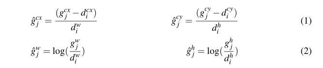

声明：本博客欢迎转发，但请保留原作者信息!

作者: [曹文龙]

博客： <https://cwlseu.github.io/>

## 引言

最近在写论文，用到latex进行编写，latex真是编辑神器，科研工作者 必备啊，在这向唐纳德*克努斯先生致敬。当年先生写《计算机程序设计的艺术》，感觉这排版工具用得太不爽了，就手撸一把,Tex就被撸出来了，而且版本号为数字PI的截断表示，听着更牛掰的是悬赏bug, 指数级悬赏bug，还带签名哦。

## 环境搭建
安装采用[CTEX]<http://www.ctex.org/CTeXDownload> 或者其他版本的都行，编辑采用Sublime Text 3， 同时安装Markdown Preview、MarkdownEditing、MarkdownHightlighting等插件，让我编辑Markdown的过程中感觉很舒适。

## Latex简介

```latex
\documentclass[12pt]{article} %声明要使用的类型为article，或者book
\usepackage{xxxx}
\begin{chinesetitle}
\title{Latex入门}
\author{cwlseu}
\date{}
\end{chinesetitle}
\begin{document}
	\maketitle
	\begin{abstract}
This is abstract
\end{abstract}
\section{Introduction}
	\subsection{Research In China}
	\subsection{Research In American}
\section{Method}
	\subsection{Assumption}
	\subsection{Deductive}
	\subsection{Objective}
\section{Experience}
	\subsection{DataSet}
	\subsection{TrainResult}
	\subsection{xxxx}
\section{Discussion}
	\subsection{No}
\begin{acknowledgement}

\end{acknowledgement}
\begin{Reference}
\end{Reference}
这是Latex册是测试，虽然当前不支持Chinese Charater
\end{document}
```

### 注释
1.  % 注释，如果想显示%，则 \%
2.  Document Class 文件类型
	Predefined Formats(article, report, book)
3. \footnode{下角标注释}
4. \newpage
5. 表格 

```latex
\documentclass{article}

\usepackage{booktabs} % Allows the use of \toprule, \midrule and \bottomrule in tables for horizontal lines

\begin{document}

\begin{table} % Add the following just after the closing bracket on this line to specify a position for the table on the page: [h], [t], [b] or [p] - these mean: here, top, bottom and on a separate page, respectively
\centering % Centers the table on the page, comment out to left-justify
\begin{tabular}{l c c c c c} % The final bracket specifies the number of columns in the table along with left and right borders which are specified using vertical bars (|); each column can be left, right or center-justified using l, r or c. To specify a precise width, use p{width}, e.g. p{5cm}
\toprule % Top horizontal line
& \multicolumn{5}{c}{Growth Media} \\ % Amalgamating several columns into one cell is done using the \multicolumn command as seen on this line
\cmidrule(l){2-6} % Horizontal line spanning less than the full width of the table - you can add (r) or (l) just before the opening curly bracket to shorten the rule on the left or right side
Strain & 1 & 2 & 3 & 4 & 5\\ % Column names row
\midrule % In-table horizontal line
GDS1002 & 0.962 & 0.821 & 0.356 & 0.682 & 0.801\\ % Content row 1
NWN652 & 0.981 & 0.891 & 0.527 & 0.574 & 0.984\\ % Content row 2
PPD234 & 0.915 & 0.936 & 0.491 & 0.276 & 0.965\\ % Content row 3
JSB126 & 0.828 & 0.827 & 0.528 & 0.518 & 0.926\\ % Content row 4
JSB724 & 0.916 & 0.933 & 0.482 & 0.644 & 0.937\\ % Content row 5
\midrule % In-table horizontal line
\midrule % In-table horizontal line
Average Rate & 0.920 & 0.882 & 0.477 & 0.539 & 0.923\\ % Summary/total row
\bottomrule % Bottom horizontal line
\end{tabular}
\caption{Table caption text} % Table caption, can be commented out if no caption is required
\label{tab:template} % A label for referencing this table elsewhere, references are used in text as \ref{label}
\end{table}

A reference to Table \ref{tab:template}.

\end{document}
```

 6. 编写公式
 * $$A_{ij} = B_{ij} + C_{ij}$$
 * $5^2 = 3^2 + 4^2$
 * $x = \frac{1+ 4ab}{\sqrt{a^2 + b^2}}$
 * $$CaCO_3 + 2HCl = CaCl_2 + H_2O + CO_2\uparrow$$
 * $$Na_2CO_3 + Ca(OH)_2 = CaCO_3\downarrow +2 NaOH$$

## 一些经验总结

### 双栏带编号的公式
```latex
\begin{align}
& \hat{g}^{cx}_j =\frac{(g_j^{cx} - d_i^{cx})}{d_i^w} & \hat{g}^{cy}_j =\frac{(g_j^{cy} - d_i^{cy})}{d_i^h} & \\
& \hat{g}^{w}_j =\log(\frac{g_j^w}{d_i^w}) & \hat{g}^{h}_j =\log(\frac{g_j^h}{d_i^h}) & 
\end{align}
```
显示出来是这样子的

### label让交叉引用更方便
```latex
\subsection{Training}
\label{sec:training}
或者
\begin{figure}[htb]        
   \center{\includegraphics[width=\textwidth]{images/b.png}}      
   \caption{}
   \label{fig:b}
\end{figure}
```
引用的时候`\ref{fig:b}`或者`\ref{sec:training}`就可以了。

## 下载网址
1. [CTEX](http://www.ctex.org/CTeXDownload)
2. [中科院毕业论文模板](http://www.ctex.org/PackageCASthesis)
3. [IEEE 会议论文模板](http://www.ieee.org/conferences_events/conferences/publishing/templates.html)