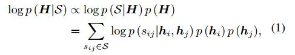
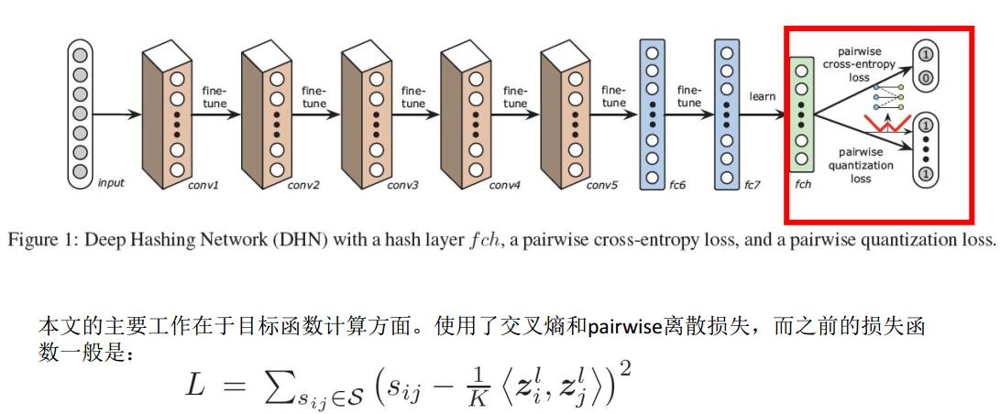
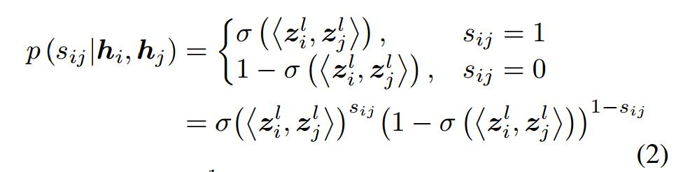
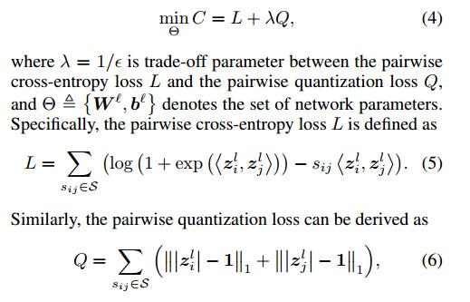

声明：本博客欢迎转发，但请保留原作者信息!                                      
作者: [曹文龙]                                                                 
博客： <https://cwlseu.github.io/>                                                  

## 引言
进行图像搜索引擎加速，不得不提到hash算法。之前的有很多基于监督的hash算法是基于在现有的特征的基础上进行hash函数的学习。现在图像引入神经网络，这个两个过程就被结合到一起了。CNNH可以说是首先将hash函数学习融入到神经网路中的先驱。这不后来就出现了Deep hashing Network

## 文章来源
[deep-hashing-network-aaai16]<http://ise.thss.tsinghua.edu.cn/~mlong/doc/deep-hashing-network-aaai16.pdf>
[]<https://arxiv.org/pdf/1504.03410.pdf>

> 本课题的主要目标
学习一个非线线性的hash函数$f:x |-> h \isa {-1, 1}^K$，使得可以使用k-bit的hash 码表示x, x是R^n空间的一点。同时应该满足保持点对之间的相似性。

## 主要贡献
1. a fully-connected hashing layer to generate compact binary hash
codes;
2. a pairwise crossentropy loss layer for similarity-preserving learning
3. a pairwise quantization loss for controlling hashing quality

## 架构图

## DataSet
**NUS-WIDE1** is a public web image dataset. We follow the settings in (Liu et al. 2011; Lai et al. 2015) and use the subset of 195,834 images that are associated with the 21
most frequent concepts, where each concept consists of at least 5,000 images.
**CIFAR-10** is a dataset containing 60,000 color images in 10 classes, and each class has 6,000 images in size 32×32.
**Flickr3** consists of 25,000 images collected from Flickr, where each image is labeled with one of the 38 semantic concepts.

## 后续论文
[Liong_Deep_Hashing_for_2015_CVPR_paper](http://www.cv-foundation.org/openaccess/content_cvpr_2015/papers/Liong_Deep_Hashing_for_2015_CVPR_paper.pdf)
[Simultaneous Feature Learning and Hash Coding with Deep Neural Networks](https://arxiv.org/pdf/1504.03410.pdf)