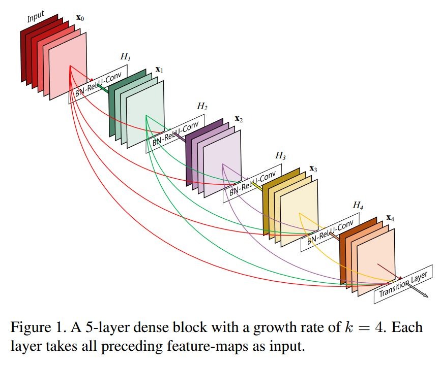
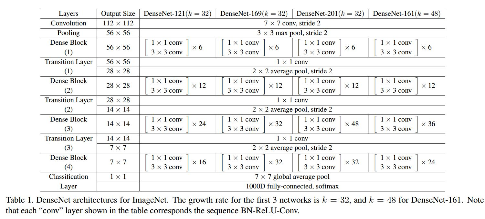
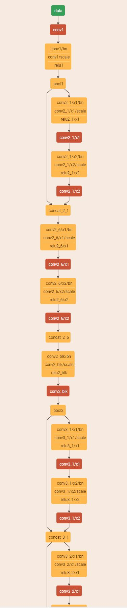
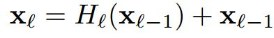
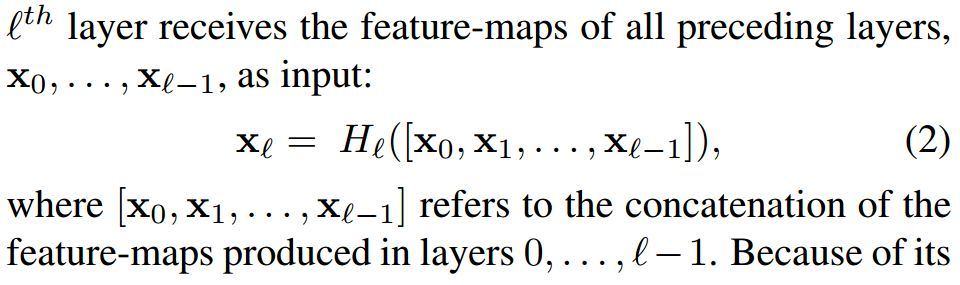
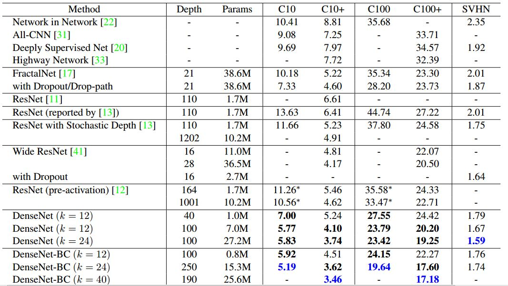
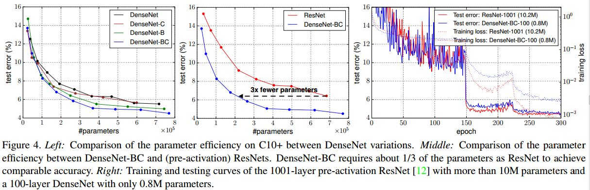
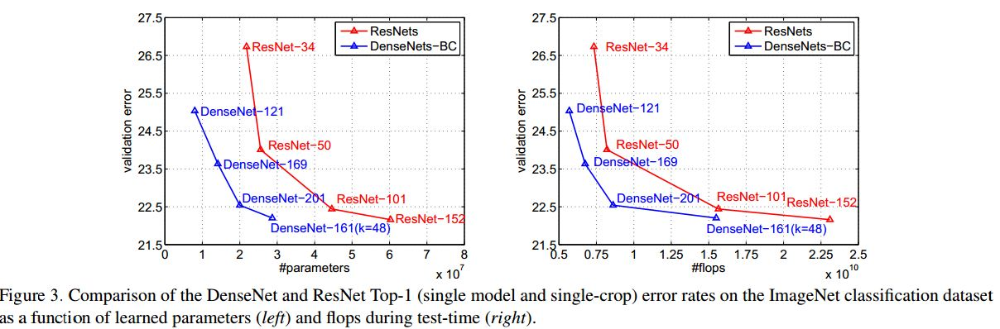
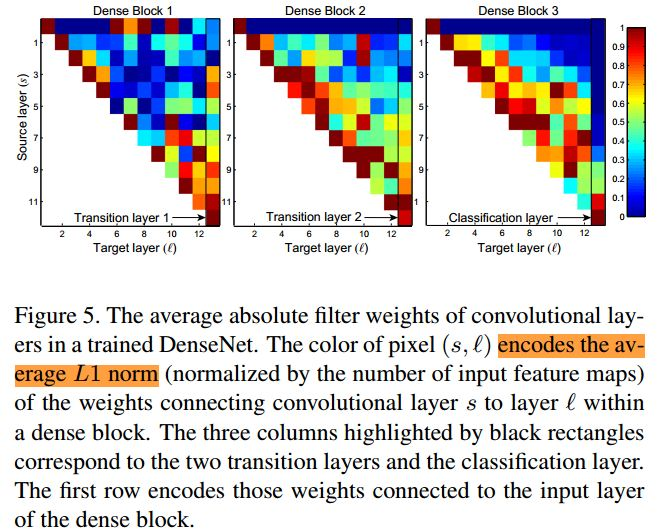

声明：本博客欢迎转发，但请保留原作者信息!                            
作者: [曹文龙]                                                                 
博客： <https://cwlseu.github.io/>

## 文章来源

[arxiv](https://arxiv.org/abs/1608.06993)          
[torch代码地址](https://github.com/liuzhuang13/DenseNet)           
[caffe模型地址](https://github.com/shicai/DenseNet-Caffe)                         

## 突出贡献

<!--  -->

    In this paper, we propose an architecture that distills this insight into a simple connectivity pattern: to ensure maximum information flow between layers in the network, we connect all layers (with matching feature-map sizes) directly with each other. To preserve the feed-forward nature, each layer obtains additional inputs from all preceding layers and passes on its own feature-maps to all subsequent
    layers. Crucially, in contrast to ResNets, we never combine features
    through summation before they are passed into a layer; instead, we combine features by concatenating them.

## 模型

对其中的121层的模型进行显示，如下图所示。为了显示得更多，我对其中第二个DenseBlock变为只剩头和尾的部分，第三层的也是如同处理。

## 残差网关键技术
关键是ResBlock的理解。传统卷积网络就是l层向前卷积，结果作为l+1层的输入。ResNet中添加了一个skip-connnection连接l层和l+1层。如下共计算公式：

## 稠密网关键技术
这里是采用串联的方式组合特征，这就要求各层特征图X0， X1...Xl-1的大小是一样的。

H()是一个composite function，是三个操作的组合

    BN->ReLU->Conv(3x3)

而Pooling操作会改变特征图的大小。因此就在采用VGG中的卷积栈的想法。每一块被称为DenseBlock, Block之间的层称为Transition Layers:

    DenseBlock特征输出->BN->Conv(1x1)->AvePooling(2x2)

## Growth rate
由于每个层的输入是所有之前层输出的连接，因此每个层的输出不需要像传统网络一样多。
稠密网中的每个denseblock单元中，每层产生特征的个数为k的话，那么第l层将有kx(l-1) + k0个输入特征。
虽然说每个层只产生k个输出，但是后面层的输入依然会很多，因此引入了**Bottleneck layers** 。本质上是引入1x1的卷积层来减少输入的数量，Hl的具体表示如下:

    BN−>ReLU−>Conv(1×1)−>BN−>ReLU−>Conv(3×3)

文中将带有Bottleneck layers的网络结构称为*DenseNet-B*。
除了在DenseBlock内部减少特征图的数量，还可以在**transition layers**中来进一步压缩。如果一个DenseNet有m个特征图的输出，则transition layer产生 ⌊θm⌋个输出，其中0<θ≤1。对于含有该操作的网络结构称为*DenseNet-C*。

同时包含**Bottleneck layer**和**Compression**的网络结构为*DenseNet-BC* 

## 效果

### 分类错误率

L表示网络深度，k为增长率。蓝色字体表示最优结果，+表示对原数据库进行data augmentation。可以发现DenseNet相比ResNet可以取得更低的错误率，并且使用了更少的参数。 

**数据集合**
1. CIFAR
    C10指的CIFAR-10, C100为CIFAR-100
2. SVHN. 
    The Street View House Numbers (SVHN) dataset
    contains 32×32 colored digit images coming from
    Google Street View. The task is to classify the central digit into the correct one of the 10 digit classes. There are 73,257 images in the training set, 26,032 images in the test set, and 531,131 images for additional training. 
3. ImageNet. 
    The ILSVRC 2012 classification dataset consists 1.2 million images for training, and 50,000 for validation, and each image is associated with a label from 1000 predefined classes.
**数据增益的方法** the images are first zero-padded with 4 pixels on each side, then randomly cropped to again produce 32×32 images;half of the images are then horizontally mirrored.

### 参数规模和训练收敛效率

前两组描述分类错误率与参数量的对比，从第二幅可以看出，在取得相同分类精度的情况下，DenseNet-BC比ResNet少了2/3的参数。第三幅图描述含有10M参数的1001层的ResNet与只有0.8M的100层的DenseNet的训练曲线图。可以发现ResNet可以收敛到更小的loss值，但是最终的test error与DenseNet相差无几。再次说明了DenseNet参数效率（Parameter Efficiency）很高！

### 计算量

右图使用FLOPS来说明计算量。通过比较ResNet-50，DenseNet-201，ResNet-101，说明计算量方面，DenseNet结果更好。

### DenseNet信息量分析

For each convolutional layer l within a block, we compute the average (absolute) weight assigned to connections with layer s. 上图 shows a heatmap for all three dense blocks. 

    The average absolute weight serves as a surrogate for the dependency of a convolutional layer on its preceding layers.

    1. All layers spread their weights over many inputs within
    the same block. This indicates that features extracted
    by very early layers are, indeed, directly used by deep
    layers throughout the same dense block.
    2. The weights of the transition layers also spread their
    weight across all layers within the preceding dense
    block, indicating information flow from the first to the
    last layers of the DenseNet through few indirections.
    3. The layers within the second and third dense block
    consistently assign the least weight to the outputs of
    the transition layer (the top row of the triangles), indicating that the transition layer outputs many redundant features (with low weight on average). This is in
    keeping with the strong results of DenseNet-BC where
    exactly these outputs are compressed.
    4. Although the final classification layer, shown on the
    very right, also uses weights across the entire dense block, there seems to be a concentration towards final
    feature-maps, suggesting that there may be some more
    high-level features produced late in the network

1. 一个densenet block中的，靠前的层提取的特征，直接被后面的层使用。
2. transition layers中使用的特征，是来自densenetblock中的中的所有层的。
3. 第二和第三 block中第一行显示，上一个block输出的特征中有大量的冗余信息。因此Densenet-BC就是这么来的

## 小结
DenseNet有如下优点： 
* 有效解决梯度消失问题 
* 强化特征传播 
* 支持特征重用 
* 大幅度减少参数数量

## 想法

1. 其实无论是ResNet还是DenseNet，核心的思想都是HighWay Nets的思想： 
就是skip connection,对于某些的输入不加选择的让其进入之后的layer(skip)，从而实现信息流的整合，避免了信息在层间传递的丢失和梯度消失的问题(还抑制了某些噪声的产生).

2. 利用DenseNet block实现了将深度网络向着浅层但是很宽的网络方向发展。