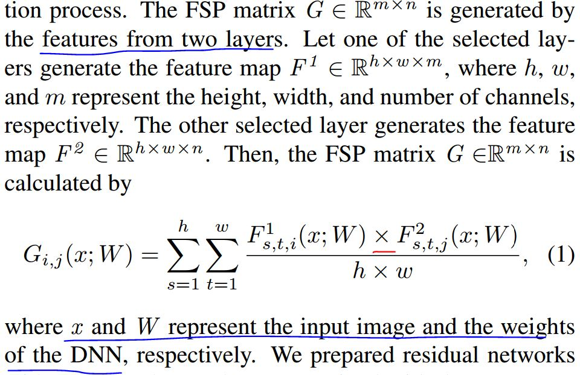
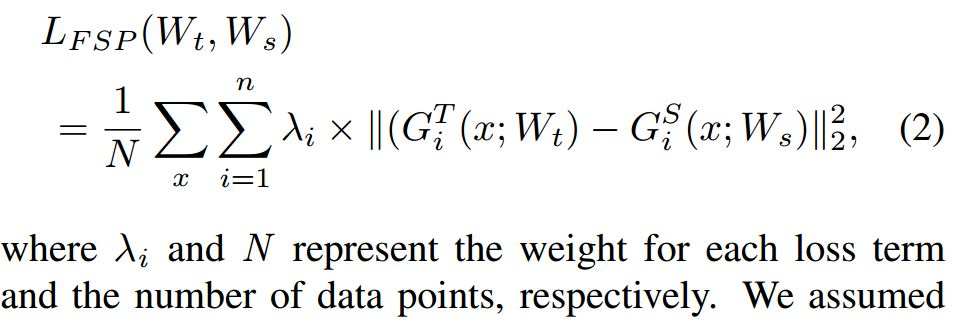
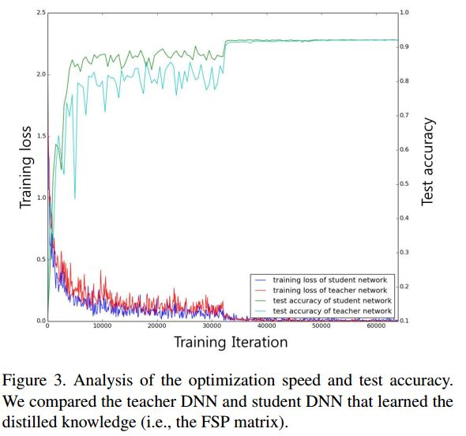

声明：本博客欢迎转发，但请保留原作者信息!                            
作者: [曹文龙]                                                                 
博客： <https://cwlseu.github.io/>

## 来源

[CVPR2017](https://cgv.kaist.ac.kr/sigmi/data/CVPR2017.pdf)

## 名词解释

**迁移学习**

迁移学习的效果与知识的表示是很相关的。

> Because a DNN uses many layers sequentially to map from the input space to the output space, the flow of solving a problem can be defined as the relationship between features from two layers.

[**Gramian Matrix格莱姆矩阵**](https://en.wikipedia.org/wiki/Gramian_matrix)

Gramian矩阵是通过计算一组特征向量的内积进行生成的，包含了两个向量之间的方向关系，可以用来表示文理特征。

**FSP matrix**

> The extracted feature maps from two layers are used to generate the flow of solution procedure (FSP) matrix. The student DNN is trained to make its FSP matrix similar to that of the teacher DNN

本文中的FSP矩阵的计算与Gramian矩阵的计算是类似的。我们计算GramianMatrix是跨层计算的。而传统Gramian Matrix是在一个层内的features之间进行计算的。如下图所示。

## Model

> 如何计算FSP矩阵

> 如何优化FSP矩阵

首先是Teacher Network中生成的FSP矩阵，Gt_i (i = 1, ..n). Student Network 中生成了n个FSP矩阵，Gs_i (i=1,.. n). 然后Teacher和Student Network的FSP矩阵组成对(Gt_i, Gs_i), i = 1,2,...n

> 方法架构图

> Stage 1: 学习FSP矩阵

    Weights of the student and teacher networks: Ws, Wt
    1: Ws = arg minWs LFSP(Wt, Ws) # 就是上面优化FSP矩阵中提到的损失函数的优化

> Stage 2: 针对原始任务进行训练

    1: Ws = arg min Ws Lori(Ws)  # 例如是分类任务的话， 我们可以使用softmax交叉熵损失作为任务的损失函数进行学习和优化

## 实验

### **Fast Optimization**

从结果中可以看出student network比teacher network 收敛速度更快。 大概快了3倍。
###  **Network Minimization**

###  **Transfer Learning**

## 评测标准
>Recognition rates

>收敛速度

## 小结
本文利用使用两层featuremap 之间的关系表示为FSP。利用这种学习过程知识表示方法，在DNN加速方面有很的表现。并且这个方法还可以应用到迁移学习中。

## 参考文献

1. [MSRA:Delving Deep into Rectifiers:Surpassing Human-Level Performance on ImageNet Classification](http://blog.csdn.net/shuzfan/article/details/51347572)
 MSRA初始化是一个均值为0方差为2/n的高斯分布
