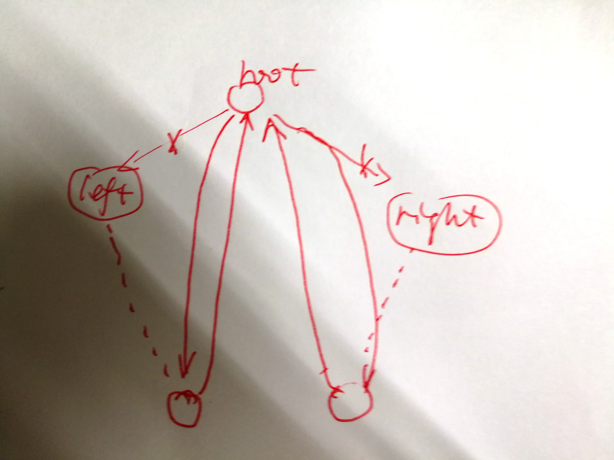

- 声明：本博客欢迎转发，但请保留原作者信息!
- 作者: [曹文龙]
- 博客： <https://cwlseu.github.io/>


## Node的定义
```cpp
struct TreeNode {
	int val;
	struct TreeNode *left;
	struct TreeNode *right;
	TreeNode(int x) :
			val(x), left(NULL), right(NULL) {
	}
};

struct ListNode {
	int val;
	struct ListNode *next;
	ListNode(int x) :
			val(x), next(NULL) {
	}
};

```
## 一些比较trick的问题

### 删除List中的一个节点
```cpp
bool delete_node(ListNode* curr)
{
	if(curr->next)
	{
		curr->val = curr->next->val;
		curr->next = curr->next->next;
		return true;
	}
	else
	{
		return false;
	}
}
```

## 将二叉树转化为双向链表


```cpp
/***************************************************************************
 *
 * 将一颗二叉树转化为双向链表的操作
 * 思路：
 * 采用中序遍历的想法的，对二叉树进行中序遍历，遍历过程就是最终的结果过程，然后将
 * 前后进行指针的重新设置即可。
 * 本题目主要考察递归和指针的操作
 *
 **************************************************************************/
class Solution {
public:
    TreeNode* Convert(TreeNode* pRootOfTree)
    {
        if(pRootOfTree == NULL) return pRootOfTree;
        pRootOfTree = ConvertNode(pRootOfTree);
        // 获取头节点的地址，最小的值对应的指针地址
        while(pRootOfTree->left) pRootOfTree = pRootOfTree->left;
        return pRootOfTree;
    }
    // 进行中序遍历
    TreeNode* ConvertNode(TreeNode* root)
    {
        if(root == NULL) return root;
		// 中序遍历左子树
        if(root->left)
        {
            TreeNode *left = ConvertNode(root->left);
            while(left->right) left = left->right;
            left->right = root;
            root->left = left;
        }
        // 中序遍历右子树
        if(root->right)
        {
            TreeNode *right = ConvertNode(root->right);
            while(right->left) right = right->left;
            right->left = root;
            root->right = right;
        }
        return root;
    }
};
```

## 从链表中查找倒数Kth个

本题的思路就是通过两个指针，一个快一个慢，中间相差k个，当其中快指针指向结尾的时候，慢指针指向的位置就是所求。

```cpp
class Solution {
public:
    ListNode* FindKthToTail(ListNode* pListHead, unsigned int k) {  
    	ListNode* fast = pListHead;
    	int i = k;
    	while(fast && i > 0)
    	{
    		fast = fast->next;
    		i--;
    	}
    	if(i != 0) return NULL;

    	ListNode* slow = pListHead;
    	while(fast && slow)
    	{
    		fast  = fast->next;
    		slow = slow->next;
    	}
    	return slow;
    }
};
```