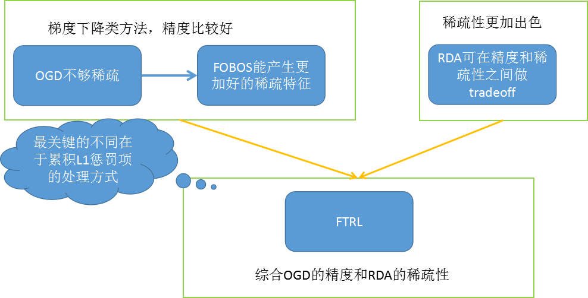

## 引言
现在做在线学习和CTR常常会用到逻辑回归(LR)，而传统的批量(Batch)算法无法有效地处理超大规模的数据集和在线数据流，Google先后三年时间（2010年-2013年）从理论研究到实际工程化实现的FTRL(Follow-the-regularized-Leader)算法，在处理诸如逻辑回归之类的带非光滑正则化项（例如1范数，做模型复杂度控制和稀疏化）的凸优化问题上性能非常出色，据闻国内各大互联网公司都第一时间应用到了实际产品中，项目中要使用FTRL进行点击率预测，准备系统的学习一下，同时后面还要用parameter server进行模型训练。
[Ad Click Prediction: a View from the Trenches](https://static.googleusercontent.com/media/research.google.com/zh-CN//pubs/archive/41159.pdf)

##  背景

### 问题
结构风险最小化的优化问题：

$$\hat{w} = arg min_w \sum_{i=1}^n L(w, z_i)+ g\|w\|_1$$
$$\hat{w} = arg min_w \sum_{i=1}^n{L(w, z_i)}$    **subject to**  $\|w\|_1 \le s$$

### 批量训练算法
批量算法中每次迭代对全体训练数据集进行计算（例如计算全局梯度），优点是精度和收敛还可以，缺点是无法有效处理大数据集（此时全局梯度计算代价太大），且没法应用于数据流做在线学习。这里分无约束优化形式和约束优化（与上面问题描述可以对应起来）两方面简单介绍一下一些传统批量算法。

#### 无约束梯度下降
1. 全局梯度下降
$$x_{t+1} = x_t - \eta\nabla f(x_t) $$
每一步求一个目标函数的全局梯度，用非增的学习率进行迭代
2. 牛顿法， LBFGS(割线拟牛顿)
牛顿和拟牛顿等方法一般对于**光滑的正则约束项**（例如2范数）效果很好，据说是求解2范数约束的逻辑回归类问题最好的方法，应用也比较广，但是当目标函数带L1非光滑、带不可微点的约束项后，牛顿类方法比较无力，理论上需要做修改。
#### 不等式约束凸优化形式

### 在线算法
批量算法有自身的局限性，而在线学习算法的特点是：每来一个训练样本，就用该样本产生的loss和梯度对模型迭代一次，一个一个数据地进行训练，因此可以处理大数据量训练和在线训练。常用的有在线梯度下降（OGD）和随机梯度下降（SGD）等，本质思想是对上面【问题描述】中的未加和的单个数据的loss函数 L（w，zi)做梯度下降，因为每一步的方向并不是全局最优的，所以整体呈现出来的会是一个看似随机的下降路线。
$$w_{t+1} = \pi_C(w_t - \alpha_t(g_t + \xi_t))$$

> 梯度下降类的方法的优点是精度确实不错，但是不足主要两点：

1. 简单的在线梯度下降很难产生**真正稀疏的解**，稀疏性在机器学习中是很看重的事情，尤其我们做工程应用，稀疏的特征会大大减少predict时的内存和复杂度。这一点其实很容易理解，说白了，即便加入L1范数（L1范数能引入稀疏解的简单示例可以产看PRML那本书的第二章），因为是浮点运算，训练出的w向量也很难出现绝对的零。到这里，大家可能会想说，那还不容易，当计算出的w对应维度的值很小时，我们就强制置为零不就稀疏了么。对的，其实不少人就是这么做的，后面的Truncated Gradient和FOBOS都是类似思想的应用；

2. 对于不可微点的迭代会存在一些问题，具体有什么问题，有一篇paper是这么说的：the iterates of the subgradient method are very rarely at the points of non-differentiability。我前后看了半天也没看明白，有熟悉的同学可以指导一下。

## Truncate Gradient, FOBOS, RDA(Regularized Dual Averaging)

### 常见的三种做稀疏解的途径

1.  L1 范数
float数据很难绝对等于0，无法产生真正的稀疏的特征权重
2.  L1范数基础上做截断
最直观没技术含量的思路，那就设定一个阈值，做截断来保证稀疏，可以结合L1范数。简单截断方法，每online训练K个数据截断一次，对OGD的迭代结果，每K步做一次截断置零：
$$f(w_i) = T_0(w_i - \eta\nabla_1L(w_i, z_i), \theta)$$

$$ T_0(v_j, \theta) = 
   \begin{cases}
    0       & \quad \text{if } |v_j| \le \theta\\
    v_j  & \quad \text{otherwise }\\
  \end{cases} $$

但是简单截断方法有问题：权重小，可能是确实是无用特征，还或者**可能是该特征才刚被更新一次**（例如训练刚开始的阶段、或者训练数据中包含该特征的样本数本来就很少），另外，简单rounding技术太aggressive了，可能会破坏在线训练算法的理论完备性。

$$f(w_i) = T_1(w_i - \eta\nabla_1L(w_i, z_i), \eta g_i, \theta)$$

$$ T_1(v_j, \alpha,\theta) = 
   \begin{cases}
    max(0, v_j - \alpha) & \quad \text{if } v_j  \in   [0, \theta]   \\
    min(0, v_j + \alpha) & \quad \text{if } v_j \in  [-\theta, 0]    \\
    v_j                  & \quad \text{otherwise}   \\
  \end{cases} $$

3. Black-box wrapper approaches
* 黑盒的方法去除一些特征，然后重新训练的看被消去的特征是否有效。
* 需要在数据集上对算法跑多次，不太实用

### FOBOS: google & UC Berkley 2009
基本思想：跟projected subgradient方法类似，不过将每一个数据的迭代过程，分解成一个经验损失梯度下降迭代和一个最优化问题。分解出的第二个最优化问题，有两项：第一项2范数那一项表示不能离第一步loss损失迭代结果太远，第二项是正则化项，用来限定模型复杂度抑制过拟合和做稀疏化等。这个最优化问题有一些特殊的性质，从而保证了最终结果的稀疏性和理论上的完备，具体细节感兴趣的可以查看对应paper。

$$w_{t+\frac{1}{2}} = w_t - \eta_t g_t^f$$
$$w_{t+1} = argmin_w \{\frac{1}{2} \|w - w_{t+\frac{1}{2}}\|^2 + \eta_{t + \frac{1}{2}} r(w)\} $$

### Regularized dual averaging (RDA), 微软10年工作
上面的简单截断、TG、FOBOS都还是建立在SGD的基础之上的，属于梯度下降类型的方法，这类型方法的优点就是精度比较高，并且TG、FOBOS也都能在稀疏性上得到提升。还有一类算法，如RDA也可以有效提升特征权重稀疏性。

#### 原理
$ W_{t+1} = arg min_W \{\frac{1}{t}\sum_{r=1}^{t} G^r + \Psi(W) + \frac{\beta^t}{t}h(W)\}$  公式（3-1）
其中本公式由三部分组成：
$\frac{1}{t}\sum_{r=1}^{t} G^r$包含了之前所有的梯度的平均值；正则化项$\Psi(W)$和额外正则化项目$\frac{\beta^t}{t}h(W)$是一个严格凸函数。
$\{\beta^t | t \ge 1\}$是一个非负非自减序列。

#### L1-RDA
在L1正则化下，RDA中的特征权重更新具有什么样的形式以及如何产生稀疏性。令$\Psi(W) = \lambda\|W\|_1$，由于$h(W)$是关于W的严格凸函数，不妨我们设$h(W) = \frac{1}{2}\|W\|^2_2$，此外将非负非自减序列$\{\beta^t | t \ge 1\}$定义为$\beta^t=\gamma\sqrt t$,将正则化项代入之前的公式中

$$ W_{t+1} = arg min_W \{\frac{1}{t}\sum_{r=1}^{t} G^r +  \lambda\|W\|_1 +  \frac{\gamma}{2\sqrt t} \|W\|^2_2\}$$ 
公式（3-2）
直接求解上式看上去非常困难，但是我们可以仿照上一篇FOBOS中采用的方法，针对特征权重的各个维度将其拆解成N个独立的标量最小化问题：

$$ w_{t+1} = arg min_{w_i \in R} \{\overline{g}_i^t +  \lambda|w| +  \frac{\gamma}{2\sqrt t} w_i^2\}$$    
公式（3-3）

如果我们定义$\xi \in \partial|w_i^*|$为$|w_i|$在$w*$的次导数，那么有公式（3-4）

$$ \partial|w_i^*| = 
   \begin{cases}
    \{-1 \lt \xi \lt 1\} & \quad \text{if } w_i^* = 0   \\
   {1} & \quad \text{if }  w_i^* \gt 0   \\
    {-1}                  & \quad \text{otherwise}   \\
  \end{cases} $$

如果对公式（3-3）求导，并令导数为0，则
$\overline{g}_i^t +  \lambda \xi +  \frac{\gamma}{\sqrt t} w_i = 0$

由于$\lambda  \gt 0$针对公式(3-5)分情况讨论，最终可得更新方法：

$$ w_i^{t+1} = 
   \begin{cases}
    0  & \quad \text{if }  | \overline{g}_i^t | \gt 0   \\
    -\frac{\sqrt \lambda}{\gamma}(\overline{g}_i^t  - \lambda sgn(\overline{g}_i^t ))    & \quad \text{otherwise}   \\
 \end{cases} $$

这里我们发现，当某个维度上累积梯度平均值的绝对值$|\overline{g}_i^t |$小于阈值的时候，该维度权重将被置0，特征权重的稀疏性由此产生。

#### L1-RDA与FOBOS比较

在L1-FOBOS中，进行“截断”的判定条件是$|w_i^t - \eta^tg_i^t|\le \lambda^t = \eta^{t+\frac{1}{2}}\lambda$。通常会定义$\eta$为的$\frac{1}{\sqrt t}$正相关函数$\eta = \Theta(\frac{1}{\sqrt{t}})$，因此L1-FOBOS的“截断阈值”为$ \Theta(\frac{1}{\sqrt{t}})$，随着$t$的增加，这个阈值会逐渐降低。

相比较而言，从公式(3-6)可以看出，L1-RDA的“截断阈值”为$\lambda$，是一个常数，并不随着$t$而变化，因此可以认为L1-RDA比L1-FOBOS在截断判定上更加aggressive，这种性质使得L1-RDA更容易产生稀疏性；此外，RDA中判定对象是梯度的累加平均值，不同于TG或L1-FOBOS中针对单次梯度计算的结果进行判定，避免了由于某些维度由于训练不足导致截断的问题。并且通过调节一个参数，很容易在精度和稀疏性上进行权衡。

#### RDA小结

* **非梯度下降**类方法，属于更加通用的一个primal-dual algorithmic schema的一个应用
* 克服了SGD类方法所欠缺的exploiting problem structure，especially for problems with explicit regularization。
* 能够更好地在精度和稀疏性之间做权衡

[RDA 在线学习算法博客](http://www.cnblogs.com/luctw/p/4757943.html)

## FTRL (Follow the regularized leader)

### OGD

OGD迭代公式的等价优化问题的含义：
每次新的结果不要太远离之前的结果
每一步还是要向正确的方向前进（梯度or子梯度方向）

- 10年理论，未显示支持正则化项迭代
- 11年证明 regret bound以及引入通用正则化项；同年，另一篇paper揭露OGD, FOBOS, RDA等算法与FTRL关系
- 13年给出工程实现性的paper和伪代码，被大规模应用

## 参考文献

[1] J. Langford, L. Li, and T. Zhang. Sparse online learning via truncated gradient.JMLR, 10, 2009. （截断梯度的paper）

[2] H. B. McMahan. Follow-the-regularized-leader and mirror descent: Equivalence theorems and L1 regularization. In AISTATS, 2011 （FOBOS、RDA、FTRL等各种方法对比的paper）

[3] L. Xiao. Dual averaging method for regularized stochastic learning and online optimization. In NIPS, 2009 （RDA方法）

[4] J. Duchi and Y. Singer. Efficient learning using forward-backward splitting. In Advances in Neural Information Processing Systems 22, pages 495{503. 2009. （FOBOS方法）

[5] H. Brendan McMahan, Gary Holt, D. Sculley, Michael Young, Dietmar Ebner, Julian Grady, Lan Nie, Todd Phillips, Eugene Davydov, Daniel Golovin, Sharat Chikkerur, Dan Liu, Martin Wattenberg, Arnar Mar Hrafnkelsson, Tom Boulos, Jeremy Kubica, Ad Click Prediction: a View from the Trenches, Proceedings of the 19th ACM SIGKDD International Conference on Knowledge Discovery and Data Mining (KDD) (2013) （这篇是那篇工程性的paper）

[6] H. Brendan McMahan. A unied analysis of regular-ized dual averaging and composite mirror descent with implicit updates. Submitted, 2011 （FTRL理论发展，regret bound和加入通用正则化项）

[7] H. Brendan McMahan and Matthew Streeter. Adap-tive bound optimization for online convex optimiza-tion. InCOLT, 2010 （开始的那篇理论性paper）

[8]. 在线学习算法发展简介http://blog.csdn.net/china1000/article/details/51176654

[9]. https://www.zhihu.com/question/55468616