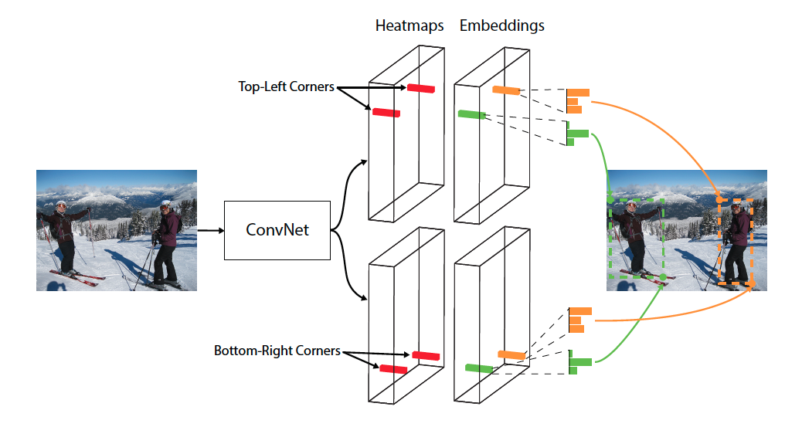

- 声明：本博客欢迎转发，但请保留原作者信息!
- 作者: [曹文龙]
- 博客： <https://cwlseu.github.io/>     

## CornerNet：目标检测算法新思路
“密歇根大学Hei Law等人在发表ECCV2018的一篇论文，提出CornerNet模型预测目标边界框的左上角和右下角一对顶点，即使用单一卷积模型生成热点图和连接矢量。 ”

http://www.cvmart.net/community/article/detail/315
https://github.com/umich-vl/CornerNet

## 最佳论文：基于解剖结构的面部表情生成
GANimation 提出了一种新颖的 GAN 模型，用于脸部表情渐进生成，可以实现无监督训练。模型通过 AU 参数化与解剖学面部变形是一致的，

在这些 AU 上调整 GAN 模型允许生成器通过简单插值来渲染各种表情幅度。此外，作者在网络中嵌入了一个注意模型，对背景和光照有一定的补充。

源码地址：https://github.com/albertpumarola/GANimation

项目地址： http://www.albertpumarola.com/research/GANimation/index.html

文章下载：http://www.albertpumarola.com/publications/files/pumarola2018ganimation.pdf

[1]. Choi, Y., Choi, M., Kim, M., Ha, J.W., Kim, S., Choo, J.: Stargan: Unified gen- erative adversarial networks for multi-domain image-to-image translation. CVPR (2018)

[2]. Gulrajani, I., Ahmed, F., Arjovsky, M., Dumoulin, V., Courville, A.C.: Improved training of wasserstein GANs. In: NIPS (2017)

附录：人体姿态检测

 Stacked Hourglass算法详解   

 https://blog.csdn.net/shenxiaolu1984/article/details/51428392

https://arxiv.org/pdf/1603.06937
