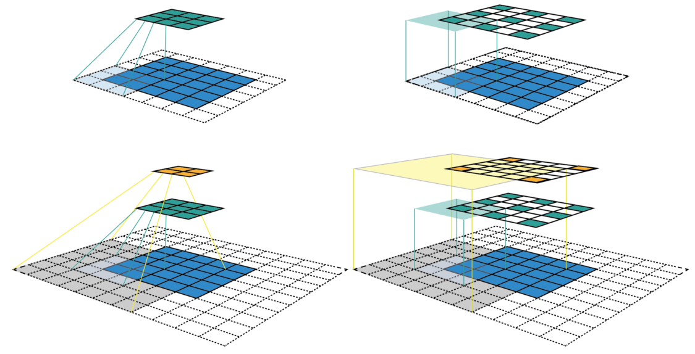
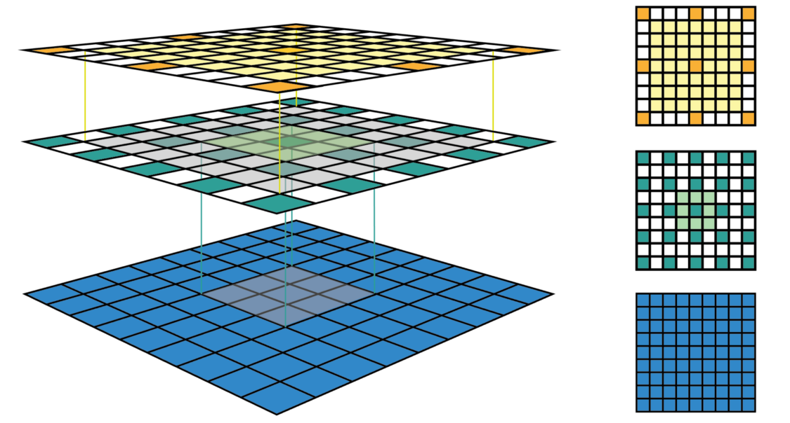
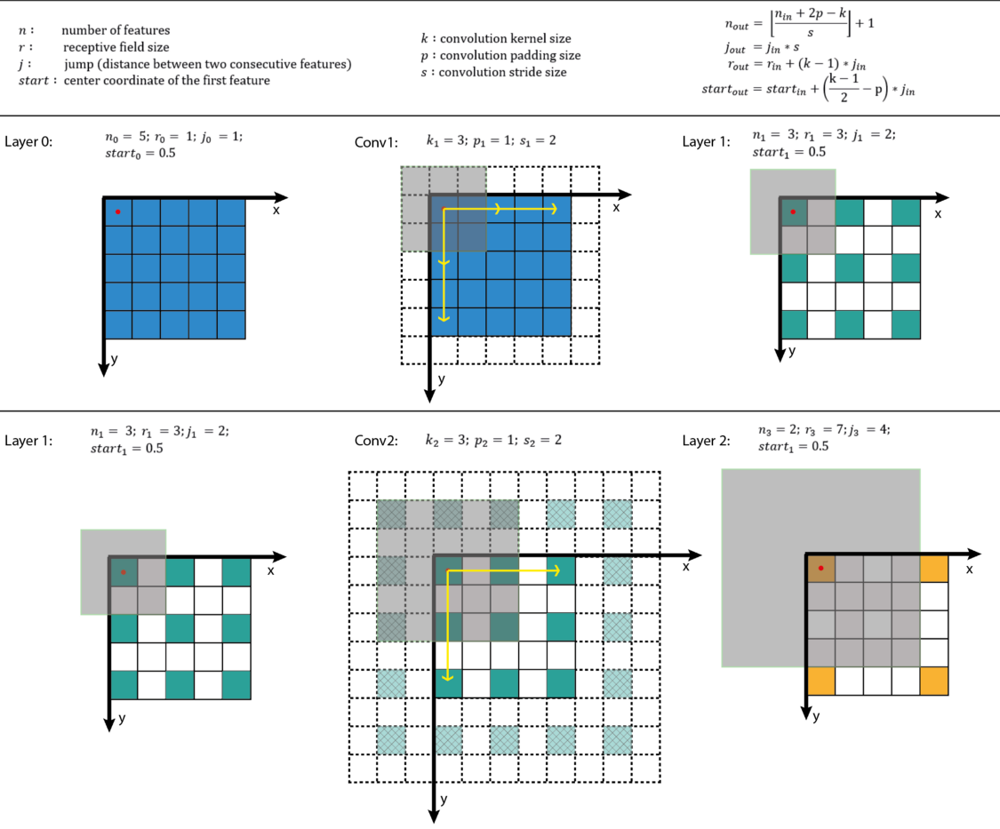

## 原文地址
翻译来源：[A guide to receptive field arithmetic for Convolutional Neural Networks](https://medium.com/@nikasa1889/a-guide-to-receptive-field-arithmetic-for-convolutional-neural-networks-e0f514068807)

看这篇博客之前希望对CNN的基本概念有所了解，尤其是卷积和pooling操作。也可以看 "[A guide to convolution arithmetic for deep learning [1]](https://arxiv.org/pdf/1603.07285.pdf)"来回顾一下. 这篇博客和该文章是想通的。

## The fixed-sized CNN feature map visualization
 By applying a convolution C with kernel size k = 3x3, padding size p = 1x1, stride s = 2x2 on an input map 5x5, we will get an output feature map 3x3 (green map).
我们假设一次叫做C的卷积过程中，输入图像大小为5x5，卷积核k=3x3，padding大小 p = 1, 步长 s = 2.



上行： 采用上述卷积C过程进行操作，产生一个3x3的特征
下行： 在上面产生的特征基础上继续采用样相同的卷积过程C，产生一个2x2的特征图
左栏: 我们只看特征图的时候，我们能够知道包含多少个特征，但是根本不能够指导1个特征值表示的感受野范围是多少。对于深度神经网络中跟踪感受野信息是不可能的。
右栏：特定featuremap大小的时候，特征值在感受野的中心位置。我们能够指导感受野的范围和位置。因为每个感受野大小是一定的，我们讷讷个够通过简单的计算确定感受野范围。
Each feature is then marked at the center of its receptive field location. Because all features in a feature map have the same receptive field size, we can simply draw a bounding box around one feature to represent its receptive field size. We don’t have to map this bounding box all the way down to the input layer since the feature map is already represented in the same size of the input layer. Figure 2 shows another example using the same convolution but applied on a bigger input map — 7x7. We can either plot the fixed-sized CNN feature maps in 3D (Left) or in 2D (Right). Notice that the size of the receptive field in Figure 2 escalates very quickly to the point that the receptive field of the center feature of the second feature layer covers almost the whole input map. This is an important insight which was used to improve the design of a deep CNN.


## Receptive Field Arithmetic
To calculate the receptive field in each layer, besides the number of features n in each dimension, we need to keep track of some extra information for each layer. These include the current receptive field size r , the distance between two adjacent features (or jump) j, and the center coordinate of the the upper left feature (the first feature) start. Note that the center coordinate of a feature is defined to be the center coordinate of its receptive field, as shown in the fixed-sized CNN feature map above. When applying a convolution with the kernel size k, the padding size p, and the stride size s, the attributes of the output layer can be calculated by the following equations:


The first equation calculates the number of output futures based on the number of input features and the convolution properties. This is the same equation presented in [1].
The second equation calculates the jump in the output feature map, which is equal to the jump in the input map times the number of input features that you jump over when applying the convolution (the stride size).
The third equation calculates the receptive field size of the output feature map, which is equal to the area that covered by k input features (k-1)*j_in plus the extra area that covered by the receptive field of the input feature that on the border.
The fourth equation calculates the center position of the receptive field of the first output feature, which is equal to the center position of the first input feature plus the distance from the location of the first input feature to the center of the first convolution (k-1)/2*j_in minus the padding space p*j_in. Note that we need to multiply with the jump of the input feature map in both cases to get the actual distance/space.
The first layer is the input layer, which always has n = image size, r = 1, j = 1, and start = 0.5. Note that in Figure 3, I used the coordinate system in which the center of the first feature of the input layer is at 0.5. By applying the four above equations recursively, we can calculate the receptive field information for all feature maps in a CNN. Figure 3 shows an example of how these equations work.

为了方便理解感受野的计算，专门写了一个python脚本。其中的CNN结构是根据AlexNet进行设定的。来看看结果。


```python
# [filter size, stride, padding]
#Assume the two dimensions are the same
#Each kernel requires the following parameters:
# - k_i: kernel size
# - s_i: stride
# - p_i: padding (if padding is uneven, right padding will higher than left padding; "SAME" option in tensorflow)
# 
#Each layer i requires the following parameters to be fully represented: 
# - n_i: number of feature (data layer has n_1 = imagesize )
# - j_i: distance (projected to image pixel distance) between center of two adjacent features
# - r_i: receptive field of a feature in layer i
# - start_i: position of the first feature's receptive field in layer i (idx start from 0, negative means the center fall into padding)

import math
convnet =   [[11,4,0],[3,2,0],[5,1,2],[3,2,0],[3,1,1],[3,1,1],[3,1,1],[3,2,0],[6,1,0], [1, 1, 0]]
layer_names = ['conv1','pool1','conv2','pool2','conv3','conv4','conv5','pool5','fc6-conv', 'fc7-conv']
imsize = 227

def outFromIn(conv, layerIn):
  n_in = layerIn[0]
  j_in = layerIn[1]
  r_in = layerIn[2]
  start_in = layerIn[3]
  k = conv[0]
  s = conv[1]
  p = conv[2]
  
  n_out = math.floor((n_in - k + 2*p)/s) + 1
  actualP = (n_out-1)*s - n_in + k 
  pR = math.ceil(actualP/2)
  pL = math.floor(actualP/2)
  
  j_out = j_in * s
  r_out = r_in + (k - 1)*j_in
  start_out = start_in + ((k-1)/2 - pL)*j_in
  return n_out, j_out, r_out, start_out
  
def printLayer(layer, layer_name):
  print(layer_name + ":")
  print("\t n features: %s \n \t jump: %s \n \t receptive size: %s \t start: %s " % (layer[0], layer[1], layer[2], layer[3]))
 
layerInfos = []
if __name__ == '__main__':
#first layer is the data layer (image) with n_0 = image size; j_0 = 1; r_0 = 1; and start_0 = 0.5
  print ("-------Net summary------")
  currentLayer = [imsize, 1, 1, 0.5]
  printLayer(currentLayer, "input image")
  for i in range(len(convnet)):
    currentLayer = outFromIn(convnet[i], currentLayer)
    layerInfos.append(currentLayer)
    printLayer(currentLayer, layer_names[i])
  print ("------------------------")
  layer_name = raw_input ("Layer name where the feature in: ")
  layer_idx = layer_names.index(layer_name)
  idx_x = int(raw_input ("index of the feature in x dimension (from 0)"))
  idx_y = int(raw_input ("index of the feature in y dimension (from 0)"))
  
  n = layerInfos[layer_idx][0]
  j = layerInfos[layer_idx][1]
  r = layerInfos[layer_idx][2]
  start = layerInfos[layer_idx][3]
  assert(idx_x < n)
  assert(idx_y < n)
  
  print ("receptive field: (%s, %s)" % (r, r))
  print ("center: (%s, %s)" % (start+idx_x*j, start+idx_y*j))

```